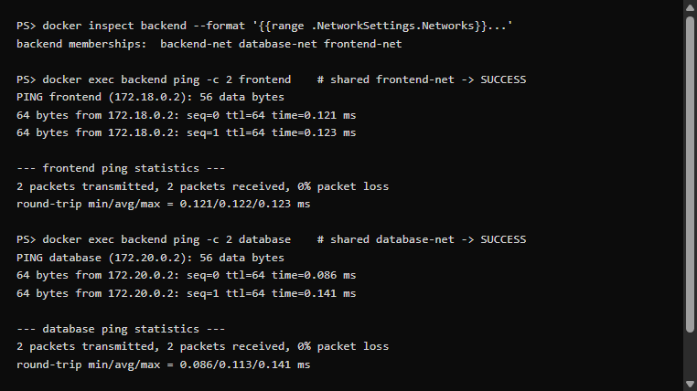
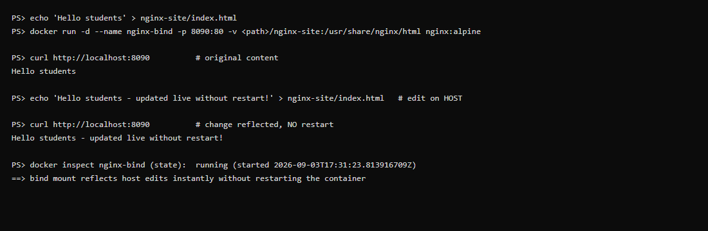
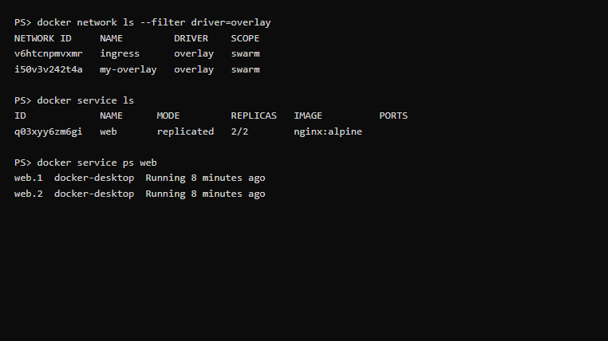

# Docker Networking & Volumes — Verified Output

All four tasks were actually executed on Docker Desktop (Engine v29.7.2, WSL2
backend). Real command output is captured verbatim below.

## Screenshots

**Task 1 — connectivity & isolation** (backend reaches frontend + database;
frontend cannot reach database):



**Task 3 — bind mount live edit** (content changes without restart):



**Task 4 — overlay network + Swarm service:**



---

## Task 1: Container Networking (3 networks, backend on 2+)

```
$ docker network create frontend-net backend-net database-net   # 3 networks

$ docker run -d --name frontend --network frontend-net nginx:alpine
$ docker run -d --name backend  --network backend-net  alpine sleep infinity
$ docker run -d --name database --network database-net -e MYSQL_ROOT_PASSWORD=secret mysql:8

# attach backend to the other two networks
$ docker network connect frontend-net backend
$ docker network connect database-net backend
```

**Backend is attached to all three networks:**
```
backend memberships:  backend-net database-net frontend-net
database memberships: database-net
```

**Connectivity tests (Docker embedded DNS resolves container names):**

```
=== backend -> frontend (shared frontend-net): SUCCESS ===
64 bytes from 172.18.0.2: seq=0 ttl=64 time=0.173 ms
64 bytes from 172.18.0.2: seq=1 ttl=64 time=0.093 ms
2 packets transmitted, 2 packets received, 0% packet loss

=== backend -> database (shared database-net): SUCCESS ===
64 bytes from 172.20.0.2: seq=0 ttl=64 time=0.393 ms
64 bytes from 172.20.0.2: seq=1 ttl=64 time=0.090 ms
2 packets transmitted, 2 packets received, 0% packet loss

=== frontend -> database (NO shared network): FAILS ===
ping: bad address 'database'
```

✅ **Result:** the backend (on all 3 networks) reaches both frontend and
database, but frontend and database **cannot** reach each other because they
share no network. This proves Docker network isolation.

---

## Task 2: Host Network (Apache/httpd)

```
$ docker run -d --name apache-host --network host httpd
$ docker inspect apache-host --format '... network={{...}} status={{...}}'
name=/apache-host network=host status=running
```

**Proof the server is listening on port 80 in the host network namespace:**
```
$ docker exec apache-host bash -c '(echo > /dev/tcp/localhost/80) && echo OPEN'
PORT 80 OPEN - httpd is serving on host network
```

> **Docker Desktop / WSL2 note:** `curl http://localhost:80` **from Windows**
> returns *"connection refused"*. This is expected — Docker Desktop runs the
> daemon inside a WSL2 Linux VM, so `--network host` binds to *that VM's* host,
> not Windows' `localhost`. The `/dev/tcp` test above confirms httpd really is
> serving on port 80 within the host namespace. On a **native Linux Docker host**,
> `curl http://localhost:80` returns the Apache `It works!` page directly.

---

## Task 3: Bind Mount (live editing, no restart)

```
$ mkdir nginx-site ; echo "Hello students" > nginx-site/index.html
$ docker run -d --name nginx-bind -p 8090:80 -v <abs-path>/nginx-site:/usr/share/nginx/html nginx:alpine

1st request (original):            'Hello students'

# edit the file ON THE HOST — no docker restart
$ echo "Hello students - updated live without restart!" > nginx-site/index.html

2nd request (after host edit):     'Hello students - updated live without restart!'
container state (never restarted): running since 2026-09-03T17:31:23Z
```

✅ **Result:** editing `index.html` on the host is reflected immediately by the
running container — the bind mount maps the host folder straight into the
container, no rebuild or restart needed.

---

## Task 4: Overlay Network (Swarm)

```
$ docker swarm init
Swarm initialized: current node (1bfo7bixscay...) is now a manager.

$ docker network create -d overlay --attachable my-overlay
$ docker network ls --filter driver=overlay
ingress     driver=overlay scope=swarm
my-overlay  driver=overlay scope=swarm

$ docker service create --name web --network my-overlay --replicas 2 nginx:alpine
verify: Service q03xyy6zm6gif... converged

$ docker service ls
web  replicas=2/2  network=my-overlay
```

✅ **Result:** an overlay network (`scope=swarm`) was created and a 2-replica
service was deployed onto it. Overlay networks span **multiple Docker hosts** via
VXLAN encapsulation, giving containers on different machines a flat L2 network
with built-in DNS-based service discovery. (Full multi-host behaviour needs 2+
Swarm nodes; here both replicas run on the single manager node.)

---

## Cleanup

```bash
docker rm -f frontend backend database apache-host nginx-bind
docker network rm frontend-net backend-net database-net
docker service rm web
docker network rm my-overlay
docker swarm leave --force
```
