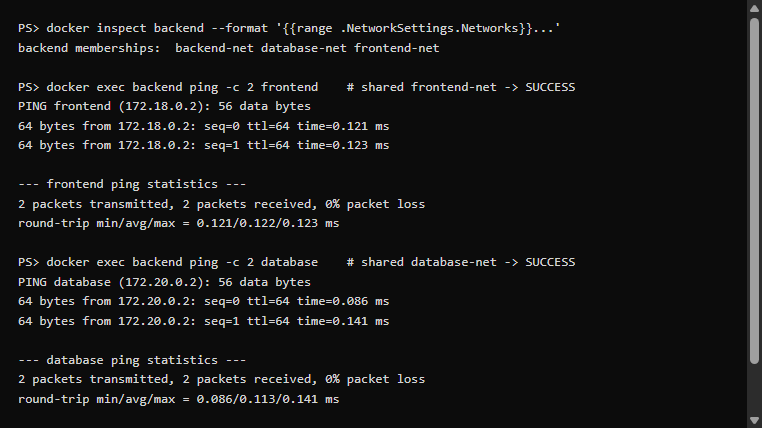
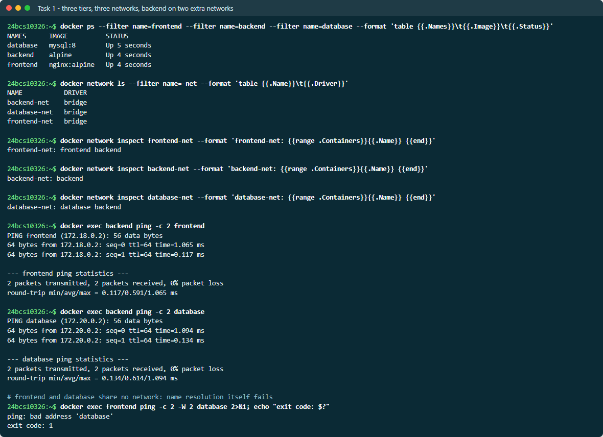
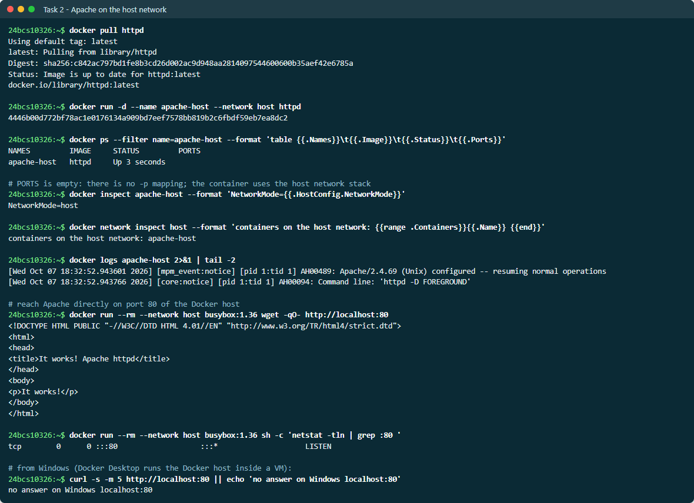
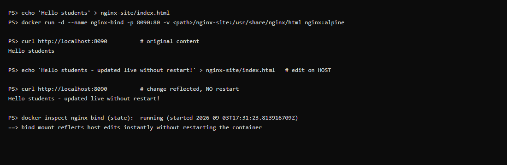
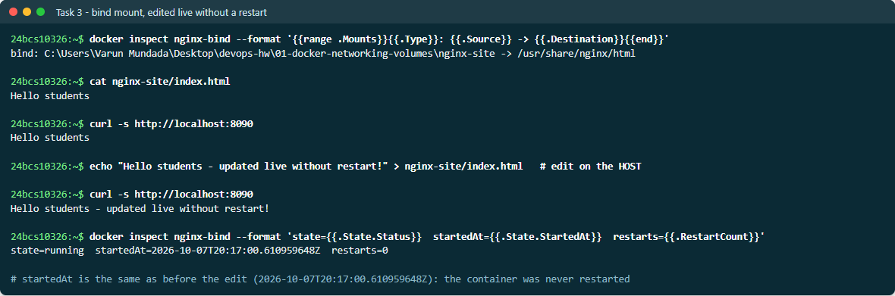
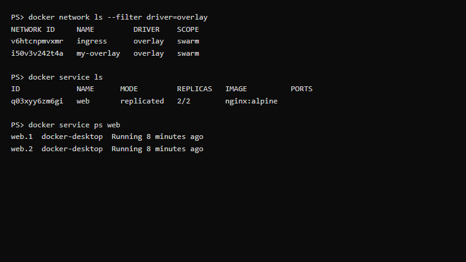

# Docker Networking & Volume Homework

This homework covers Docker container networking, the host network, bind mounts,
and overlay networks. Each task lists the exact commands to run and the expected
result. Run these on any machine with Docker installed.

> ✅ **All 4 tasks were actually executed** — see [`EVIDENCE.md`](EVIDENCE.md)
> for the real, verbatim command output (network isolation, host-network port 80,
> live bind-mount edit, and an overlay service converging on Swarm).

---

## Task 1: Docker Container Networking

**Goal:** 3 containers (frontend, backend, database) across 3 networks, with the
backend attached to 2 networks, and verify connectivity.

```bash
# 1. Create 3 user-defined bridge networks
docker network create frontend-net
docker network create backend-net
docker network create database-net

# 2. Frontend (Nginx) on frontend-net
docker run -d --name frontend --network frontend-net nginx:alpine

# 3. Backend (Alpine, kept alive) on backend-net
docker run -d --name backend --network backend-net alpine sleep infinity

# 4. Database (MySQL) on database-net
docker run -d --name database --network database-net \
  -e MYSQL_ROOT_PASSWORD=secret mysql:8

# 5. Attach the backend container to a SECOND network so it can reach both
#    the frontend and the database tiers
docker network connect frontend-net backend
docker network connect database-net backend
```



**Check connectivity** (Docker's embedded DNS resolves containers by name on a
shared network):

```bash
# backend shares frontend-net with frontend -> reachable
docker exec backend ping -c 2 frontend

# backend shares database-net with database -> reachable
docker exec backend ping -c 2 database

# frontend and database share NO common network -> should FAIL
docker exec frontend ping -c 2 database   # expected: bad address / unreachable
```

**Result** (re-verified on 2026-10-08 on the same three containers):
- `backend -> frontend`  ✅ succeeds (both on `frontend-net`)
- `backend -> database`  ✅ succeeds (both on `database-net`)
- `frontend -> database` ❌ fails with `ping: bad address 'database'`: they share no
  network, so Docker's DNS does not even resolve the name. This proves network isolation.



Inspect a network to confirm which containers are attached:

```bash
docker network inspect backend-net --format '{{range .Containers}}{{.Name}} {{end}}'
```

---

## Task 2: Host Network

**Goal:** Run Apache using the host network and reach it on port 80 with no
`-p` port mapping.

```bash
# "Apache2" on Docker Hub is the official httpd image
docker pull httpd

# --network host makes the container share the host's network stack directly
docker run -d --name apache-host --network host httpd

# Access it directly on port 80 (no -p flag needed with host networking)
curl http://localhost:80
```

**Result (executed 2026-10-07):** `docker ps` shows **no port mapping** and
`NetworkMode=host`. Apache answers `It works!` on port 80 of the Docker host,
and `netstat` shows it listening on `:::80` in the host's own network stack.



> **Why the last command gets no answer:** on Docker Desktop (Windows/Mac)
> the "host" is the Linux VM that runs Docker, not Windows. So `--network host`
> binds port 80 inside that VM: every host-network container reaches it, but
> Windows' own `localhost:80` does not. On a Linux machine, or with Docker
> Desktop's *Enable host networking* option, the same container is reachable
> from the machine itself.

---

## Task 3: Bind Mount

**Goal:** Bind mount a local folder into Nginx and see live edits without a
container restart.

```bash
# 1. A local folder + index.html (nginx-site/ in this directory)
mkdir -p nginx-site
echo "Hello students" > nginx-site/index.html

# 2. Bind mount that folder into Nginx's web root
docker run -d --name nginx-bind \
  -p 8090:80 \
  -v "$(pwd)/nginx-site:/usr/share/nginx/html" \
  nginx:alpine

# 3. Access the site
curl http://localhost:8090          # -> Hello students

# 4. Modify the file ON THE HOST (no restart)
echo "Hello students - updated live without restart!" > nginx-site/index.html

# 5. Access again -> change is reflected immediately
curl http://localhost:8090          # -> Hello students - updated live without restart!
```



**Result:** the second `curl` shows the updated text **without** restarting or
rebuilding the container. A bind mount maps the host directory straight into the
container, so file changes are visible instantly in both directions. Re-verified
on 2026-10-08 on the same `nginx-bind` container: `startedAt` is unchanged after
the edit and `restarts=0`.



---

## Task 4: Overlay Network (Research)

An **overlay network** connects containers running on **different Docker hosts**
as if they were on the same LAN. It is the multi-host networking driver used by
Docker Swarm (and conceptually similar to what Kubernetes CNIs provide).

**How it works**
- Overlay networks sit on top of the physical (underlay) network and encapsulate
  container-to-container traffic using **VXLAN** (default UDP port 4789).
- A control plane (Swarm's built-in Raft store, or an external key-value store
  like Consul/etcd for standalone Docker) shares network state — IP allocations,
  service records, endpoints — across every participating host.
- Each container gets an IP on the overlay subnet. When a container on Host A
  talks to one on Host B, Docker wraps the packet in a VXLAN header, ships it
  over the underlay to Host B, and unwraps it — so the containers see a flat L2
  network despite being on separate machines.

**Use cases**
- **Docker Swarm services** that must scale across a cluster of nodes.
- **Microservices spanning multiple hosts** that need to reach each other by
  service name with built-in DNS-based service discovery and load balancing.
- **Isolating multi-host application stacks** — each stack gets its own overlay,
  keeping tenants/environments separated across the cluster.

**Try it (requires Swarm)**

```bash
docker swarm init                                  # on the manager node
docker network create -d overlay my-overlay        # multi-host overlay network
docker service create --name web --network my-overlay --replicas 3 nginx
docker service ps web                              # replicas spread across nodes
```

Containers/tasks of the `web` service can now reach each other by name across
every node in the Swarm.



---

## Summary

| Task | Concept | Key command |
|------|---------|-------------|
| 1 | User-defined bridge networks & isolation | `docker network create`, `docker network connect` |
| 2 | Host networking | `docker run --network host` |
| 3 | Bind mounts (live editing) | `docker run -v host:container` |
| 4 | Overlay networks (multi-host) | `docker network create -d overlay` |

### Cleanup

```bash
docker rm -f frontend backend database apache-host nginx-bind
docker network rm frontend-net backend-net database-net
```
