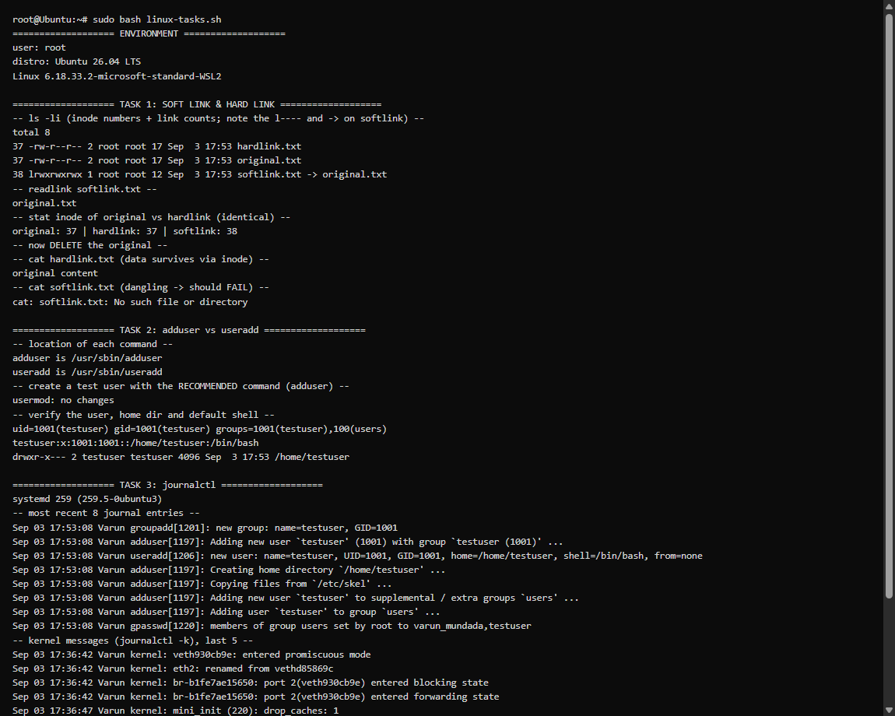

# Linux Homework — Verified Output

Tasks 1–3 were executed for real on a Linux host: **Ubuntu 26.04 LTS**
(WSL2, kernel 6.18, **systemd 259** running). The script is
[`linux-tasks.sh`](linux-tasks.sh); run it with `sudo bash linux-tasks.sh`.



---

## Task 1: Soft link & Hard link (real Linux)

```text
$ ls -li
37 -rw-r--r-- 2 root root 17 hardlink.txt        <-- inode 37, link count 2
37 -rw-r--r-- 2 root root 17 original.txt         <-- SAME inode 37, link count 2
38 lrwxrwxrwx 1 root root 12 softlink.txt -> original.txt   <-- inode 38, real symlink

$ readlink softlink.txt
original.txt

$ stat -c '%i' ...
original: 37 | hardlink: 37 | softlink: 38

# delete the original
$ rm original.txt
$ cat hardlink.txt
original content                                  <-- SURVIVES (data kept via inode)
$ cat softlink.txt
cat: softlink.txt: No such file or directory      <-- BREAKS (dangling symlink)
```

✅ Confirms: hard link and original share inode 37 (link count 2); the soft link
is a separate inode 38 pointing to the *name*. Deleting the original leaves the
hard link working but breaks the soft link.

## Task 2: `adduser` vs `useradd` (real Linux)

```text
$ type adduser ; type useradd
adduser is /usr/sbin/adduser
useradd is /usr/sbin/useradd

# recommended command on Ubuntu:
$ adduser --disabled-password --gecos "" testuser
Adding new user `testuser' (1001) ...
Creating home directory `/home/testuser' ...
Copying files from `/etc/skel' ...

$ id testuser
uid=1001(testuser) gid=1001(testuser) groups=1001(testuser),100(users)
$ grep '^testuser:' /etc/passwd
testuser:x:1001:1001::/home/testuser:/bin/bash
$ ls -ld /home/testuser
drwxr-x--- 2 testuser testuser 4096 /home/testuser
```

✅ `adduser` automatically created the home directory (`/home/testuser`), set the
shell to `/bin/bash`, and created the matching group — all the friendly defaults
that make it the recommended command on Ubuntu.

## Task 3: `journalctl` (real Linux, systemd 259)

```text
$ journalctl -n 8 --no-pager        # most recent entries (captures the adduser above)
Sep 03 17:53:08 Varun groupadd[1201]: new group: name=testuser, GID=1001
Sep 03 17:53:08 Varun adduser[1197]: Adding new user `testuser' (1001) ...
Sep 03 17:53:08 Varun useradd[1206]: new user: name=testuser, UID=1001, GID=1001, home=/home/testuser, shell=/bin/bash
Sep 03 17:53:08 Varun adduser[1197]: Creating home directory `/home/testuser' ...
...

$ journalctl -k -n 5 --no-pager     # kernel messages
Sep 03 17:36:42 Varun kernel: veth930cb9e: entered promiscuous mode
Sep 03 17:36:42 Varun kernel: br-b1fe7ae15650: port 2(veth930cb9e) entered forwarding state
...

$ journalctl -u cron -n 5 --no-pager   # logs for a specific service
Sep 03 17:00:28 Varun cron[126]: (CRON) INFO (Running @reboot jobs)
Sep 03 17:17:01 Varun CRON[844]: pam_unix(cron:session): session opened for user root ...
```

✅ `journalctl` reads systemd's journal: general entries (`-n`), kernel messages
(`-k`), and per-service logs (`-u cron`). Note the entries even captured the
`adduser` activity from Task 2 in real time.
