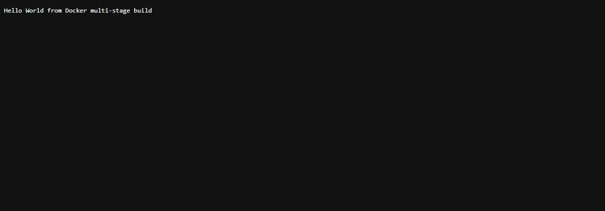

# Multi-Stage Build — Verified Output

- **Name:** Varun Mundada
- **Enrollment number:** 24BCS10326

All commands below were actually run on Docker Desktop (Engine v29.7.2, WSL2
backend). Real output is captured verbatim.

## Screenshots

**Application running on port 8080:**



**`docker ps` showing the container on port 8080:**


## Build

```
$ docker build -t multistage-hello .
...
#16 naming to docker.io/library/multistage-hello:latest done
#16 unpacking to docker.io/library/multistage-hello:latest 0.1s done
#16 DONE 0.4s
```

## Run on port 8080

```
$ docker run -d -p 8080:8080 --name multistage-hello multistage-hello
be9f48d10fa529ca193392137b1669e2d4d17cc6b88b39175c48df882d869757
```

## Access the application (Task 1 requirement)

```
$ curl http://localhost:8080
Hello World from Docker multi-stage build
```

## `docker ps` — container running on port 8080 (Task 2 requirement)

```
CONTAINER ID   IMAGE              STATUS         PORTS                                         NAMES
be9f48d10fa5   multistage-hello   Up 2 seconds   0.0.0.0:8080->8080/tcp, [::]:8080->8080/tcp   multistage-hello
```

## Multi-stage benefit — final image is tiny

```
$ docker images multistage-hello
REPOSITORY         TAG       SIZE
multistage-hello   latest    23.2MB
```

The full `golang` build image is ~300 MB, but because the compiler and source
stayed in **stage 1** and only the compiled static binary was copied into the
`alpine` **stage 2**, the final image is just **23.2 MB**.

---

## Task 3: Deploy 3+ application types (verified)

Node.js, Python, and Java apps (from `../06-docker-hello-world/`) were all built
and run. Live `docker ps`:

```
NAMES              STATUS          PORTS
hello-java         Up 2 minutes    0.0.0.0:8085->8080/tcp
hello-python       Up 15 minutes   0.0.0.0:5000->5000/tcp
hello-node         Up 17 minutes   0.0.0.0:3000->3000/tcp
multistage-hello   Up 18 minutes   0.0.0.0:8080->8080/tcp
```

Responses:

```
$ curl http://localhost:3000   ->  <h1>Hello World from Node.js!</h1>
$ curl http://localhost:5000   ->  <h1>Hello World from Python (Flask)!</h1>
$ curl http://localhost:8085   ->  <h1>Hello World from Java!</h1>
```
