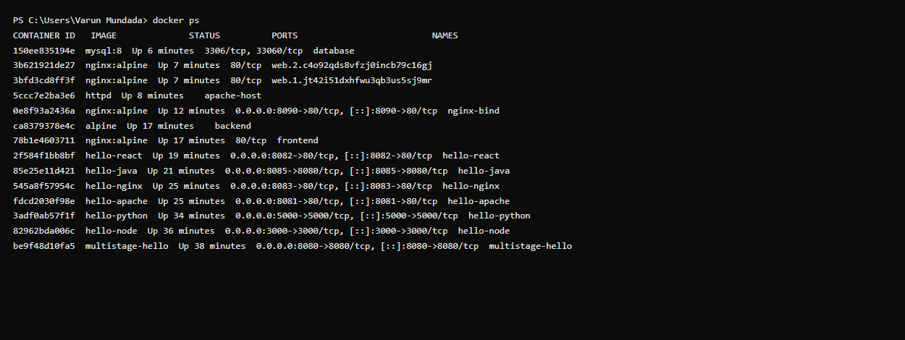

# Docker Multi-Stage Build Homework

## Task 2: Documentation

- **Name:** _<add your name>_
- **Enrollment number:** _<add your enrollment number>_

> Replace the placeholders above, then add screenshots of the running app and of
> `docker ps` into a `screenshots/` folder and reference them at the bottom.

---

## Task 1: Run the Multi-Stage Dockerfile

This folder contains a small **Go** web server ([`main.go`](main.go)) and a
[multi-stage `Dockerfile`](Dockerfile). The app prints:

```
Hello World from Docker multi-stage build
```

and listens on **port 8080**.

### Why multi-stage?
- **Stage 1 (`golang:1.22-alpine`)** — has the full Go compiler (~300 MB) and
  builds a static binary.
- **Stage 2 (`alpine:3.20`)** — copies **only** the compiled binary. No compiler,
  no source, no build tools ship in the final image, so it drops to a few MB and
  has a much smaller attack surface.

### Build & run

```bash
# From this folder
docker build -t multistage-hello .

# Run it, mapping container port 8080 -> host port 8080
docker run -d -p 8080:8080 --name multistage-hello multistage-hello

# Access the app
curl http://localhost:8080
# -> Hello World from Docker multi-stage build

# Verify the running container on port 8080
docker ps
```

### Expected `docker ps` output

```text
CONTAINER ID   IMAGE               COMMAND      STATUS         PORTS                    NAMES
a1b2c3d4e5f6   multistage-hello    "./server"   Up 5 seconds   0.0.0.0:8080->8080/tcp   multistage-hello
```

### Confirm the image is small (multi-stage benefit)

```bash
docker images multistage-hello
# The final image is only a few MB because the Go toolchain stayed in stage 1.
```

---

## Task 3: Docker Application Deployment (3+ app types)

At least three different application types are deployed via Docker. These reuse
the apps built in [`../06-docker-hello-world/`](../06-docker-hello-world/):

| Type | Folder | Run command | Port |
|------|--------|-------------|------|
| Node.js | `../06-docker-hello-world/nodejs-app` | `docker build -t hello-node . && docker run -d -p 3000:3000 hello-node` | 3000 |
| Python | `../06-docker-hello-world/python-app` | `docker build -t hello-python . && docker run -d -p 5000:5000 hello-python` | 5000 |
| Java | `../06-docker-hello-world/java-app` | `docker build -t hello-java . && docker run -d -p 8080:8080 hello-java` | 8080 |

After deploying, `docker ps` should list all running containers.

---

## Evidence / Screenshots

Add these once run on a machine with Docker:

- [ ] Browser/curl showing `Hello World from Docker multi-stage build`
- [ ] `docker ps` showing the container on port 8080
- [ ] `docker images` showing the small final image size
- [ ] `docker ps` showing the 3 deployed app types (Task 3)

```
<!--  -->
<!--  -->
```
