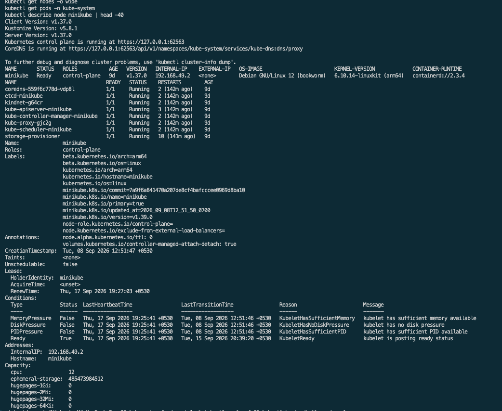
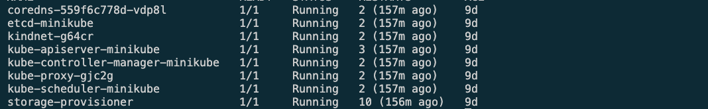
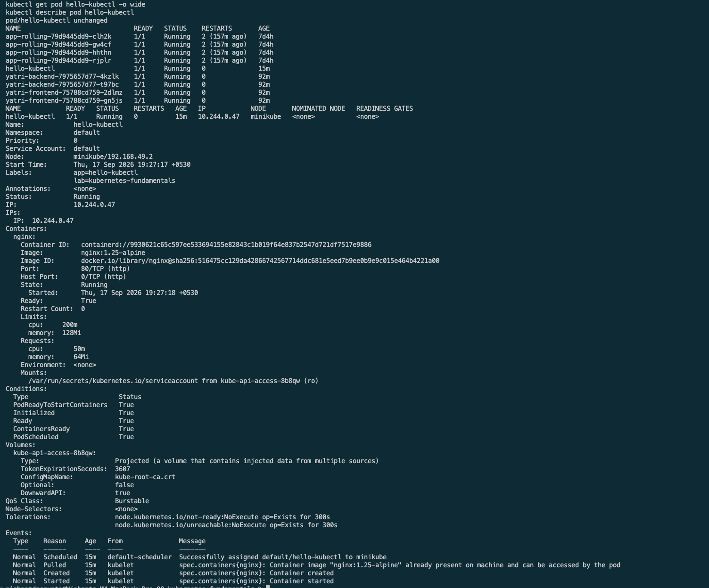
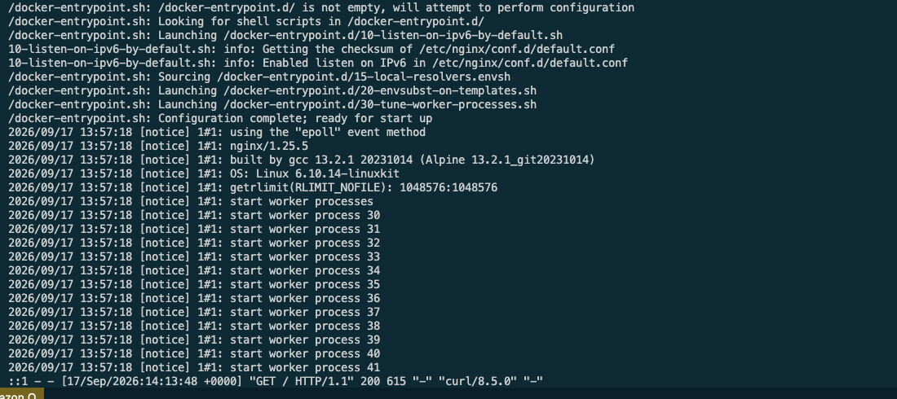
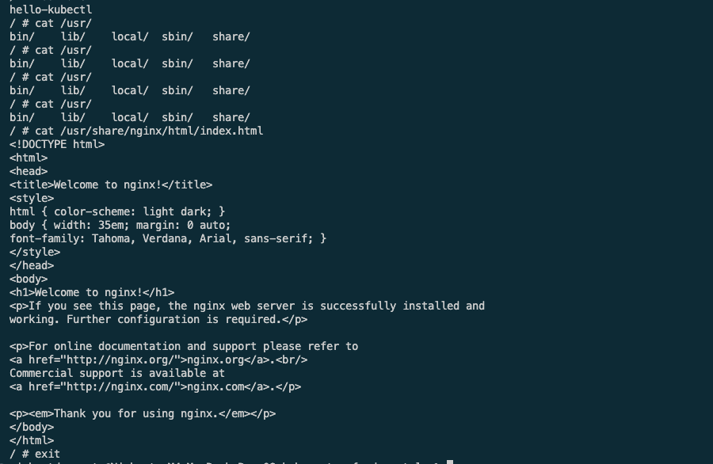
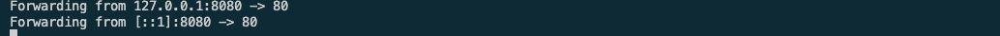
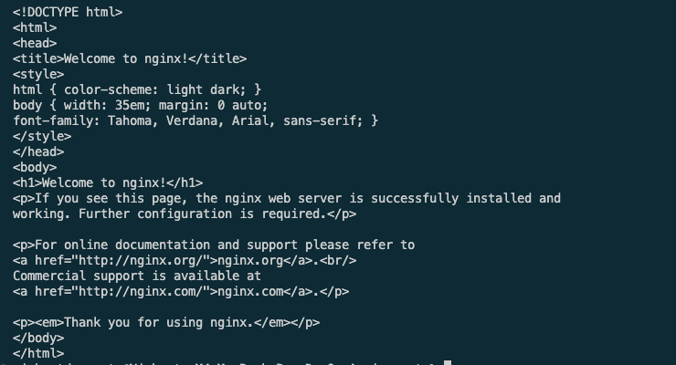
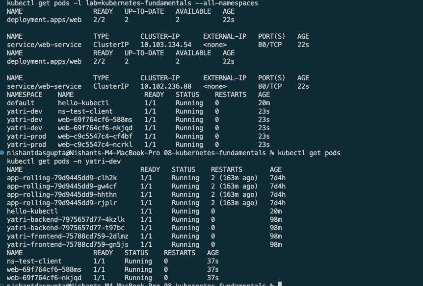
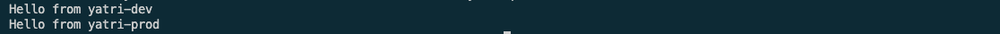

# Kubernetes Fundamentals

This section covers what sits underneath the Kubernetes objects used in the later sections: cluster architecture, a local Minikube cluster, the `kubectl`
CLI, and namespaces.

| Topic | Files | What it demonstrates |
| --- | --- | --- |
| Cluster architecture | `01-cluster-architecture/` | Control plane and node components in a running cluster |
| kubectl basics | `02-kubectl-basics/hello-pod.yaml` | Inspecting, debugging, and reaching a Pod from the CLI |
| Namespaces | `03-namespaces/` | Isolating environments and resolving Services across them |

The commands for every task are in [running.md](running.md).

## Cluster Architecture

A Kubernetes cluster is split into a control plane, which decides what should
run, and worker nodes, which run it. Minikube packs both onto a single node.

### Control plane

| Component | Responsibility |
| --- | --- |
| `kube-apiserver` | The only entry point to the cluster. Every `kubectl` command and every internal component talks to it over the REST API |
| `etcd` | Key-value store holding the entire cluster state, so the cluster can be restored after a restart |
| `kube-scheduler` | Chooses which node an unscheduled Pod should run on, based on resources, affinity, and taints |
| `kube-controller-manager` | Runs the control loops that drive actual state toward desired state, such as replacing a failed Pod |
| `cloud-controller-manager` | Talks to a cloud provider for load balancers, storage, and routes. Not used on Minikube |

### Node

| Component | Responsibility |
| --- | --- |
| `kubelet` | Node agent. Takes Pod specs from the API server, starts their containers, and reports health back |
| Container runtime | Actually runs the containers, usually `containerd` |
| `kube-proxy` | Programs the node's iptables or IPVS rules so Service traffic reaches the right Pod |

### What happens during `kubectl apply`

1. `kubectl` sends the manifest to `kube-apiserver`.
2. The API server validates it and writes the object to `etcd`.
3. The scheduler notices a Pod with no node assigned and picks one.
4. That node's `kubelet` sees the assignment and tells the runtime to start the container.
5. Controllers keep watching, and recreate the Pod if it dies.

Nothing is created directly by the client. Every step is a controller reacting
to recorded desired state, which is why the same manifest applied twice
produces no change.



Running `kubectl get pods -n kube-system` shows these components as real Pods
on the node.



## kubectl Basics

`kubectl` is a client for the API server. The commands below cover the ones
used throughout the later sections.

| Command | Purpose |
| --- | --- |
| `kubectl cluster-info` | Confirm the API server address and that the cluster answers |
| `kubectl get <kind>` | List objects, with `-o wide` for node and IP columns |
| `kubectl describe <kind> <name>` | Full detail plus the event log, the first place to look when a Pod will not start |
| `kubectl logs <pod>` | Read a container's stdout, with `-f` to follow |
| `kubectl exec -it <pod> -- sh` | Open a shell inside a running container |
| `kubectl port-forward pod/<pod> 8080:80` | Reach a Pod from the local machine without a Service |
| `kubectl apply -f <file>` | Create or update from a manifest |
| `kubectl delete -f <file>` | Remove what the manifest created |

`get` answers what exists, `describe` answers why it is in that state, and
`logs` answers what the application itself reported. Most debugging is those
three in order.





`kubectl exec -it` opens a shell inside the container, where the Pod name
appears as the hostname and the served file can be read directly.



`port-forward` tunnels a local port to the Pod, which is useful before any
Service exists.





### Imperative and declarative

`kubectl run` and `kubectl create` are imperative: the configuration lives in
the command and disappears with the shell history. `kubectl apply -f` is
declarative: the manifest is the record, it can be committed to Git, and
re-applying it is safe because Kubernetes compares desired state against
actual state rather than trying to create the object again.

This repository uses manifests everywhere for that reason.

### Manifest anatomy

Every manifest in this repository has the same four top-level fields:

| Field | Meaning |
| --- | --- |
| `apiVersion` | Which API group and version validates this object, such as `v1` or `apps/v1` |
| `kind` | The object type, such as `Pod`, `Deployment`, or `Service` |
| `metadata` | Identity: `name`, `namespace`, and the `labels` other objects select on |
| `spec` | Desired state, whose shape depends on the `kind` |

## Namespaces

A namespace is a scope for object names. Two objects may share a name as long
as they are in different namespaces, which is what makes one cluster usable for
several environments.

`03-namespaces/` creates `yatri-dev` and `yatri-prod`, then puts a Deployment
named `web` and a Service named `web-service` in each. The names collide only
in appearance, because the namespace is part of each object's identity.



`kubectl` commands default to the `default` namespace, so `kubectl get pods`
does not show these Pods at all. They need `-n yatri-dev`, or a change of the
context's default namespace.

Kubernetes creates four namespaces of its own:

| Namespace | Contents |
| --- | --- |
| `default` | Where objects land when no namespace is given |
| `kube-system` | Control plane components and cluster add-ons |
| `kube-public` | Readable by everyone, used for cluster information |
| `kube-node-lease` | Node heartbeat objects |

### DNS across namespaces

A namespace scopes names but does not block traffic. Every Service gets the DNS
name `<service>.<namespace>.svc.cluster.local`, and a client resolving a bare
`web-service` gets the one in its own namespace. From the client Pod in
`yatri-dev`:

```text
curl web-service                                  -> Hello from yatri-dev
curl web-service.yatri-prod.svc.cluster.local     -> Hello from yatri-prod
```




## Takeaway

The control plane records desired state and controllers work to match it, `kubectl` is only a client of that API, and namespaces scope object names so one cluster can hold several environments. The Pods Deployments, Services, and Ingress rules in the following sections are all built on these mechanics.
