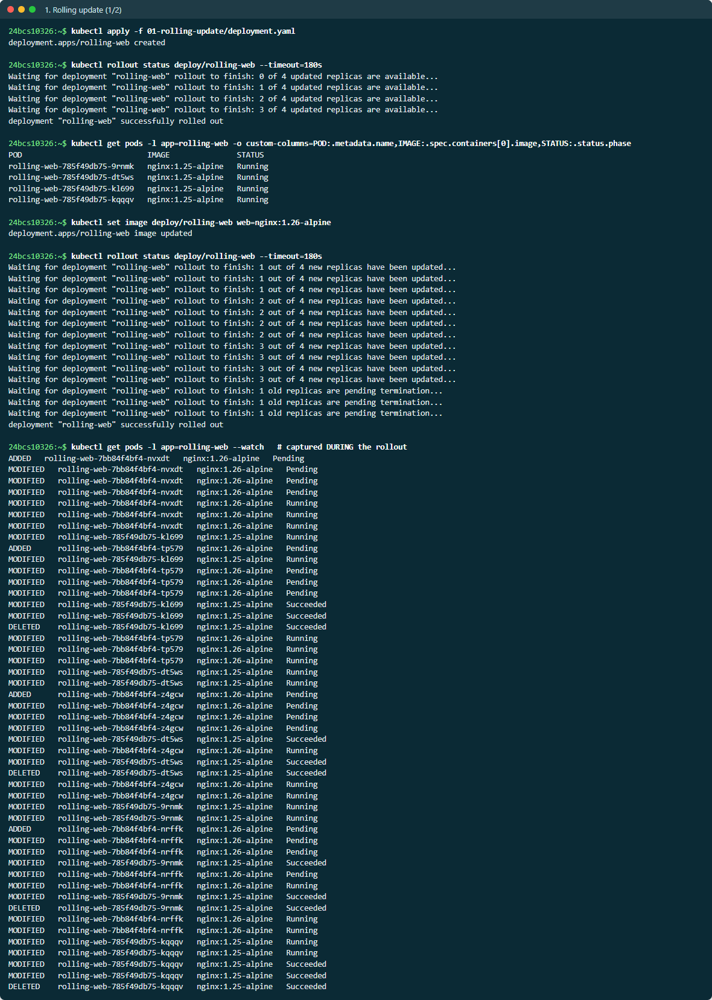
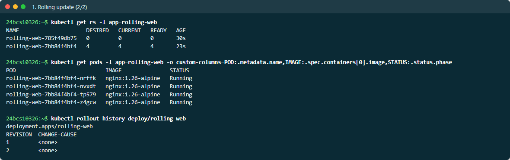
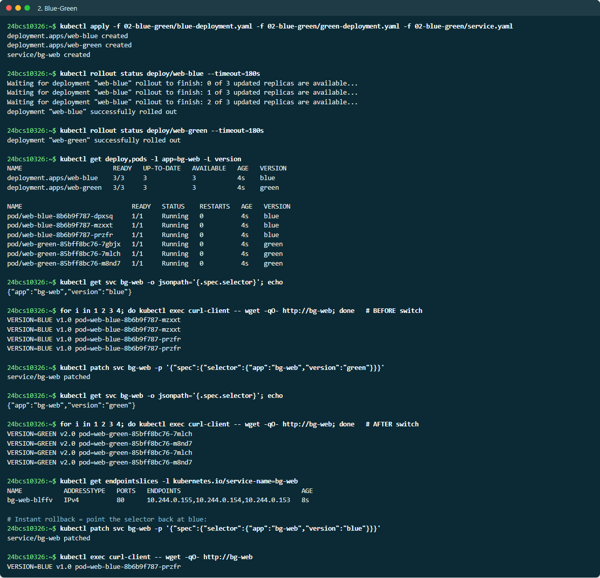
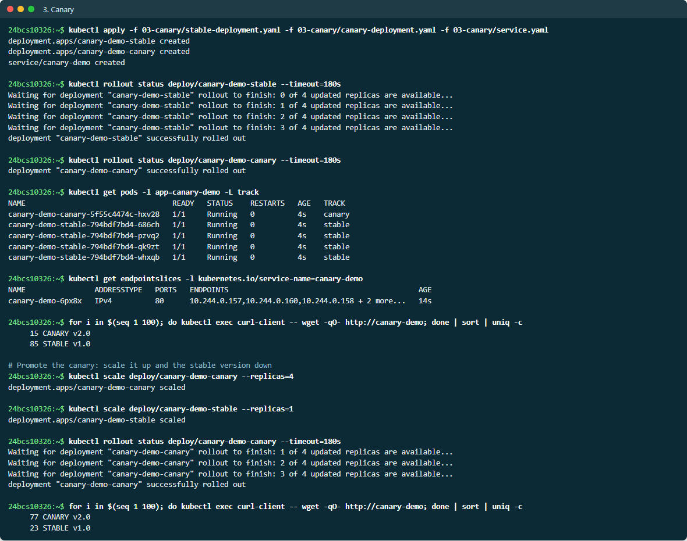
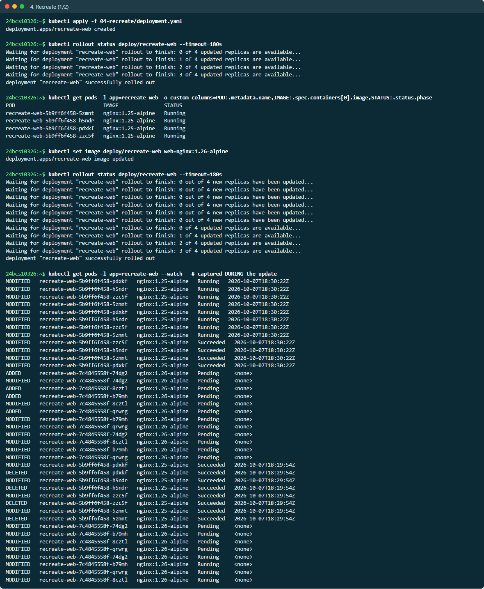
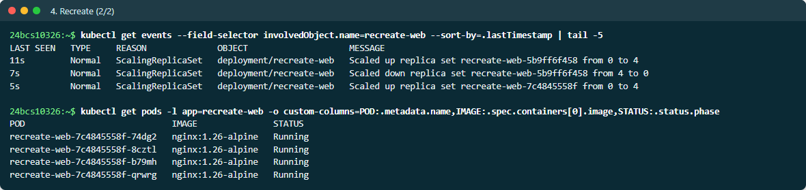

# Deployment Strategies

All four strategies were run live on minikube (Kubernetes v1.37.0). The full,
unedited terminal output is in [EVIDENCE.md](EVIDENCE.md); the excerpts below
are taken from it.

| Strategy | Manifests | Downtime | Extra capacity | Rollback | Traffic split |
| --- | --- | --- | --- | --- | --- |
| Rolling update | [01-rolling-update](01-rolling-update/) | None | +`maxSurge` Pods | `kubectl rollout undo` | Mixed during the roll |
| Blue-green | [02-blue-green](02-blue-green/) | None | 2× (both versions running) | Flip the selector back — instant | All or nothing |
| Canary | [03-canary](03-canary/) | None | +canary Pods | Scale canary to 0 | Proportional to replicas |
| Recreate | [04-recreate](04-recreate/) | **Yes** | None | Redeploy the old version | Never mixed |

```bash
# run them yourself
kubectl apply -f 01-rolling-update/
kubectl set image deploy/rolling-web web=nginx:1.26-alpine
kubectl rollout status deploy/rolling-web
```

## 01 — Rolling update

**Setup:** 4 replicas, `maxSurge: 1`, `maxUnavailable: 0`, and a readiness
probe. Kubernetes may add one extra Pod at a time and may never drop below four
ready Pods.

**Update:** `kubectl set image deploy/rolling-web web=nginx:1.26-alpine`

**Observed** — the watch captured *during* the rollout shows old and new Pods
alive at the same time, one swapped at a time:

```text
ADDED      rolling-web-7bb84f4bf4-5lrfq   nginx:1.26-alpine   Pending     <- 1 new Pod surges in
MODIFIED   rolling-web-7bb84f4bf4-5lrfq   nginx:1.26-alpine   Running     <- becomes Ready
MODIFIED   rolling-web-785f49db75-nm9gc   nginx:1.25-alpine   Running     <- only now is 1 old Pod terminated
ADDED      rolling-web-7bb84f4bf4-68r2l   nginx:1.26-alpine   Pending     <- next new Pod
MODIFIED   rolling-web-785f49db75-nm9gc   nginx:1.25-alpine   Succeeded
```

Afterwards the Deployment owns two ReplicaSets — the old one scaled to zero and
kept for rollback:

```text
NAME                     DESIRED   CURRENT   READY
rolling-web-785f49db75   0         0         0      <- revision 1, nginx 1.25
rolling-web-7bb84f4bf4   4         4         4      <- revision 2, nginx 1.26
```

**Why it matters:** with `maxUnavailable: 0` and a readiness probe, capacity
never drops — an old Pod is only removed after its replacement passes
readiness. This is the Kubernetes default and the right choice for most
stateless services.

> **Screenshots:** live output from a second run of the same commands on 2026-10-07, so Pod names and timings differ from [EVIDENCE.md](EVIDENCE.md).





## 02 — Blue-green

**Setup:** two complete Deployments, `web-blue` (v1.0) and `web-green` (v2.0),
3 replicas each, running side by side. One Service, `bg-web`, selects
`version: blue`.

**Switch:** change one label in the Service selector.

```bash
kubectl patch svc bg-web -p '{"spec":{"selector":{"app":"bg-web","version":"green"}}}'
```

**Observed:**

```text
# BEFORE the switch
VERSION=BLUE v1.0 pod=web-blue-8b6b9f787-l49px
VERSION=BLUE v1.0 pod=web-blue-8b6b9f787-9x2z9

# AFTER the switch - 100% of traffic moved at once
VERSION=GREEN v2.0 pod=web-green-85bff8bc76-vl288
VERSION=GREEN v2.0 pod=web-green-85bff8bc76-7rwkt
VERSION=GREEN v2.0 pod=web-green-85bff8bc76-q59lh
```



Patching the selector back to `blue` restored v1.0 instantly — that is the
rollback, and it takes the same few milliseconds.

**Why it matters:** green is fully deployed and can be tested *before* it gets
any traffic, and the cut-over is atomic — users never see a mix of versions.
The cost is running double capacity for the duration.

## 03 — Canary

**Setup:** `canary-demo-stable` (v1.0, 4 replicas) and `canary-demo-canary`
(v2.0, 1 replica). The Service selects **only** `app: canary-demo` and
deliberately ignores the `track` label, so all five Pods are endpoints of the
same Service.

**Observed** — 100 requests, counted:

```text
# 1 canary : 4 stable replicas  (expected ~20% canary)
     18 CANARY v2.0
     82 STABLE v1.0

# promoted: 4 canary : 1 stable  (expected ~80% canary)
     82 CANARY v2.0
     18 STABLE v1.0
```



**Why it matters:** only a small fraction of users is exposed to the new
version while it is watched for errors. If it misbehaves, scale the canary to
zero; if it is healthy, promote it gradually.

**Limitation:** with plain Kubernetes the split can only be expressed through
replica counts, so 1% would need 99 stable Pods. Precise percentages (or
routing by header or cookie) need an Ingress controller with canary
annotations, a service mesh such as Istio, or Argo Rollouts.

## 04 — Recreate

**Setup:** 4 replicas, `strategy.type: Recreate`.

**Observed** — every old Pod received its deletion timestamp at the **same
instant** and terminated *before* the first new Pod was even created:

```text
MODIFIED   recreate-web-5b9ff6f458-6hx8t   nginx:1.25-alpine   Running     2026-10-07T15:09:18Z  <- all 4 marked
MODIFIED   recreate-web-5b9ff6f458-tvvdc   nginx:1.25-alpine   Running     2026-10-07T15:09:18Z     for deletion
MODIFIED   recreate-web-5b9ff6f458-868gv   nginx:1.25-alpine   Running     2026-10-07T15:09:18Z     together
MODIFIED   recreate-web-5b9ff6f458-dzzs7   nginx:1.25-alpine   Running     2026-10-07T15:09:18Z
MODIFIED   recreate-web-5b9ff6f458-6hx8t   nginx:1.25-alpine   Succeeded   ...                   <- all 4 gone
...
ADDED      recreate-web-7c4845558f-qwlx5   nginx:1.26-alpine   Pending     <none>                <- only now do
ADDED      recreate-web-7c4845558f-llc5c   nginx:1.26-alpine   Pending     <none>                   new Pods appear
```

The Deployment events confirm the order:

```text
Scaled down replica set recreate-web-5b9ff6f458 from 4 to 0
Scaled up replica set recreate-web-7c4845558f from 0 to 4
```

`kubectl rollout status` also reported `0 out of 4 new replicas have been
updated` several times — the window in which **no** Pods were serving.

**Why it matters:** there is a guaranteed outage between the two versions. It
is used when two versions must never run concurrently — a database schema
migration that the old code cannot handle, a singleton consumer, or a
`ReadWriteOnce` volume that only one Pod may mount.




