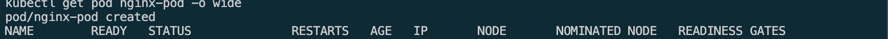
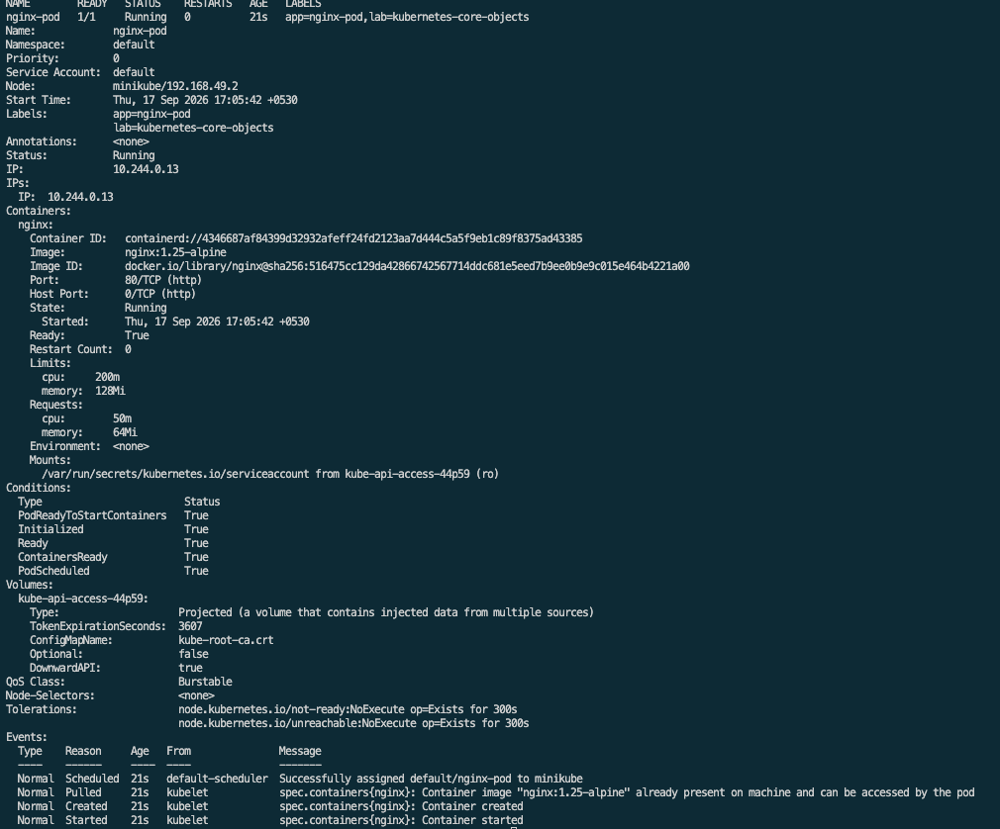
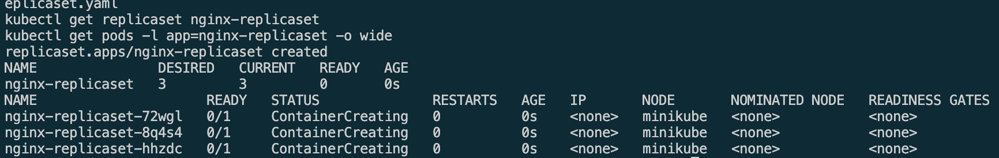
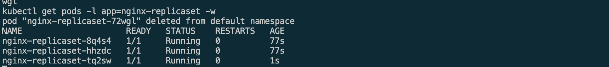
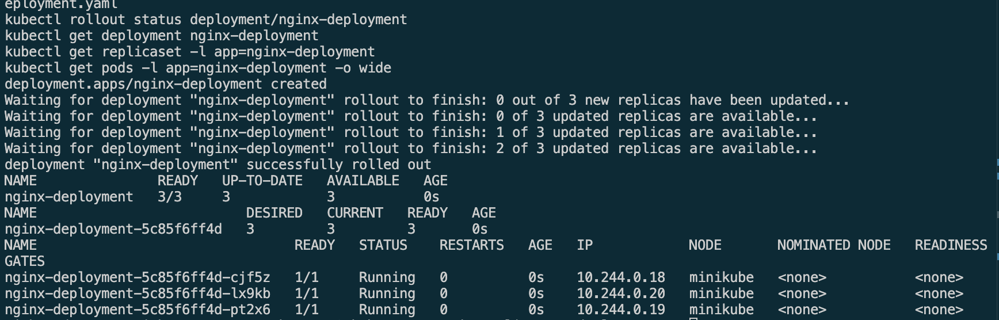
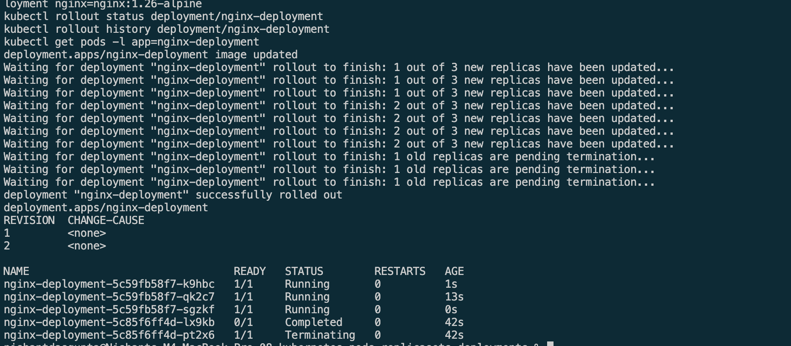
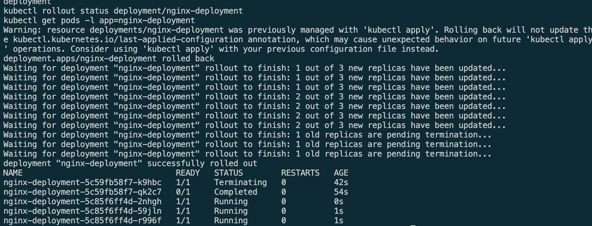

# Kubernetes Pods, ReplicaSets, and Deployments

This lab demonstrates three Kubernetes workload objects using NGINX:

| Object | Manifest | What it demonstrates |
| --- | --- | --- |
| Pod | `01-pod/nginx-pod.yaml` | A single, manually managed NGINX container |
| ReplicaSet | `02-replicaset/nginx-replicaset.yaml` | Maintaining three identical NGINX Pods and self-healing |
| Deployment | `03-deployment/nginx-deployment.yaml` | Managing ReplicaSets with a rolling update and rollback |

## Pod

A Pod is Kubernetes' smallest deployable unit. This standalone NGINX Pod is running with one container, its own IP address, and defined CPU and memory limits. A Pod is not self-healing: if it is deleted, no controller recreates
it.

## ReplicaSet

A ReplicaSet keeps a specified number of identical Pods running. Here, its desired count is three. When one Pod was deleted, the ReplicaSet immediately created a replacement and restored the count to three.

## Deployment

A Deployment manages ReplicaSets and provides controlled application updates.
It started with three ready Pods, then replaced NGINX 1.25 with NGINX 1.26 through a rolling update. Kubernetes recorded both revisions, making a rollback to the earlier version possible.

## Takeaway

A Pod runs an application, a ReplicaSet maintains the required number of Pods and a Deployment manages ReplicaSets to support safe updates and rollbacks.
