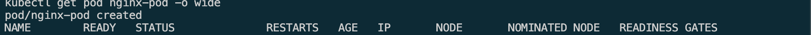
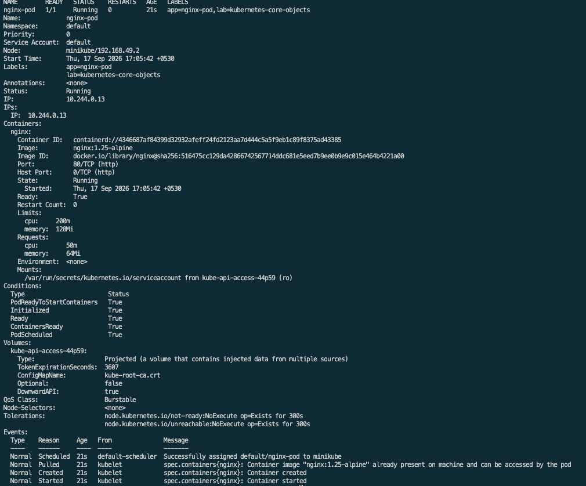
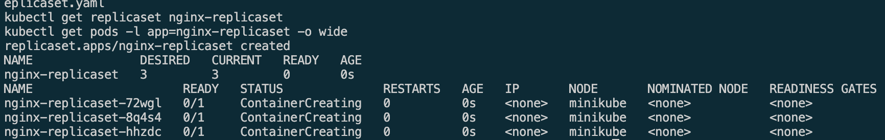
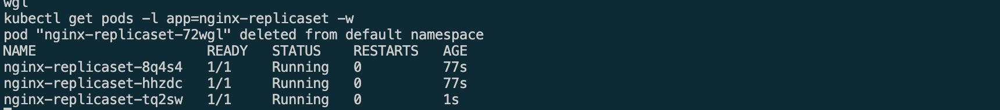
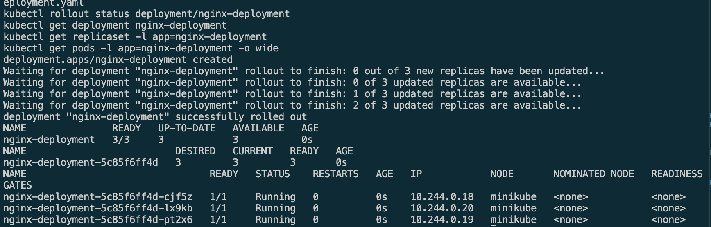
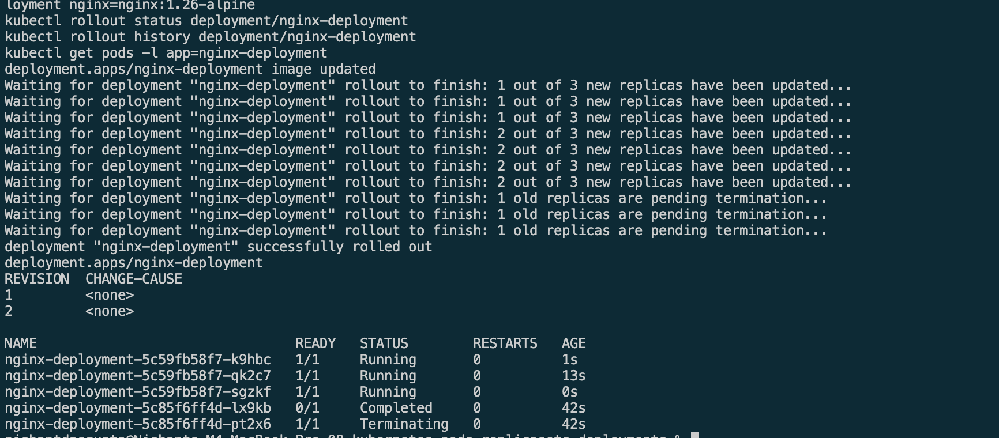
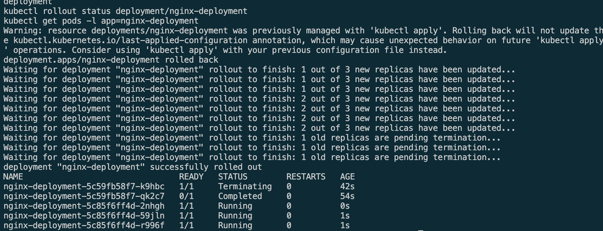

# Kubernetes Pods, ReplicaSets, and Deployments

This lab demonstrates three Kubernetes workload objects using NGINX:

| Object | Manifest | What it demonstrates |
| --- | --- | --- |
| Pod | `01-pod/nginx-pod.yaml` | A single, manually managed NGINX container |
| ReplicaSet | `02-replicaset/nginx-replicaset.yaml` | Maintaining three identical NGINX Pods and self-healing |
| Deployment | `03-deployment/nginx-deployment.yaml` | Managing ReplicaSets with a rolling update and rollback |
| Deployment strategies | [`04-deployment-strategies/`](04-deployment-strategies/) | Rolling update, blue-green, canary and recreate |
| Pod lifecycle | [`05-pod-lifecycle/`](05-pod-lifecycle/) | Pending, Running, Succeeded, Failed, restart back-off, init containers, hooks, probes |

## Pod

A Pod is Kubernetes' smallest deployable unit. This standalone NGINX Pod is running with one container, its own IP address, and defined CPU and memory limits. A Pod is not self-healing: if it is deleted, no controller recreates
it.

## ReplicaSet

A ReplicaSet keeps a specified number of identical Pods running. Here, its desired count is three. When one Pod was deleted, the ReplicaSet immediately created a replacement and restored the count to three.

## Deployment

A Deployment manages ReplicaSets and provides controlled application updates.
It started with three ready Pods, then replaced NGINX 1.25 with NGINX 1.26 through a rolling update. Kubernetes recorded both revisions, making a rollback to the earlier version possible.

## Task 1 — Deployment strategies

All four strategies were implemented and run live; see
[04-deployment-strategies/README.md](04-deployment-strategies/README.md) for the
walkthrough and [EVIDENCE.md](04-deployment-strategies/EVIDENCE.md) for the raw
output.

| Strategy | What the run showed |
| --- | --- |
| Rolling update | Old (1.25) and new (1.26) Pods overlapped; one swapped at a time with zero capacity loss |
| Blue-green | One selector patch moved 100% of traffic from `BLUE v1.0` to `GREEN v2.0`, and back again |
| Canary | 1 canary + 4 stable replicas → 18 of 100 requests hit the canary (~20%) |
| Recreate | All 4 old Pods terminated before any new Pod was created — a visible outage window |

## Task 2 — Pod lifecycle

Eight YAML files each drive a Pod into one lifecycle state. Each was applied,
inspected with `get` and `describe`, and explained; see
[05-pod-lifecycle/README.md](05-pod-lifecycle/README.md).

## Takeaway

A Pod runs an application, a ReplicaSet maintains the required number of Pods and a Deployment manages ReplicaSets to support safe updates and rollbacks.
