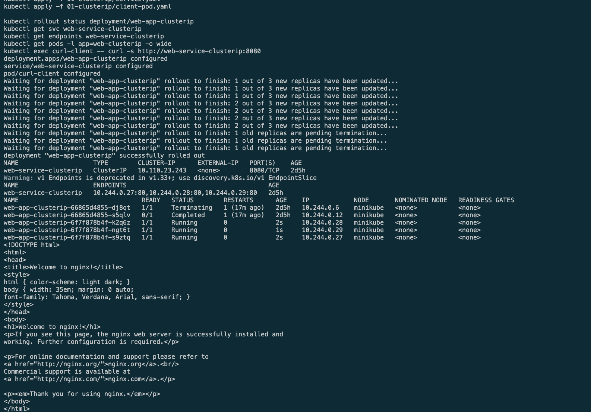
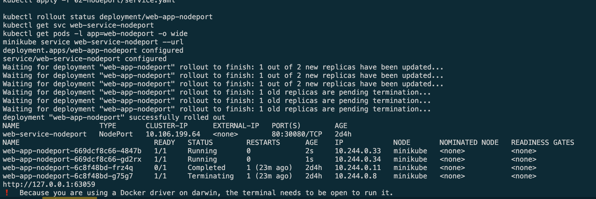
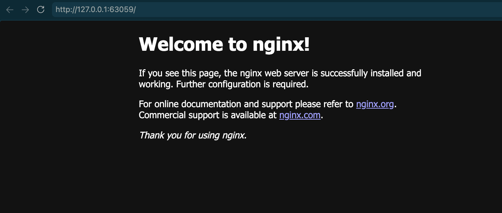
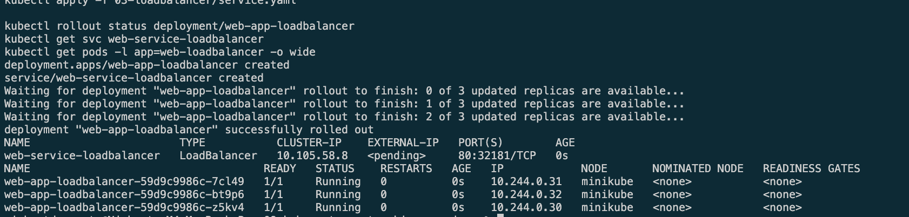
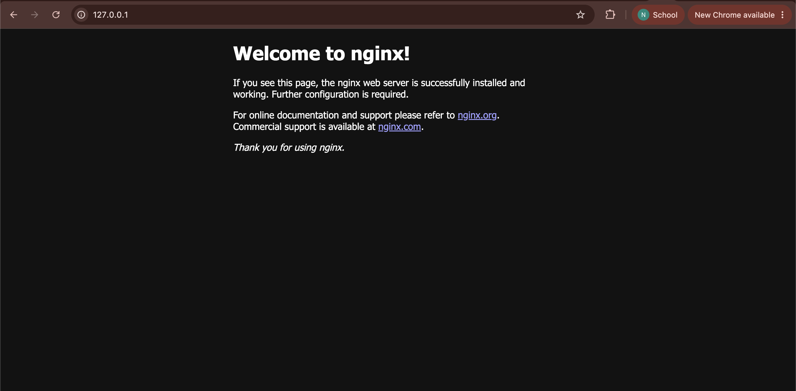
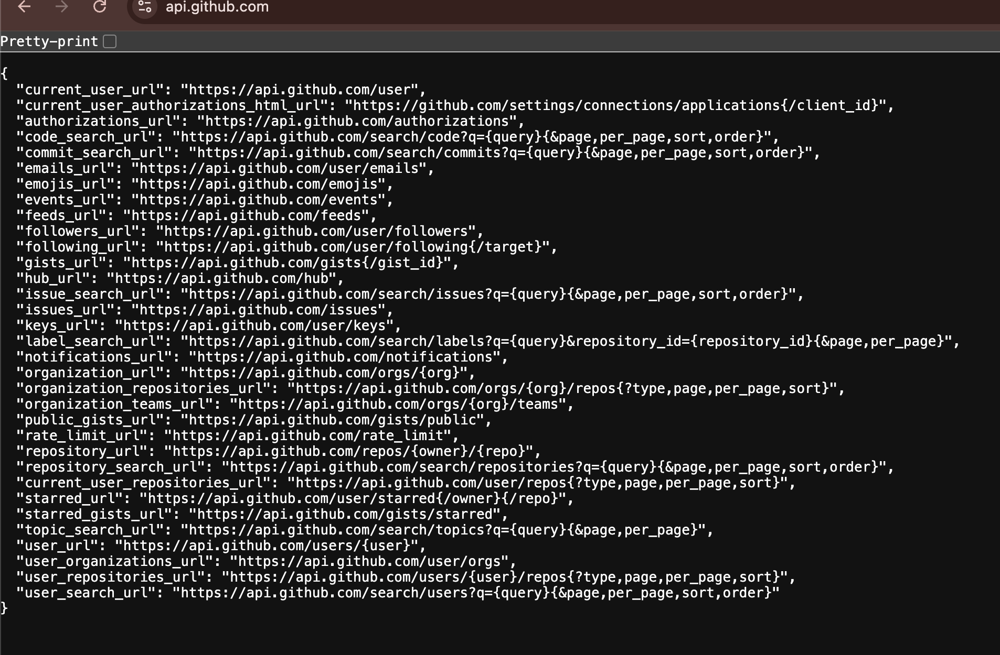
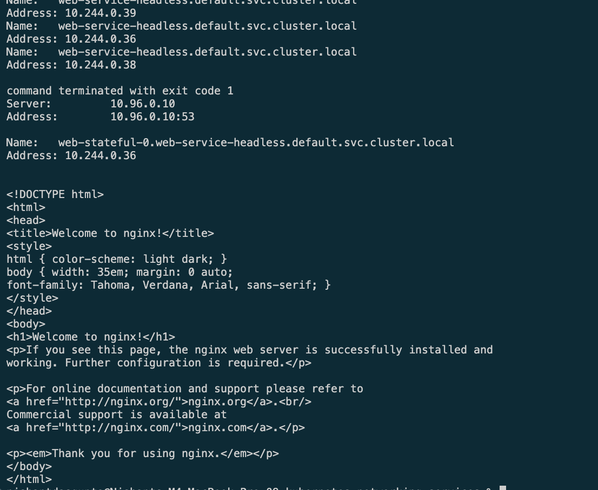

# Kubernetes Networking and Services

This lab demonstrates the five Kubernetes Service patterns.

| Service type | Scope | Main purpose |
| --- | --- | --- |
| ClusterIP | Internal cluster network | Stable access to a group of Pods |
| NodePort | Node IP and fixed port | Simple external access for local or bare-metal clusters |
| LoadBalancer | External load balancer | Public application access in cloud environments |
| ExternalName | DNS alias only | Internal name for an external service |
| Headless Service | Direct Pod DNS | Discovery of individual Pods in stateful workloads |

## 1. ClusterIP

ClusterIP is the default Kubernetes Service. It gives internal clients one
stable IP address and DNS name while routing requests to the three matching
NGINX Pods. The individual Pod IPs can change without affecting clients.

## 2. NodePort

NodePort exposes the application through port `30080` on every cluster node.
It also creates an internal ClusterIP, so the Service can be reached from both
inside and outside the cluster.

## 3. LoadBalancer

LoadBalancer is intended for cloud environments. Kubernetes requests an
external load balancer from the cloud provider, which forwards public traffic
to the three NGINX Pods. On a local Minikube cluster, it may remain pending
until a tunnel or load-balancer addon is used.

## 4. ExternalName

ExternalName does not select Pods or create a virtual IP. Instead, it maps the
internal DNS name `external-database-service` to `api.github.com`, allowing
applications to use a stable in-cluster alias for an external service.

## 5. Headless Service

A Headless Service uses `clusterIP: None`, so it does not load-balance through
a virtual IP. Its DNS response contains the addresses of the individual Pods
in the StatefulSet, allowing clients to reach a specific Pod directly.

## Takeaway

Use ClusterIP for internal applications, NodePort for simple node-level exposure,
LoadBalancer for public cloud traffic, ExternalName for external DNS aliases, and 
Headless Services for stateful workloads that need direct Pod discovery.
