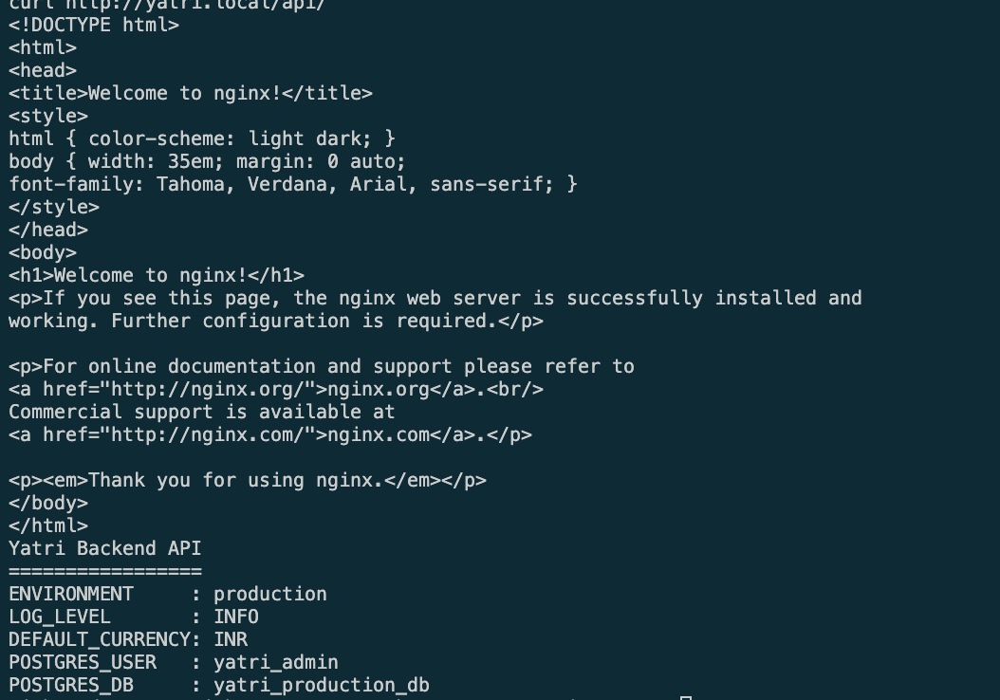
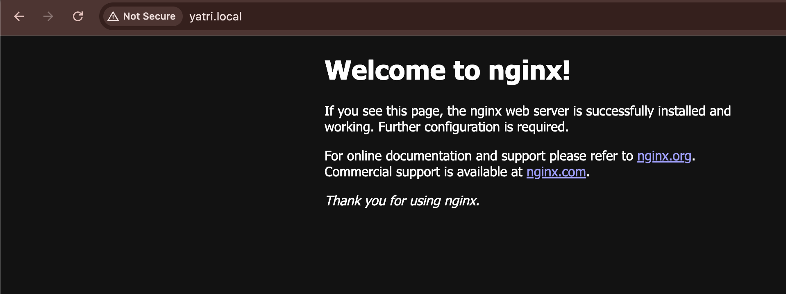
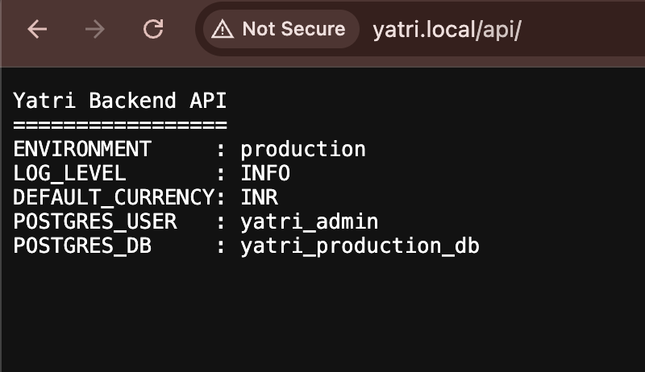

# Kubernetes Ingress, ConfigMaps, and Secrets

This full demo runs a frontend and backend behind one Ingress rule.

```text
yatri.local/       → Frontend Service → NGINX Pods
yatri.local/api/   → Backend Service  → Python Pods
```

## ConfigMap

The ConfigMap stores non-sensitive application settings such as the
environment, log level, currency, and port. Both workloads receive these values
as environment variables, so configuration can change without rebuilding an
image.

## Secret

The Secret stores the database username, password, and database name. The
backend receives these as environment variables. Secret values are Base64
encoded, not encrypted, so they should never be printed in screenshots.

## Ingress

The NGINX Ingress controller provides one entry point for both services.
Requests to `/` reach the frontend, while requests to `/api/` are routed to the
backend. The rewrite rule removes the `/api` prefix before the backend receives
the request.

## Evidence

The terminal test confirms that the Ingress routes the root path to the
frontend and `/api/` to the backend. The backend response displays values from
the ConfigMap and non-sensitive Secret fields; the password is not shown.



The frontend is available at `yatri.local/` through the Ingress rule.



The `/api/` route reaches the backend and confirms the injected configuration
and database username and name.



## Key Takeaway

ConfigMaps separate ordinary configuration from images, Secrets keep sensitive
values out of application code, and Ingress gives multiple services one
host-based, path-based entry point.
