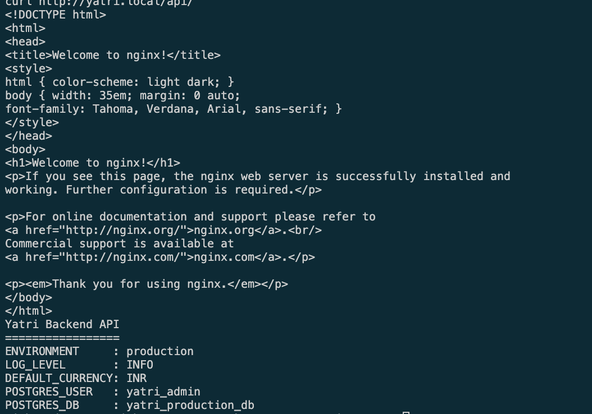
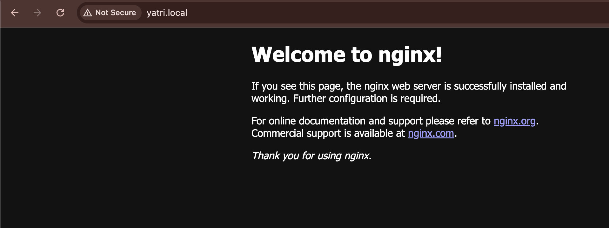
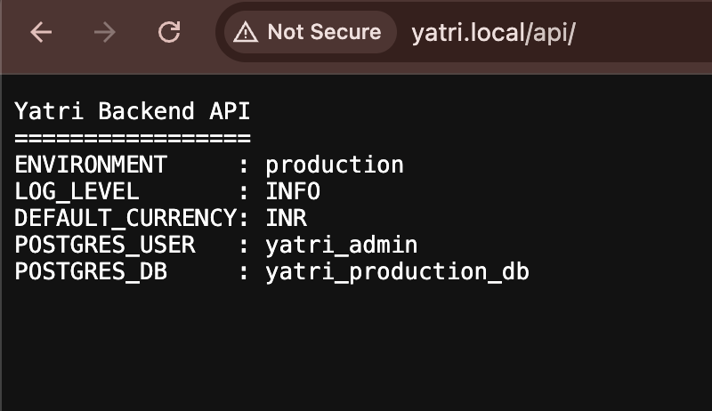

# Kubernetes Ingress, ConfigMaps, and Secrets

This full demo runs a frontend and backend behind one Ingress rule.

```text
yatri.local/       → Frontend Service → NGINX Pods
yatri.local/api/   → Backend Service  → Python Pods
```

## ConfigMap

The ConfigMap stores non-sensitive application settings such as the
environment, log level, currency, and port. Both workloads receive these values
as environment variables, so configuration can change without rebuilding an
image.

## Secret

The Secret stores the database username, password, and database name. The
backend receives these as environment variables. Secret values are Base64
encoded, not encrypted, so they should never be printed in screenshots.

### Why Secrets should not be committed to Git

A Kubernetes Secret is **base64-encoded, not encrypted**. Anyone who can read
the YAML can decode it in one command:

```bash
echo 'cGFzc3dvcmQxMjM=' | base64 -d      # -> password123
```

Committing that YAML to Git causes problems that cannot be undone by deleting
the file later:

- **Git history is permanent.** A later commit that removes the file leaves the
  value in every clone, every fork and every CI cache. Removing it properly
  means rewriting history, and the credential must be rotated anyway.
- **Repositories leak.** They get made public, cloned to laptops, mirrored and
  shared with contractors. Bots scan public GitHub for credentials within
  minutes of a push.
- **Access is too broad.** Everyone with repository read access gets
  production credentials, which defeats Kubernetes RBAC on Secrets.

What to do instead:

| Approach | How it works |
| --- | --- |
| Create Secrets out-of-band | `kubectl create secret generic db --from-literal=password=...` — never written to a file |
| Sealed Secrets | Commit an *encrypted* `SealedSecret`; only the in-cluster controller can decrypt it |
| External Secrets Operator | Commit a reference; values are pulled from AWS Secrets Manager, Vault or GCP Secret Manager |
| SOPS | Encrypt the values inside the YAML with KMS or age keys; safe to commit |
| Secret scanning | Gitleaks or TruffleHog in pre-commit hooks and CI ([Session 17](../16-cicd-devsecops/)) to stop leaks before they land |

The `secret.yaml` in this demo holds throwaway lab values. A real project
would use one of the approaches above.

## Ingress

The NGINX Ingress controller provides one entry point for both services.
Requests to `/` reach the frontend, while requests to `/api/` are routed to the
backend. The rewrite rule removes the `/api` prefix before the backend receives
the request.

## Evidence

The terminal test confirms that the Ingress routes the root path to the
frontend and `/api/` to the backend. The backend response displays values from
the ConfigMap and non-sensitive Secret fields; the password is not shown.



The frontend is available at `yatri.local/` through the Ingress rule.



The `/api/` route reaches the backend and confirms the injected configuration
and database username and name.



## Task 4 — Ingress vs Ingress Controller

[ingress-vs-ingress-controller/README.md](ingress-vs-ingress-controller/README.md)
explains what each one is, how they differ, why both are required, and gives
examples — including how to recognise an Ingress that no controller has
claimed.

## Task 5 — Troubleshooting

[troubleshooting/README.md](troubleshooting/README.md) covers four broken
scenarios: a missing ConfigMap, a wrong Secret key, an Ingress pointing at a
non-existent Service, and an Ingress with a class no controller implements.
Each was identified, investigated, root-caused, fixed and verified, with
before/after output in [troubleshooting/EVIDENCE.md](troubleshooting/EVIDENCE.md).

## Key Takeaway

ConfigMaps separate ordinary configuration from images, Secrets keep sensitive
values out of application code, and Ingress gives multiple services one
host-based, path-based entry point.
