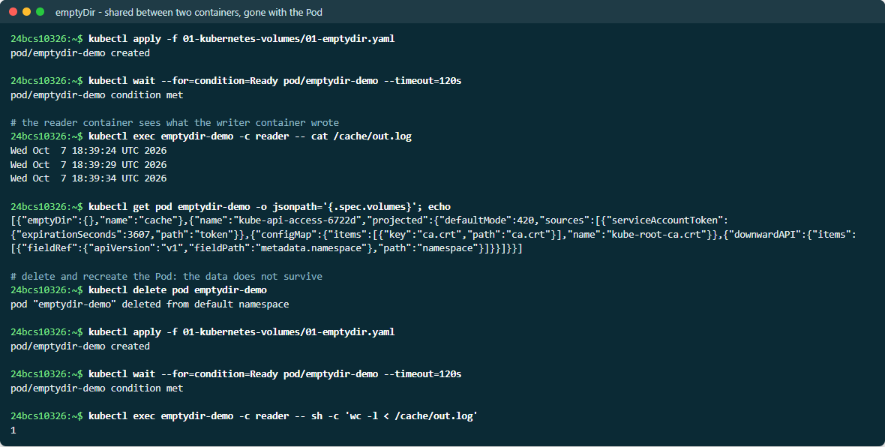
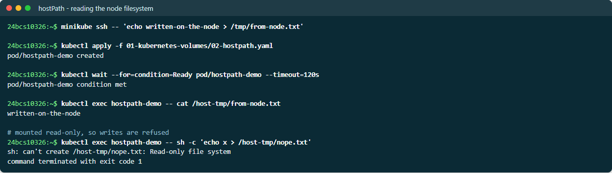
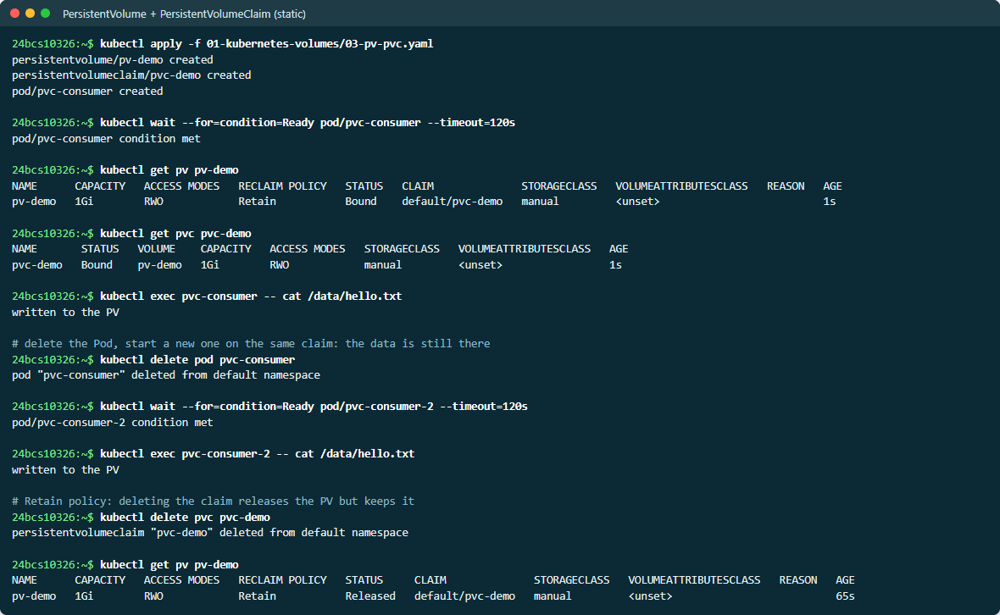
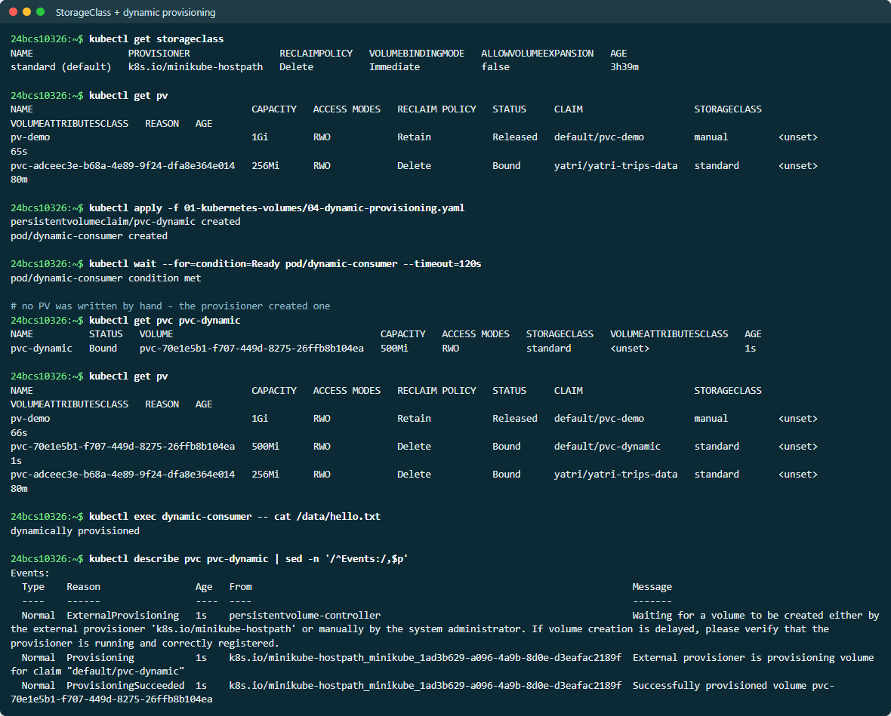

# Kubernetes Volumes

A container filesystem is ephemeral. When a container restarts, everything it
wrote is gone — not when the *Pod* restarts, when the **container** restarts.
Volumes exist to decouple data lifetime from container lifetime.

Each example has a manifest in this folder and was applied on minikube. The
results are summarised [at the end](#verified-on-the-cluster), with raw output
in [EVIDENCE.md](EVIDENCE.md).

| Type | Lifetime | Survives container restart | Survives Pod delete | Typical use |
| --- | --- | --- | --- | --- |
| `emptyDir` | Pod | Yes | **No** | Scratch space, cache, sidecar hand-off |
| `hostPath` | Node | Yes | Yes (data stays on that node) | Node agents, log collectors |
| PersistentVolume | Independent | Yes | Yes | Real durable storage |
| PersistentVolumeClaim | Namespace | Yes | Yes | How a Pod *requests* a PV |
| StorageClass | Cluster | n/a | n/a | Template for creating PVs on demand |

## emptyDir

An empty directory created when the Pod is assigned to a node, and deleted
permanently when the Pod is removed. All containers in the Pod can mount it,
which makes it the standard way for a sidecar to share files with the main
container.

```yaml
apiVersion: v1
kind: Pod
metadata:
  name: emptydir-demo
spec:
  containers:
    - name: writer
      image: busybox:1.36
      command: ["/bin/sh", "-c", "while true; do date >> /cache/out.log; sleep 5; done"]
      volumeMounts:
        - name: cache
          mountPath: /cache
    - name: reader
      image: busybox:1.36
      command: ["/bin/sh", "-c", "sleep 10; tail -f /cache/out.log"]
      volumeMounts:
        - name: cache
          mountPath: /cache      # same volume, both containers see it
  volumes:
    - name: cache
      emptyDir: {}
```

A useful variant puts it in RAM instead of on disk — fast, but it counts
against the container memory limit:

```yaml
  volumes:
    - name: cache
      emptyDir:
        medium: Memory
        sizeLimit: 64Mi
```

**The trap:** people reach for `emptyDir` expecting persistence. Delete the Pod
and the data is gone. A Deployment rolling update deletes Pods, so an
`emptyDir` does *not* survive a deploy.

> **Screenshots:** live output from a second run on 2026-10-07, so names and ages differ from the evidence text.



## hostPath

Mounts a file or directory from the **node's** filesystem into the Pod.

```yaml
apiVersion: v1
kind: Pod
metadata:
  name: hostpath-demo
spec:
  containers:
    - name: reader
      image: busybox:1.36
      command: ["/bin/sh", "-c", "ls /host-logs; sleep 3600"]
      volumeMounts:
        - name: logs
          mountPath: /host-logs
          readOnly: true
  volumes:
    - name: logs
      hostPath:
        path: /var/log
        type: Directory
```

`type` is worth setting — `Directory` fails fast if the path is missing,
whereas `DirectoryOrCreate` creates it.

**Use it for:** node-level agents — log shippers, monitoring exporters, CNI
plugins. These are legitimately node-scoped.

**Do not use it for application data.** Two reasons: the Pod is tied to
whichever node holds the data, so rescheduling loses it; and a writable
`hostPath` is a serious security hole — mounting `/` or the container runtime
socket is a straightforward container escape. Most clusters block it with Pod
Security Admission (`baseline` and `restricted` both forbid it).



## PersistentVolume (PV)

A **cluster-level** piece of storage, provisioned either by an administrator
(static) or automatically by a StorageClass (dynamic). It is not namespaced
and its lifecycle is independent of any Pod.

```yaml
apiVersion: v1
kind: PersistentVolume
metadata:
  name: pv-demo
spec:
  capacity:
    storage: 1Gi
  accessModes:
    - ReadWriteOnce
  persistentVolumeReclaimPolicy: Retain
  storageClassName: manual
  hostPath:                     # a real cluster would use EBS, NFS, Ceph...
    path: /mnt/data
```

**Access modes:**

| Mode | Short | Meaning |
| --- | --- | --- |
| `ReadWriteOnce` | RWO | Mounted read-write by a single **node** (not a single Pod) |
| `ReadOnlyMany` | ROX | Mounted read-only by many nodes |
| `ReadWriteMany` | RWX | Mounted read-write by many nodes — needs NFS/CephFS/EFS |
| `ReadWriteOncePod` | RWOP | Exactly one Pod, cluster-wide |

Block storage like AWS EBS or GCP PD is RWO only. Expecting RWX from EBS is a
common and painful mistake.

**Reclaim policy** — what happens when the claim is deleted:

| Policy | Effect |
| --- | --- |
| `Delete` | The underlying storage is destroyed. Default for dynamic provisioning. |
| `Retain` | The PV stays as `Released`; data is kept but needs manual cleanup before reuse. |

## PersistentVolumeClaim (PVC)

A PVC is a **request** for storage: "I need 5Gi, ReadWriteOnce". It is
namespaced, and it is what a Pod actually references. The separation matters —
developers write PVCs and never need to know whether the cluster runs on EBS,
Ceph or NFS.

```yaml
apiVersion: v1
kind: PersistentVolumeClaim
metadata:
  name: pvc-demo
spec:
  accessModes:
    - ReadWriteOnce
  resources:
    requests:
      storage: 1Gi
  storageClassName: manual
---
apiVersion: v1
kind: Pod
metadata:
  name: pvc-consumer
spec:
  containers:
    - name: app
      image: nginx:1.25-alpine
      volumeMounts:
        - name: data
          mountPath: /usr/share/nginx/html
  volumes:
    - name: data
      persistentVolumeClaim:
        claimName: pvc-demo
```

**Binding:** the control plane matches a `Pending` PVC to a suitable PV by
size, access mode and `storageClassName`. Once bound the relationship is
exclusive and one-to-one — a second PVC cannot bind the same PV.

```bash
kubectl get pv,pvc
# STATUS: Available -> Bound -> Released
```



A PVC stuck in `Pending` means either no PV matches, or the StorageClass has
no provisioner. `kubectl describe pvc` says which.

## StorageClass

A template describing *how* to create storage on demand, so nobody has to
pre-create PVs by hand.

```yaml
apiVersion: storage.k8s.io/v1
kind: StorageClass
metadata:
  name: fast-ssd
provisioner: kubernetes.io/aws-ebs
parameters:
  type: gp3
  encrypted: "true"
reclaimPolicy: Delete
allowVolumeExpansion: true
volumeBindingMode: WaitForFirstConsumer
```

Key fields:

- **`provisioner`** — the CSI driver that creates the volume
  (`ebs.csi.aws.com`, `disk.csi.azure.com`, `k8s.io/minikube-hostpath` …).
- **`parameters`** — passed straight to the driver: disk type, IOPS, encryption.
- **`allowVolumeExpansion`** — lets you grow a PVC later by editing its size.
- **`volumeBindingMode: WaitForFirstConsumer`** — delays creating the volume
  until a Pod is scheduled, so the disk is created in the *same availability
  zone* as the Pod. Without it, a volume in `us-east-1a` can leave a Pod
  permanently unschedulable because the only free capacity is in `1b`.

```bash
kubectl get storageclass
# the one marked (default) is used when a PVC omits storageClassName
```

## Dynamic provisioning

Static provisioning means an admin creates PVs ahead of time and hopes the
sizes match what developers ask for. Dynamic provisioning removes that step.

```text
1. User creates a PVC naming a StorageClass (or omitting it, taking the default)
2. The PVC is Pending; no matching PV exists
3. The external provisioner for that StorageClass sees the PVC
4. It calls the storage backend (CreateVolume on the CSI driver)
5. It creates a PV object representing the new disk
6. The PV binds to the PVC -> STATUS: Bound
7. The Pod is scheduled, the volume is attached to the node and mounted
```

All the user writes is this:

```yaml
apiVersion: v1
kind: PersistentVolumeClaim
metadata:
  name: app-data
spec:
  accessModes: [ReadWriteOnce]
  resources:
    requests:
      storage: 10Gi
  # storageClassName omitted -> the default StorageClass is used
```

For StatefulSets this is combined with `volumeClaimTemplates`, which creates
one PVC per replica automatically:

```yaml
  volumeClaimTemplates:
    - metadata:
        name: data
      spec:
        accessModes: [ReadWriteOnce]
        resources:
          requests:
            storage: 10Gi
```

That yields `data-mysql-0`, `data-mysql-1`, `data-mysql-2` — and crucially,
when `mysql-1` is rescheduled it reattaches to *its own* `data-mysql-1`, which
is what makes a StatefulSet actually stateful.



## Summary

```text
StorageClass  --(dynamically creates)-->  PersistentVolume
                                                 ^
                                                 | bound to
                                                 |
Pod  --(references)-->  PersistentVolumeClaim ----+
```

Choose by the question *"how long must this data live?"*:

- **Just this Pod** → `emptyDir`
- **This node, node-level data** → `hostPath`
- **Longer than any Pod** → PVC backed by a StorageClass

## Verified on the cluster

| Manifest | What was proven |
| --- | --- |
| [01-emptydir.yaml](01-emptydir.yaml) | The `reader` container saw lines written by the `writer` container. After deleting and recreating the Pod, the log had **1** line — the old data was gone |
| [02-hostpath.yaml](02-hostpath.yaml) | A file written on the minikube node (`/tmp/from-node.txt`) was readable in the Pod. Writing failed with `Read-only file system` because the mount is `readOnly` |
| [03-pv-pvc.yaml](03-pv-pvc.yaml) | PVC `Bound` to `pv-demo`. A **new** Pod on the same claim read `written to the PV`. Deleting the PVC left the PV `Released`, not deleted (`Retain`) |
| [04-dynamic-provisioning.yaml](04-dynamic-provisioning.yaml) | No PV was written by hand; `k8s.io/minikube-hostpath` created `pvc-3310386a-…` within a second (`ProvisioningSucceeded`), with reclaim policy `Delete` from the StorageClass |

```text
$ kubectl get pv
NAME                                       CAPACITY   RECLAIM POLICY   STATUS     CLAIM                 STORAGECLASS
pv-demo                                    1Gi        Retain           Released   default/pvc-demo      manual
pvc-3310386a-fad4-43ce-a17d-4f9fc9d5b0c1   500Mi      Delete           Bound      default/pvc-dynamic   standard

$ kubectl get storageclass
NAME                 PROVISIONER                RECLAIMPOLICY   VOLUMEBINDINGMODE
standard (default)   k8s.io/minikube-hostpath   Delete          Immediate
```

The two PVs side by side show both provisioning models: one created by hand
(`manual`, `Retain`, now `Released`), and one created on demand by the
StorageClass (`standard`, `Delete`, `Bound`).
