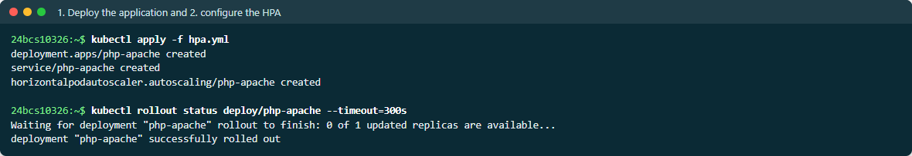
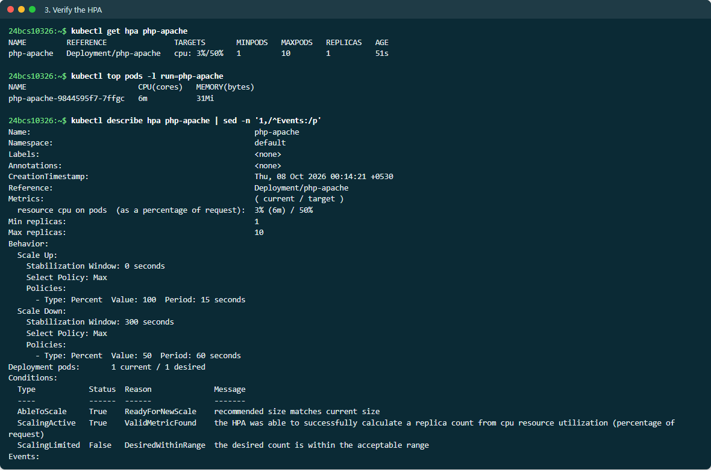
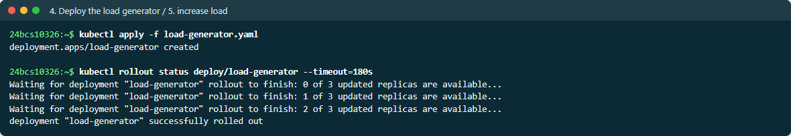
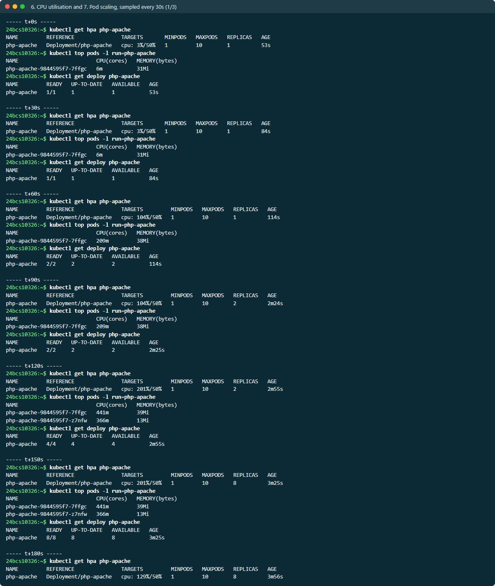
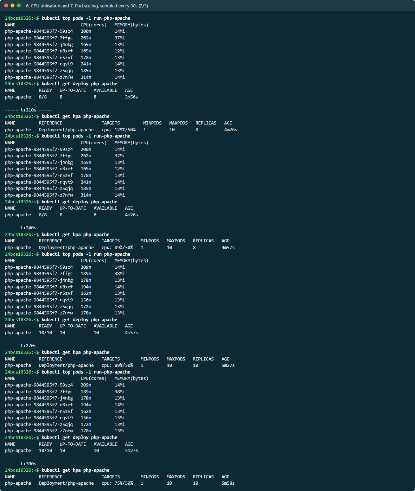
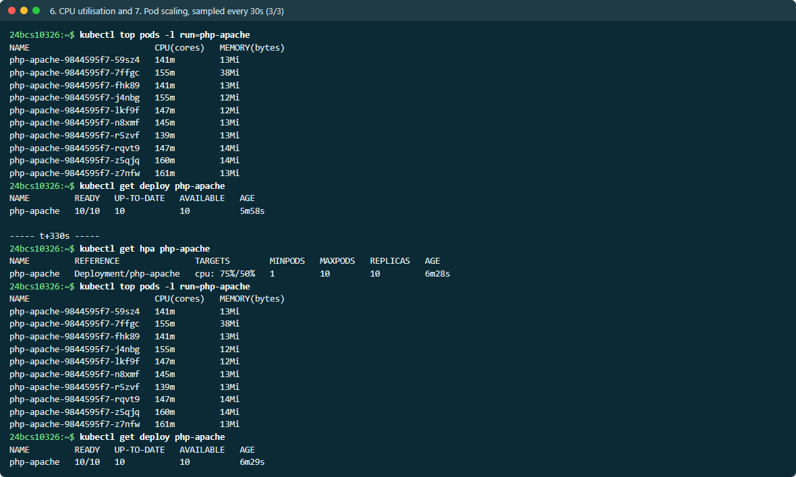
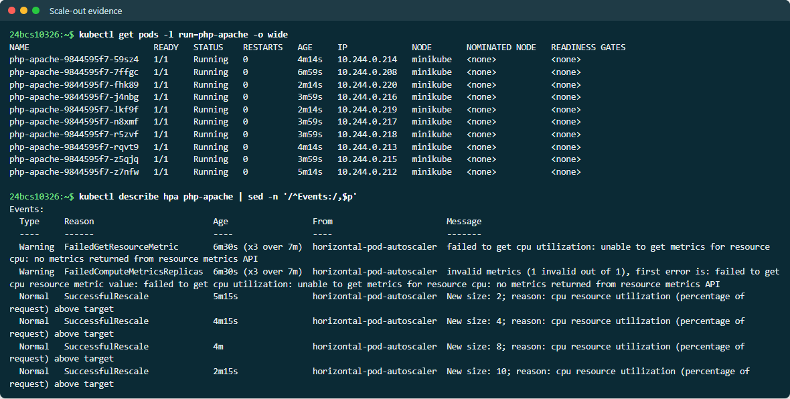
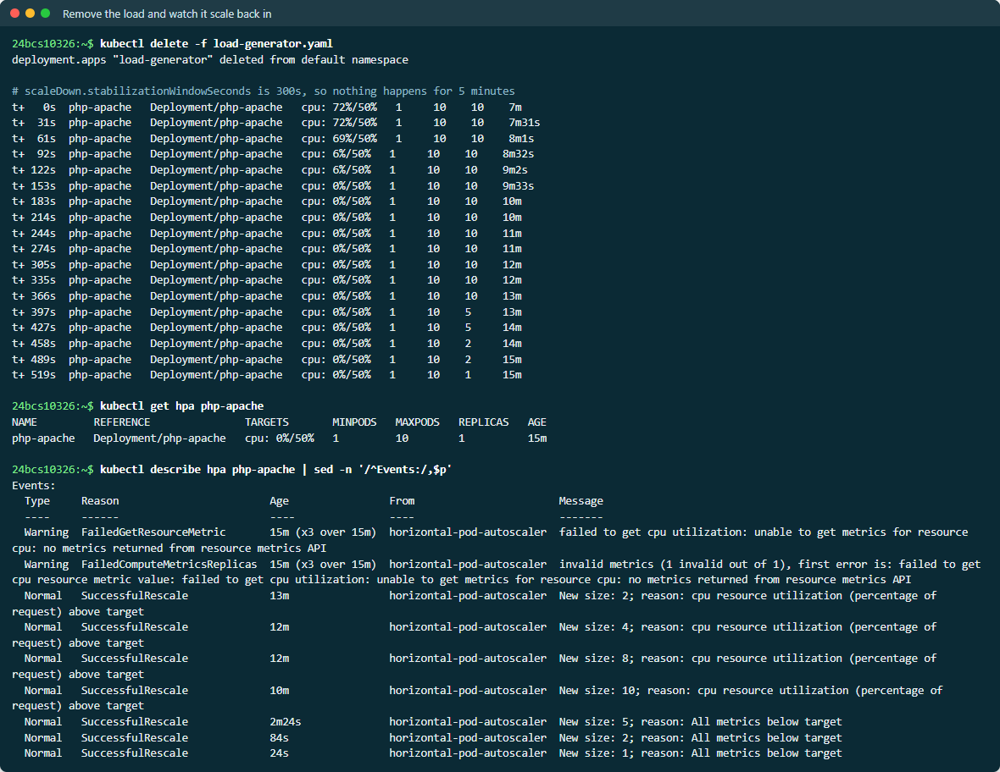

# HPA — Horizontal Pod Autoscaler

| File | Contents |
| --- | --- |
| [hpa.yml](hpa.yml) | `php-apache` Deployment (CPU request 200m) + Service + `autoscaling/v2` HPA: 1–10 replicas, target 50% CPU, explicit scale-up and scale-down behaviour |
| [load-generator.yaml](load-generator.yaml) | 3 BusyBox Pods running an infinite `wget` loop against the Service |

Full output is in [EVIDENCE.md](EVIDENCE.md).

## How the HPA decides

Every 15 seconds the HPA controller reads the Pods' CPU usage from
**metrics-server** and computes:

```text
desiredReplicas = ceil( currentReplicas × currentUtilisation / targetUtilisation )
```

Utilisation is measured **against the CPU request**, not the limit. With a
200m request, a Pod using 330m reports **165%**. That is why the HPA does
nothing — and shows `<unknown>` — for a container without requests.

The `behavior` block shapes how fast it acts:

| | Setting | Effect |
| --- | --- | --- |
| scaleUp | `stabilizationWindowSeconds: 0`, at most +100% every 15s | React to load immediately, at most doubling each step |
| scaleDown | `stabilizationWindowSeconds: 300`, at most −50% per minute | Wait for 5 minutes of consistently lower recommendations before removing Pods |

## The run, step by step

```bash
kubectl apply -f hpa.yml                 # 1-2. deploy the app and configure the HPA
kubectl get hpa php-apache               # 3. verify
kubectl apply -f load-generator.yaml     # 4-5. deploy the load generator, increase load
kubectl get hpa php-apache -w            # 6. CPU utilisation
kubectl get deploy php-apache -w         # 7. Pod scaling
kubectl top pods -l run=php-apache
kubectl describe hpa php-apache
```

**3 — verify, before any load:**

```text
NAME         REFERENCE               TARGETS       MINPODS   MAXPODS   REPLICAS
php-apache   Deployment/php-apache   cpu: 0%/50%   1         10        1

Conditions:
  AbleToScale     True    ScaleDownStabilized
  ScalingActive   True    ValidMetricFound     the HPA was able to successfully calculate a replica count from cpu ...
  ScalingLimited  False   DesiredWithinRange
```

**6 & 7 — CPU utilisation and Pod scaling, sampled every 30 seconds after the
load started:**

```text
 time    TARGETS          REPLICAS   Deployment READY
 t+0s    cpu: 0%/50%         1          1/1
 t+30s   cpu: 0%/50%         1          1/1
 t+60s   cpu: 165%/50%       1          2/2      <- load arrives; first scale-up
 t+90s   cpu: 165%/50%       4          4/4
 t+120s  cpu: 150%/50%       4          8/8
 t+150s  cpu: 150%/50%       9          9/9
 t+180s  cpu: 76%/50%        9         10/10     <- maxReplicas reached
 t+240s  cpu: 64%/50%       10         10/10
 t+300s  cpu: 58%/50%       10         10/10     <- still above target, but capped at 10
```

What this shows:

- The Deployment went **1 → 2 → 4 → 8 → 9 → 10**. Each step was at most a
  doubling, as the policy allows; the last two steps were single Pods as the
  formula's answer approached `maxReplicas`.
- Utilisation fell as replicas were added (165% → 58%) because the same load
  was spread across more Pods.
- At 10 replicas it stayed above the 50% target. The HPA was **capped by
  `maxReplicas`**, and capacity was exhausted. In production that state
  deserves an alert (see the `YatriHPAMaxedOut` rule in the
  [final project](../../20-final-devops-project/monitoring/config/yatri-rules.yml)).

**Scale-in** — a second run, observed all the way down:

```text
            TARGETS         REPLICAS
t+   0s     cpu: 143%/50%    6       <- load generator deleted here
t+  62s     cpu:  98%/50%   10       <- scaled UP after the load was gone: metrics lag ~1 min
t+ 123s     cpu:  19%/50%   10
t+ 184s     cpu:   0%/50%   10       <- idle, but the 300s stabilisation window holds
t+ 396s     cpu:   0%/50%   10
t+ 427s     cpu:   0%/50%    5       <- window expired: -50%
t+ 457s     cpu:   0%/50%    2       <- -50% again, one period later
t+ 518s     cpu:   0%/50%    1       <- minReplicas

Normal  SuccessfulRescale  New size: 10; reason: cpu resource utilization (percentage of request) above target
Normal  SuccessfulRescale  New size: 5;  reason: All metrics below target
Normal  SuccessfulRescale  New size: 2;  reason: All metrics below target
Normal  SuccessfulRescale  New size: 1;  reason: All metrics below target
```

Two behaviours are visible:

- **Metrics lag.** metrics-server samples roughly every 15–60s, so the HPA
  acted on stale data and scaled *up* to 10 a minute after the load had
  stopped. Autoscaling always reacts to the recent past.
- **Scale-down is deliberately slow.** CPU was 0% from about t+184s, but the
  HPA waited until 300s after its last high recommendation, then removed at
  most 50% per minute (10 → 5 → 2 → 1). This damping prevents flapping when
  load is bursty.

> **Screenshots:** live output from a second, complete run on 2026-10-07: scale-out 1 → 2 → 4 → 8 → 10 under load, then scale-in 10 → 5 → 2 → 1 once the 300 s stabilization window passed. Every command the task lists (`get hpa`, `get pods`, `top pods`, `describe hpa`) is in the samples.

















## Requirements and gotchas

- **metrics-server** must be running (`minikube addons enable metrics-server`),
  otherwise `TARGETS` shows `<unknown>`.
- Every container in the target Pods needs a **CPU request**.
- **Unready Pods are ignored** when computing utilisation (see the
  [mini project](../04-mini-project/), where failing probes left CPU at
  `<unknown>`).
- `registry.k8s.io/hpa-example` is only published as `:latest`, and `:latest`
  implies `imagePullPolicy: Always`. During this lab that put every Pod start
  behind a slow, serialised image pull, so `hpa.yml` now sets
  `imagePullPolicy: IfNotPresent` explicitly.
- Don't hard-code `replicas` in a Deployment that an HPA manages. Every
  `kubectl apply` would reset the count (and GitOps tools need to ignore that
  field — see the Argo CD `ignoreDifferences` in the final project).
