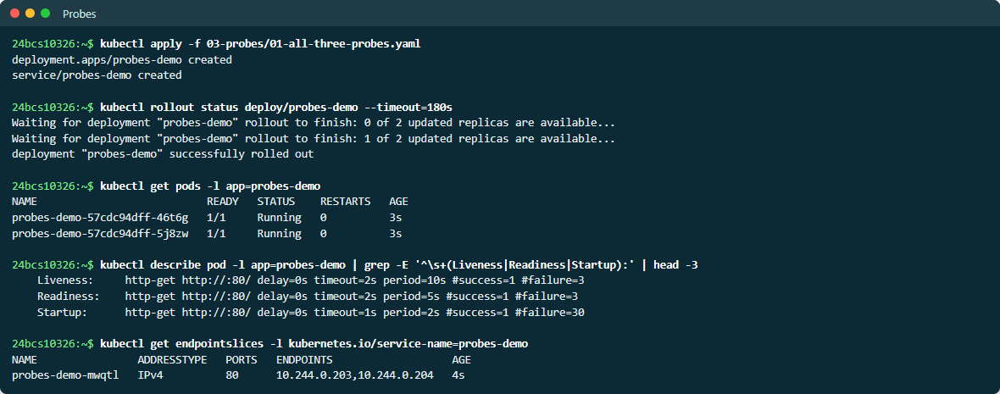
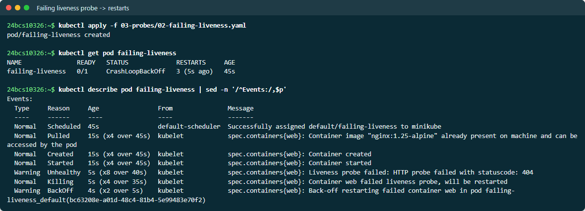
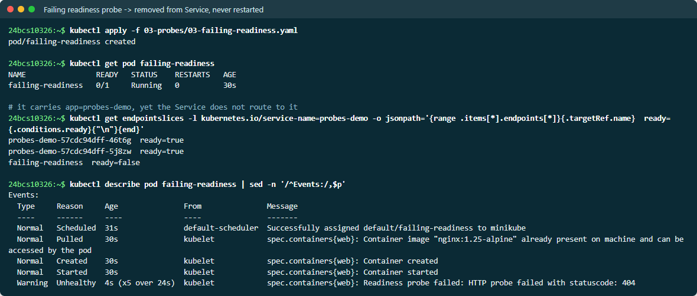
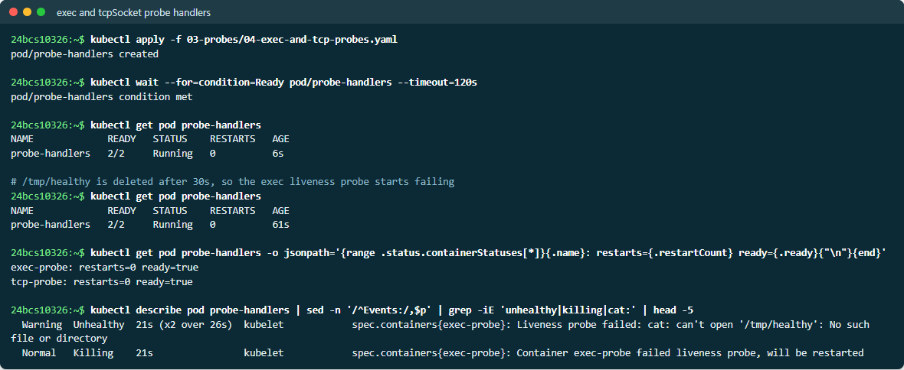

# Probes

Probes are how the kubelet asks a container *"are you OK?"*. There are three
kinds, and each one answers a different question with a different consequence.

| Probe | Question | On failure | Typical check |
| --- | --- | --- | --- |
| **startup** | Has it finished starting? | Keeps the other two probes **disabled** until it passes; if it never passes, the container is restarted | Same as liveness, with a generous `failureThreshold` |
| **readiness** | Can it take traffic *right now*? | Pod removed from Service endpoints — **not restarted** | Dependencies reachable, warm-up done |
| **liveness** | Is it hopelessly stuck? | Container **killed and restarted** | Process responds at all |

Handlers: `httpGet` (2xx/3xx = success), `tcpSocket` (port accepts a
connection), `exec` (command exits 0), and `grpc`.

Full output is in [EVIDENCE.md](EVIDENCE.md).

## 01 — All three together

[01-all-three-probes.yaml](01-all-three-probes.yaml): a two-replica nginx
Deployment.

```text
Liveness:   http-get http://:80/ delay=0s timeout=2s period=10s #success=1 #failure=3
Readiness:  http-get http://:80/ delay=0s timeout=2s period=5s  #success=1 #failure=3
Startup:    http-get http://:80/ delay=0s timeout=1s period=2s  #success=1 #failure=30

probes-demo-d4h4t   IPv4   80   10.244.0.97,10.244.0.96     <- both Pods in the Service
```

The startup probe allows up to 30 × 2s = 60s to boot. Without it, a slow
starter needs a large liveness `initialDelaySeconds`, which also delays
detecting a real hang later.

> **Screenshots:** live output from a second run on 2026-10-07, so names and ages differ from the evidence text.



## 02 — Failing liveness → restarts

[02-failing-liveness.yaml](02-failing-liveness.yaml) probes `/healthz`, which
nginx does not serve.

```text
failing-liveness   1/1   Running   2 (14s ago)   45s

Warning  Unhealthy  Liveness probe failed: HTTP probe failed with statuscode: 404
Normal   Killing    Container web failed liveness probe, will be restarted
```

Two restarts in 45 seconds. The application itself was fine — nginx was
serving `/` — but a liveness probe pointed at the wrong path kills a healthy
container over and over. **A wrong liveness probe is worse than none.**



## 03 — Failing readiness → no traffic, no restart

[03-failing-readiness.yaml](03-failing-readiness.yaml) carries the same
`app=probes-demo` label as the Deployment above, so the Service selects it —
but its readiness probe always fails.

```text
failing-readiness   0/1   Running   0   30s          <- never restarted

$ kubectl get endpointslices ... -o jsonpath='{.targetRef.name} ready={.conditions.ready}'
probes-demo-57cdc94dff-448kt  ready=true
probes-demo-57cdc94dff-tv57t  ready=true
failing-readiness             ready=false              <- listed, but not routed to

Warning  Unhealthy  Readiness probe failed: HTTP probe failed with statuscode: 404
```

The Pod is selected by the Service, yet marked `ready=false` in the
EndpointSlice, so kube-proxy sends it no traffic. `RESTARTS` stays at 0.



## 04 — exec and tcpSocket handlers

[04-exec-and-tcp-probes.yaml](04-exec-and-tcp-probes.yaml) is a two-container
Pod:

- `exec-probe` runs `cat /tmp/healthy` as its liveness probe; the container
  deletes that file after 30s.
- `tcp-probe` (nginx) uses a `tcpSocket` readiness probe on port 80.

```text
Warning  Unhealthy  Liveness probe failed: cat: can't open '/tmp/healthy': No such file or directory
Normal   Killing    Container exec-probe failed liveness probe, will be restarted

exec-probe: restarts=0 ready=true      <- sampled while the kill was still in progress
tcp-probe:  restarts=0 ready=true
```

The `Killing` event fired, yet the restart count was still 0 when sampled. The
container runs `sleep` under `/bin/sh` as **PID 1**, which ignores `SIGTERM`, so
the kubelet waits the full `terminationGracePeriodSeconds` (30s) before
sending `SIGKILL`. Applications that do not handle `SIGTERM` slow down every
restart and every rolling update in exactly this way.



## Choosing probe settings

- Point liveness at something **cheap and local** — never at a database or a
  downstream service. Otherwise one dependency outage restarts every Pod at
  once.
- Readiness *may* check dependencies: removing the Pod from traffic is the
  right reaction to "I can't reach the database".
- Use a startup probe instead of a long `initialDelaySeconds`.
- `failureThreshold × periodSeconds` is the time until action. Make it longer
  than a normal GC pause or a brief load spike.
