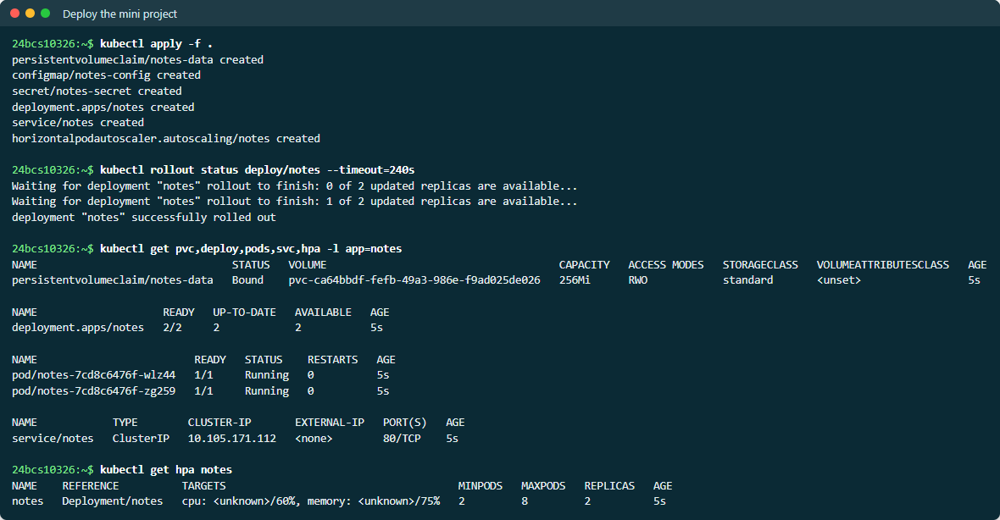
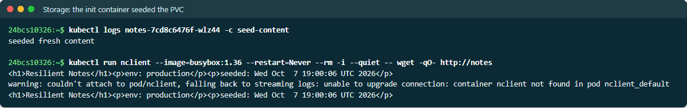
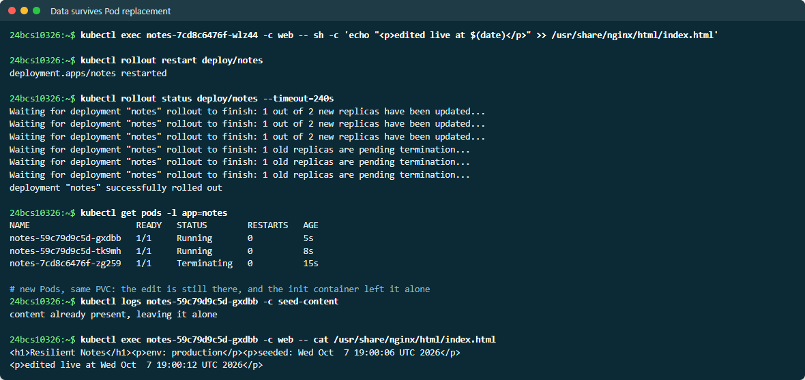
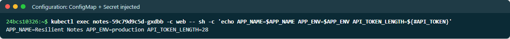
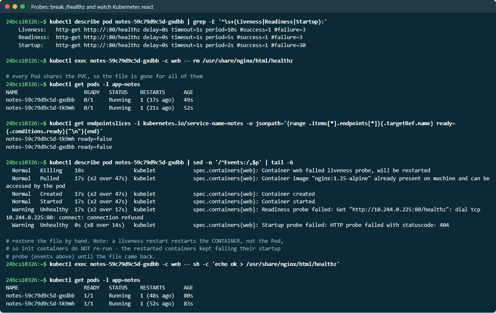
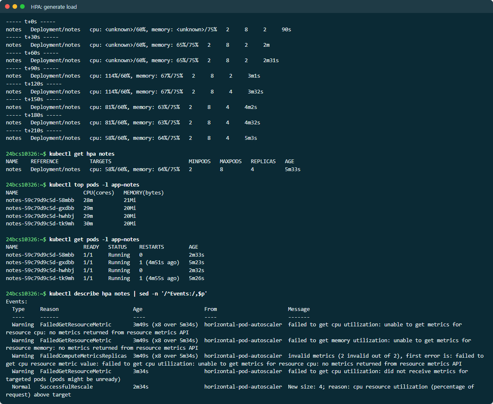

# Mini Project — Resilient Notes

One small application that uses everything from this session together:
**persistent storage, all three probes, and autoscaling**, plus a ConfigMap
and a Secret. Full run output is in [EVIDENCE.md](EVIDENCE.md).

```text
                    ┌──────────────────── Deployment: notes ─────────────────────┐
  Service notes ──► │  initContainer seed-content ──writes──► /data/index.html   │
  (ClusterIP)       │  container web (nginx)    ──serves──── /data  (PVC)        │
                    │     startup / readiness / liveness  ->  GET /healthz       │
                    │     envFrom: ConfigMap notes-config, Secret notes-secret   │
                    └────────────────────────────────────────────────────────────┘
                         ▲ scales 2..8 on CPU 60% / memory 75%       │
                    HorizontalPodAutoscaler                 PVC notes-data (256Mi,
                                                            dynamic, StorageClass standard)
```

| File | Contents |
| --- | --- |
| [01-storage.yaml](01-storage.yaml) | `PersistentVolumeClaim` — dynamically provisioned |
| [02-config.yaml](02-config.yaml) | `ConfigMap` (app name, env) + `Secret` (API token) |
| [03-deployment.yaml](03-deployment.yaml) | Init container, nginx, three probes, resources, Service |
| [04-hpa.yaml](04-hpa.yaml) | CPU **and** memory targets, scale-up/scale-down behaviour |

```bash
kubectl apply -f .
```

## What the run demonstrated

**Storage — seeded once, survives Pod replacement.** The init container only
writes `index.html` if it is not already on the volume:

```text
$ kubectl logs <first pod> -c seed-content
seeded fresh content

# edit the page live, then replace every Pod with a rollout restart
$ kubectl logs <new pod> -c seed-content
content already present, leaving it alone

$ kubectl exec <new pod> -c web -- cat /usr/share/nginx/html/index.html
<h1>Resilient Notes</h1><p>env: production</p><p>seeded: Wed Oct  7 16:01:17 UTC 2026</p>
<p>edited live at Wed Oct  7 16:01:23 UTC 2026</p>
```

> **Screenshots:** live output from a second run on 2026-10-07, so names and ages differ from the evidence text.













New Pods, same PVC, and the live edit was still there.

**Configuration — injected, not baked in:**

```text
APP_NAME=Resilient Notes APP_ENV=production API_TOKEN_LENGTH=28
```

The token was verified by length only, never printed.

**Probes — a shared dependency failing.** Deleting `/healthz` from the shared
volume broke the health check for *every* replica at once:

```text
notes-...-dvpwz   0/1   Running   1 (14s ago)
notes-...-rgk6q   0/1   Running   1 (17s ago)

notes-...-rgk6q ready=false
notes-...-dvpwz ready=false          <- Service has no ready endpoints

Warning  Unhealthy  Liveness probe failed: HTTP probe failed with statuscode: 404
Normal   Killing    Container web failed liveness probe, will be restarted
Warning  Unhealthy  Startup probe failed: HTTP probe failed with statuscode: 404
```

Two lessons:

1. Readiness removed both Pods from the Service, and liveness restarted both.
   Because the health file lived on *shared* storage, one bad write took the
   whole service down. A health check should reflect the state of **this
   Pod** only.
2. The restarts did not fix anything. A liveness restart restarts the
   *container*, not the Pod, so the init container that creates `/healthz`
   did **not** run again, and the restarted containers kept failing their
   startup probe until the file was restored by hand. Both Pods then returned
   to `1/1 Running`.

**Autoscaling — CPU drove the decision:**

```text
t+0s     cpu: <unknown>/60%, memory: 57%/75%   replicas 2
t+90s    cpu: 120%/60%,      memory: 69%/75%   replicas 2
t+120s   cpu: 120%/60%,      memory: 69%/75%   replicas 4     <- scaled out
t+210s   cpu: 61%/60%,       memory: 66%/75%   replicas 4     <- settled near target

Normal   SuccessfulRescale   New size: 4; reason: cpu resource utilization (percentage of request) above target
```

CPU showed `<unknown>` for the first minute, and the HPA events explain why:
`did not receive metrics for targeted pods (pods might be unready)`. The probe
test had just made both Pods unready, and **the HPA ignores unready Pods** when
computing utilisation — so a fleet that is failing its probes cannot be
autoscaled out of trouble.

## Design notes

- `ReadWriteOnce` works for several replicas here only because minikube has a
  single node. On a multi-node cluster, Pods scheduled on other nodes could
  not mount the volume; that would need `ReadWriteMany` (EFS, NFS, CephFS), or
  a StatefulSet with one volume per replica.
- The HPA has a 180s scale-down stabilisation window and removes at most one
  Pod per minute. That keeps it from flapping when load dips briefly.
