# Kubernetes Troubleshooting Commands

Hands-on with each troubleshooting command, run against a small `web`
Deployment (2 × nginx) in namespace `ts-cmds`. All output is real; see
[EVIDENCE.md](EVIDENCE.md) for the complete run.

## Which command answers which question

| Question | Command |
| --- | --- |
| *What exists, and what state is it in?* | `kubectl get` |
| *Where is it running, and on which IP?* | `kubectl get -o wide` |
| *Why is it in that state?* | `kubectl describe` (read **Events** at the bottom) |
| *What did the application say?* | `kubectl logs` |
| *What does it look like from inside?* | `kubectl exec` |
| *What happened, in order?* | `kubectl events` |
| *What does this field mean?* | `kubectl explain` |
| *Is it starved of CPU or memory?* | `kubectl top` |

The usual flow is **get → describe → logs → exec**. Widen with `events` and
`top` when the cause is not inside the Pod.

## kubectl get

```bash
kubectl get nodes
kubectl get all -n ts-cmds
kubectl get pods -n ts-cmds --show-labels
kubectl get pods -A --field-selector=status.phase!=Running        # everything unhealthy, cluster-wide
kubectl get pod <pod> -o jsonpath='{.status.phase} {.status.podIP} {.spec.nodeName}'
kubectl get pods -o custom-columns=NAME:.metadata.name,IMAGE:.spec.containers[0].image,RESTARTS:.status.containerStatuses[0].restartCount
```

The `--field-selector=status.phase!=Running` query is the fastest way to find
trouble. During this run it immediately showed what was still pulling:

```text
NAMESPACE       NAME                                       READY   STATUS              RESTARTS   AGE
default         hpa-prepull                                0/1     ContainerCreating   0          2m35s
ingress-nginx   ingress-nginx-controller-d7cd8c989-tfmp7   0/1     ContainerCreating   0          27m
```

`-o jsonpath` and `-o custom-columns` pull exactly the fields you need, which is
ideal for scripts and for comparing many Pods at once.

> **Screenshots:** live output from a second run on 2026-10-07 in a scratch namespace, `ts-cmds`.

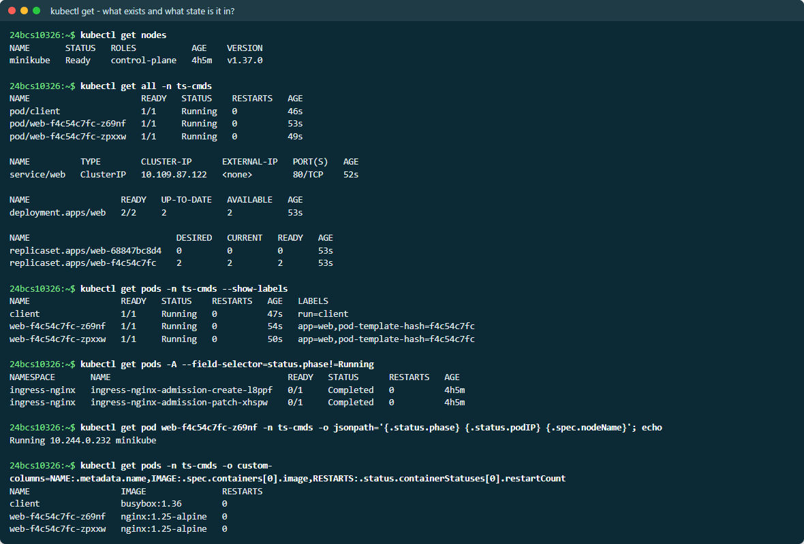

## kubectl get -o wide

Adds the Pod IP, the node, and (for Services) the selector:

```bash
kubectl get pods -n ts-cmds -o wide
kubectl get svc  -n ts-cmds -o wide        # shows SELECTOR - compare it with the Pod labels
kubectl get nodes -o wide                  # internal IP, OS image, kernel, container runtime
```

The Service `SELECTOR` column next to the Pods' `--show-labels` is how a broken
Service selector is spotted (see [common issue 06](../02-common-issues/06-service-connectivity/)).

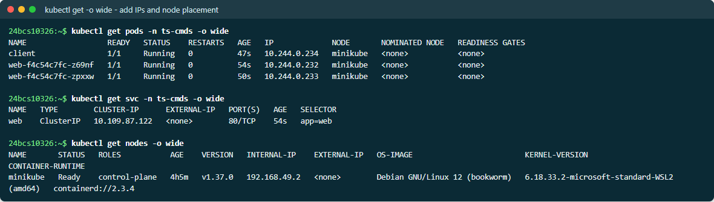

## kubectl describe

```bash
kubectl describe pod <pod> -n ts-cmds
kubectl describe svc web -n ts-cmds
kubectl describe node minikube
```

`describe` combines the object's spec, its status and conditions, and **its
recent Events**. For anything stuck — `Pending`, `ContainerCreating`,
`ImagePullBackOff`, `CreateContainerConfigError` — the Events section usually
states the cause outright, often before the container has produced a single
log line.

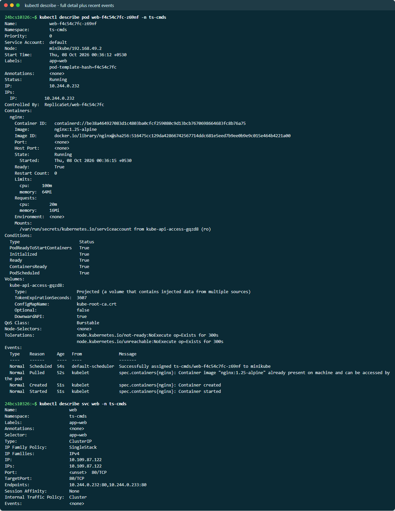

## kubectl logs

```bash
kubectl logs <pod> --tail=5
kubectl logs deploy/web --tail=3                    # picks one Pod of the Deployment
kubectl logs -l app=web --tail=2 --prefix           # every matching Pod, each line prefixed
kubectl logs <pod> --since=30s --timestamps
kubectl logs <pod> -c <container>                   # multi-container Pods / init containers
kubectl logs <pod> --previous                       # the previous container instance
```

`--prefix` with a label selector is the quickest way to read a whole
Deployment at once.

> On this cluster (Kubernetes v1.37), a crash-looping container stays in the
> `terminated` state between restarts, so plain `kubectl logs` already shows
> the crashed run. `--previous` points one instance further back and failed
> once that container had been garbage-collected. See the
> [Pod lifecycle notes](../../09-kubernetes-pods-replicasets-deployments/05-pod-lifecycle/).

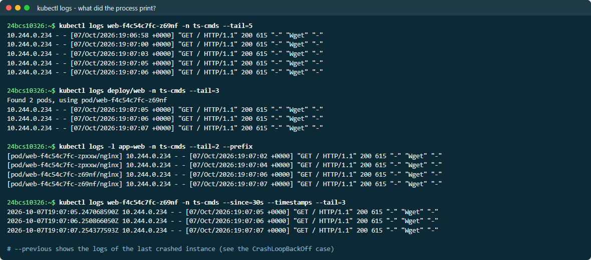

## kubectl exec

```bash
kubectl exec <pod> -- nginx -v
kubectl exec <pod> -- cat /etc/resolv.conf        # DNS configuration the Pod actually got
kubectl exec <pod> -- env                         # injected ConfigMap/Secret variables
kubectl exec <pod> -- netstat -tln                # what is listening, and on which address
kubectl exec <pod> -- sh -c 'ps aux; df -h /'
kubectl exec client -- nslookup web               # test Service DNS from another Pod
kubectl exec -it <pod> -- sh                      # interactive shell
```

`netstat -tln` shows *which address* a process is bound to. That single
command diagnosed the [loopback-bind bug](../02-common-issues/08-pod-networking/)
(`127.0.0.1:80` instead of `0.0.0.0:80`) and the
[wrong targetPort](../03-mini-project/) (`0.0.0.0:8080` while the Service sent
traffic to 80).

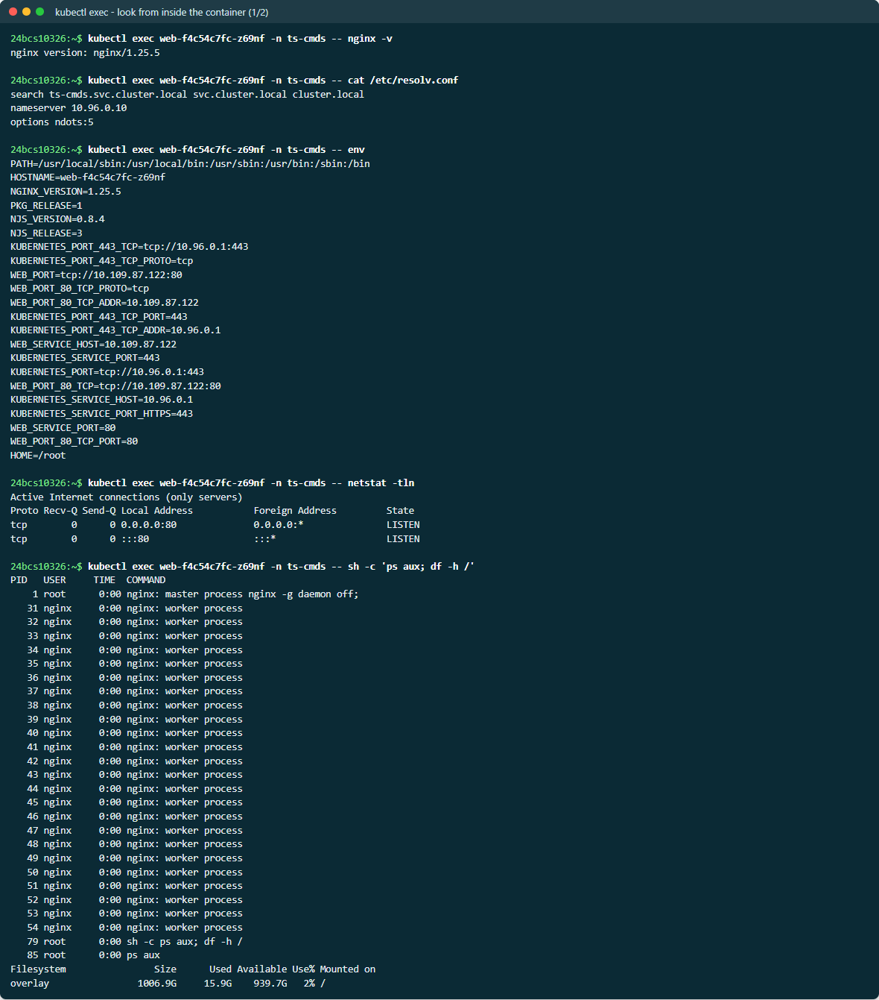

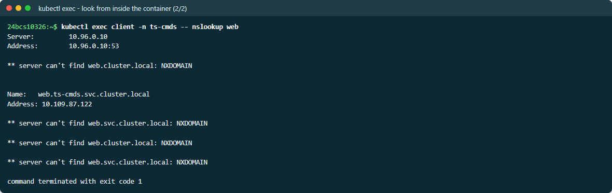

## kubectl events

```bash
kubectl events -n ts-cmds                          # namespace timeline, oldest -> newest
kubectl events -n ts-cmds --for pod/<pod>          # one object only
kubectl events -A --types=Warning                  # only problems, cluster-wide
kubectl get events -n ts-cmds --sort-by=.lastTimestamp
```

```text
$ kubectl events -n ts-cmds --for pod/web-f4c54c7fc-r5d9h
LAST SEEN   TYPE     REASON      OBJECT                    MESSAGE
52s         Normal   Scheduled   Pod/web-f4c54c7fc-r5d9h   Successfully assigned ts-cmds/web-f4c54c7fc-r5d9h to minikube
50s         Normal   Pulled      Pod/web-f4c54c7fc-r5d9h   Container image "nginx:1.25-alpine" already present on machine ...
50s         Normal   Created     Pod/web-f4c54c7fc-r5d9h   Container created
50s         Normal   Started     Pod/web-f4c54c7fc-r5d9h   Container started
```

Events are only kept for about **1 hour** by default, so capture them early.
`kubectl events` sorts properly by time; `kubectl get events` needs
`--sort-by`.

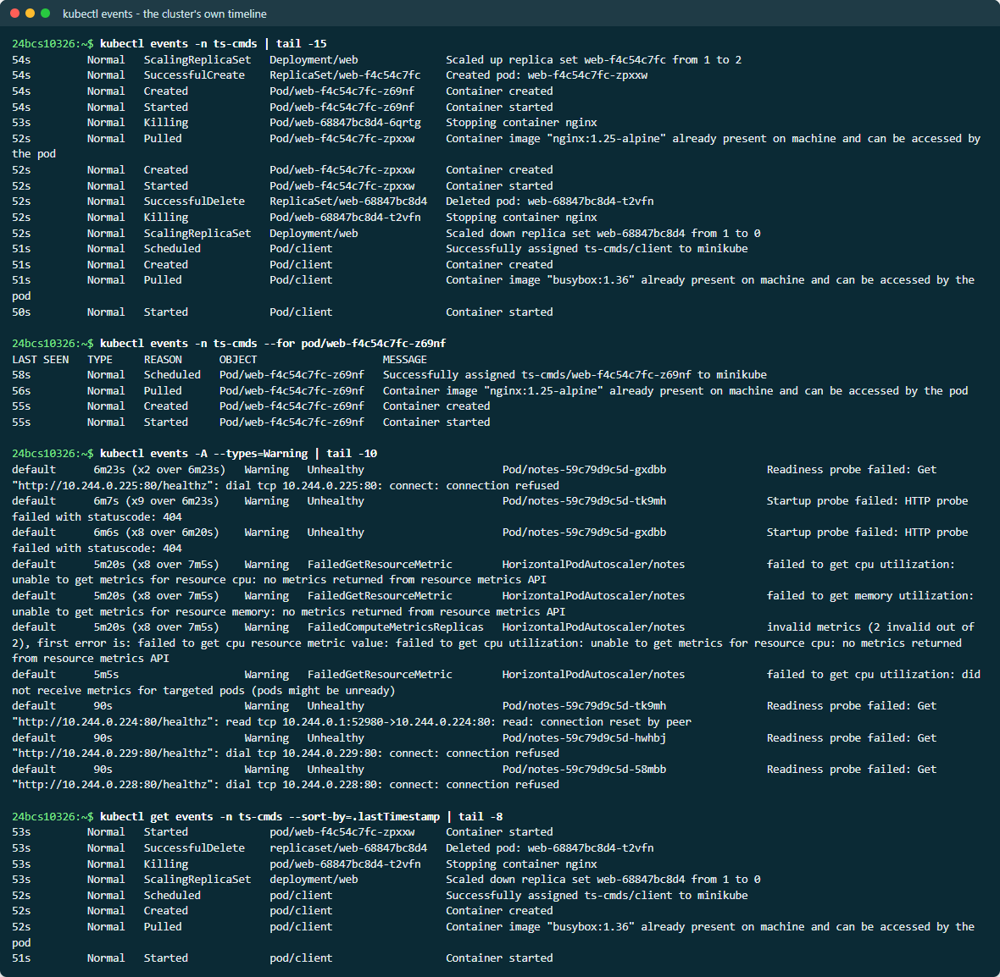

## kubectl explain

```bash
kubectl explain pod.spec.containers.readinessProbe
kubectl explain deployment.spec.strategy.rollingUpdate
kubectl explain pod.spec --recursive | head -30
```

```text
FIELD: readinessProbe <Probe>
DESCRIPTION:
    Periodic probe of container service readiness. Container will be removed
    from service endpoints if the probe fails. Cannot be updated.
```

This is the API reference for the exact cluster version, offline. It answers
"is the field `targetPort` or `targetport`?" and "where does `ndots` go?"
without guessing.

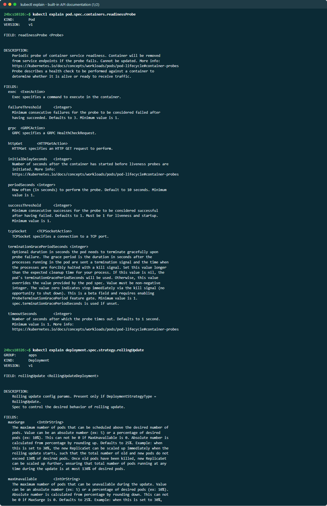

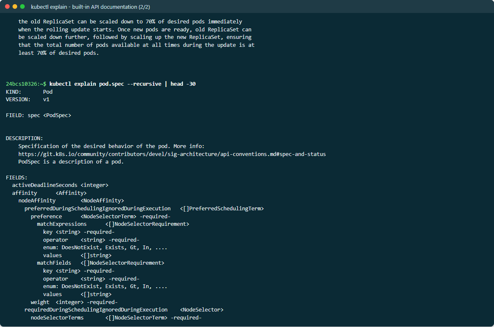

## kubectl top

Requires metrics-server (`minikube addons enable metrics-server`).

```text
$ kubectl top nodes
NAME       CPU(cores)   CPU(%)   MEMORY(bytes)   MEMORY(%)
minikube   245m         1%       1828Mi          23%

$ kubectl top pods -n ts-cmds --containers
POD                   NAME    CPU(cores)   MEMORY(bytes)
web-f4c54c7fc-2gxfk   nginx   0m           17Mi
web-f4c54c7fc-2hwp2   nginx   2m           17Mi
```

Compare these numbers with the Pod's requests and limits: memory near the
limit means OOMKills are coming, and CPU pinned at the limit means throttling.

> The first attempt returned `error: metrics not available yet`. metrics-server
> needs a full scrape cycle (up to about 60s) after a Pod starts before it has
> data. That is not a fault, but it is easy to misread as one.

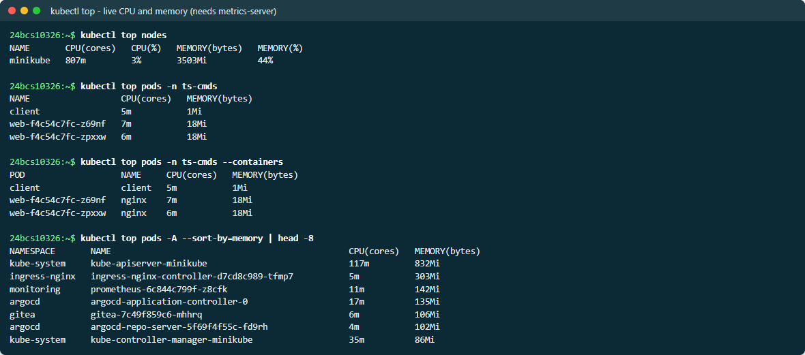

## Other everyday helpers

```bash
kubectl get deploy web -o yaml --show-managed-fields=false    # the live object, minus noise
kubectl auth can-i list secrets -n ts-cmds \
  --as=system:serviceaccount:ts-cmds:default                  # -> no  (RBAC check)
kubectl api-resources --namespaced=true -o name
kubectl cluster-info
kubectl get --raw='/readyz?verbose'                           # API server health checks
kubectl diff -f fixed/                                        # live object vs manifest
```

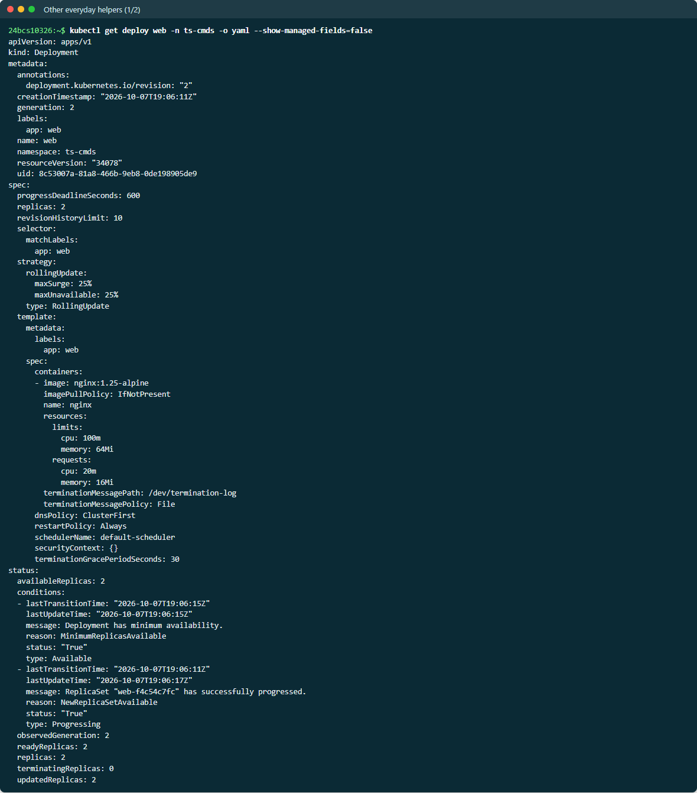

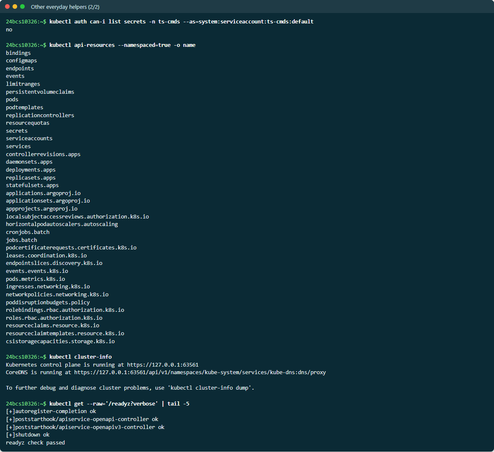
