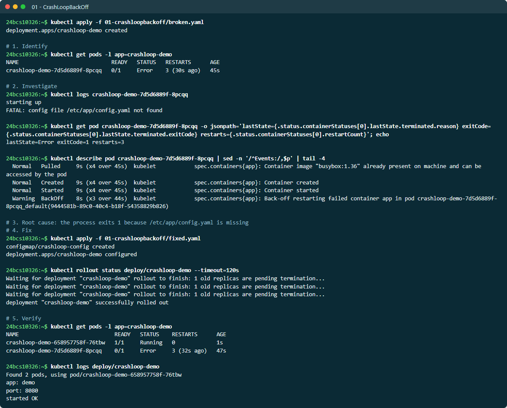
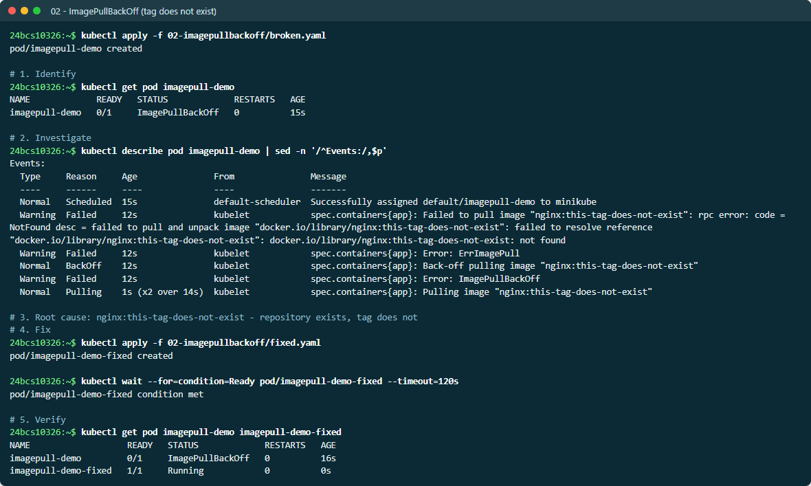
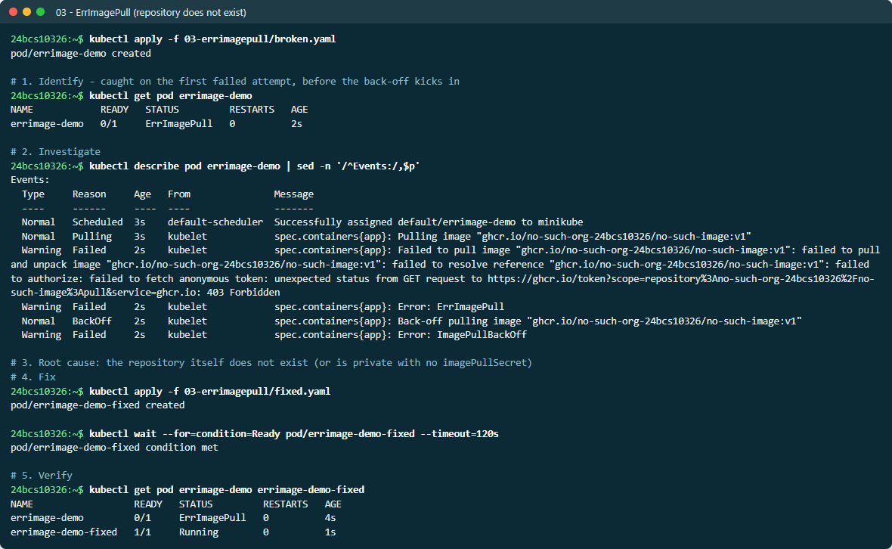
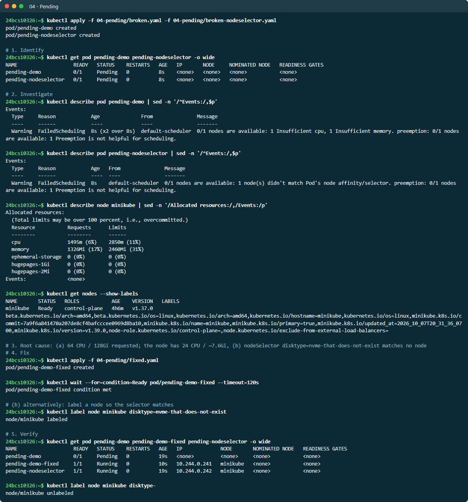
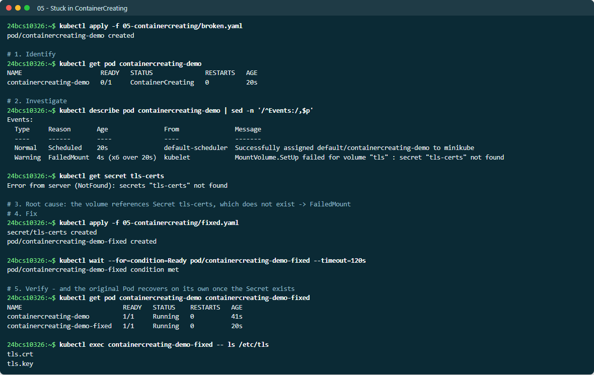
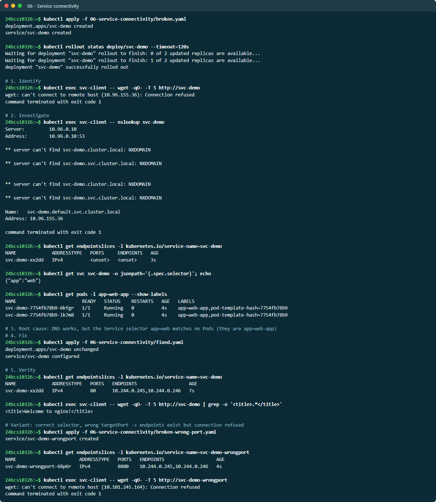
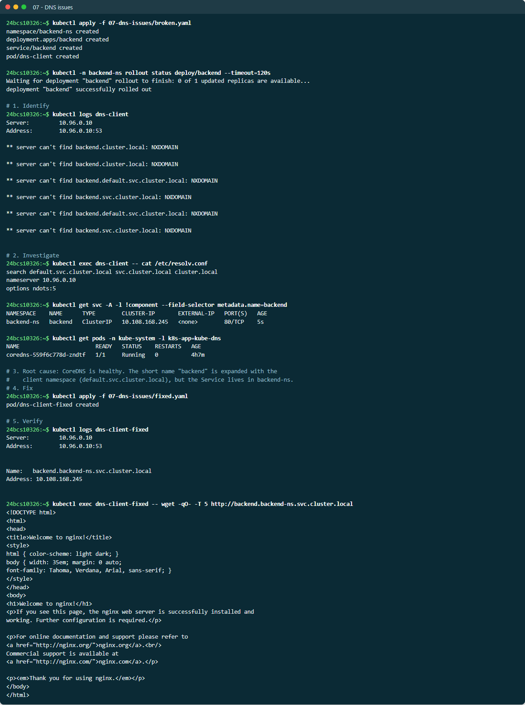
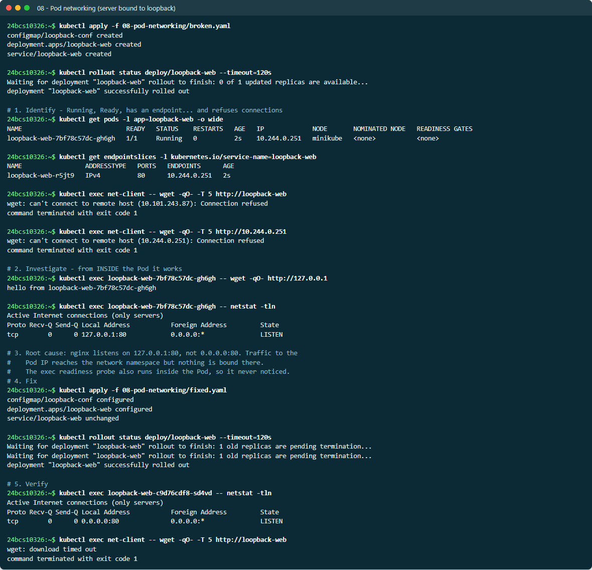
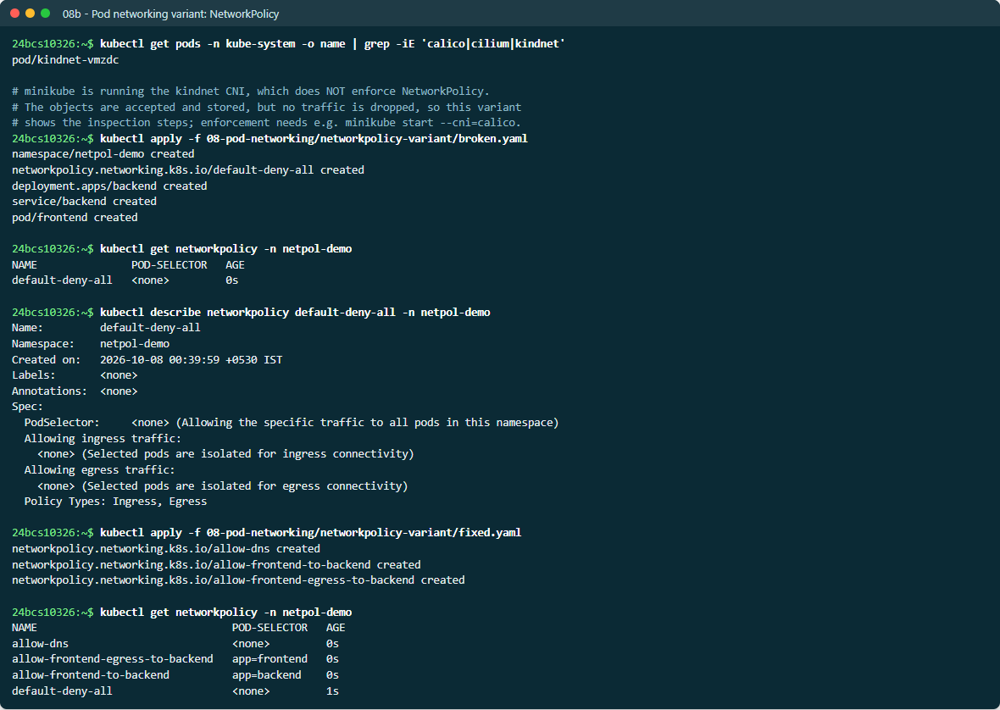
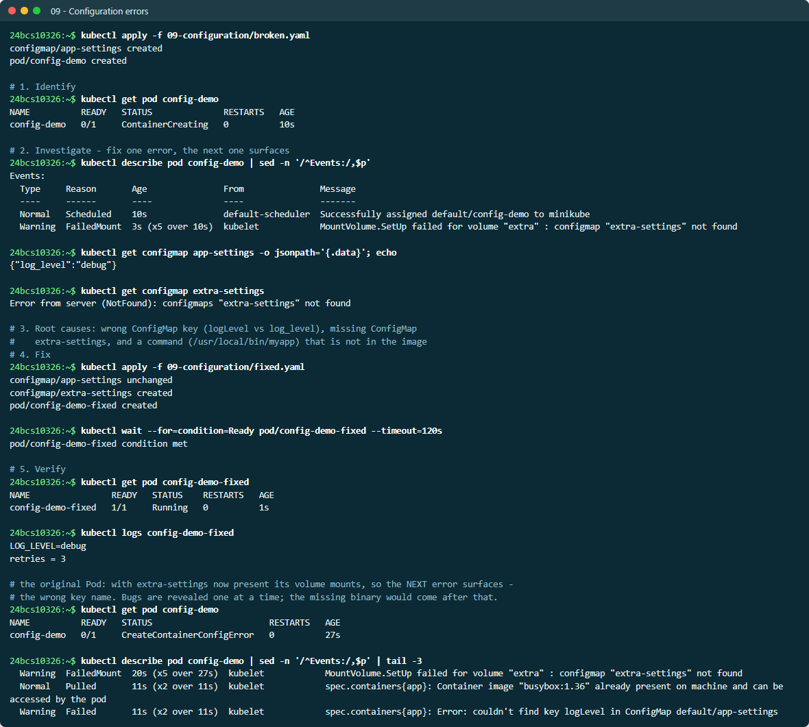

# Common Kubernetes Issues

Nine failure modes, each reproduced on minikube from a `broken.yaml` and
resolved with a `fixed.yaml`, following the same six steps every time:
**identify → investigate → root cause → fix → verify → document**.
The excerpts below come from [EVIDENCE.md](EVIDENCE.md), which has the full
unedited run.

| # | Issue | First signal | Root cause in this lab |
| --- | --- | --- | --- |
| 01 | [CrashLoopBackOff](01-crashloopbackoff/) | `RESTARTS` climbing, `BackOff` events | App exits 1: config file missing |
| 02 | [ImagePullBackOff](02-imagepullbackoff/) | `ImagePullBackOff` | Tag does not exist |
| 03 | [ErrImagePull](03-errimagepull/) | `ErrImagePull` | Repository does not exist (or is private) |
| 04 | [Pending](04-pending/) | No node, no IP | Requests exceed node capacity / nodeSelector matches nothing |
| 05 | [ContainerCreating](05-containercreating/) | Stuck creating | Volume references a missing Secret |
| 06 | [Service connectivity](06-service-connectivity/) | Connection refused | Selector matches no Pods / wrong targetPort |
| 07 | [DNS](07-dns-issues/) | `NXDOMAIN` | Short name used across namespaces |
| 08 | [Pod networking](08-pod-networking/) | Refused on the Pod IP | Server bound to `127.0.0.1` |
| 09 | [Configuration](09-configuration/) | `CreateContainerConfigError` | Wrong key, missing ConfigMap, bad command |

---

## 01 — CrashLoopBackOff

**Identify**

```text
crashloop-demo-7d5d6889f-g4nrm   0/1   Error   3 (31s ago)   45s
```

**Investigate**

```text
$ kubectl logs crashloop-demo-7d5d6889f-g4nrm
FATAL: config file /etc/app/config.yaml not found      <- stderr
starting up                                            <- stdout (streams interleave)

lastState=Error exitCode=1 restarts=3
Warning  BackOff  kubelet  Back-off restarting failed container app
```

**Root cause:** the process exits 1 because its config file is not mounted.
**Fix:** mount a ConfigMap containing `config.yaml`. **Verify:** the new Pod is
`Running` with 0 restarts and logs `started OK`.

On Kubernetes v1.37 the `STATUS` column showed `Error` between restarts rather
than `CrashLoopBackOff`. The `BackOff` events and the climbing `RESTARTS` count
are the reliable signals.

> **Screenshots:** live output from a second run on 2026-10-07, so names and ages differ from the evidence text. Each one follows the same steps: identify, investigate, root cause, fix, verify.



## 02 — ImagePullBackOff (the tag does not exist)

```text
imagepull-demo   0/1   ImagePullBackOff   0   19s

Warning  Failed   Failed to pull image "nginx:this-tag-does-not-exist": ... not found
Warning  Failed   Error: ErrImagePull
Normal   BackOff  Back-off pulling image "nginx:this-tag-does-not-exist"
Warning  Failed   Error: ImagePullBackOff
```

**Root cause:** the repository exists, the tag does not. The events show the
progression: one failed pull (`ErrImagePull`), then the kubelet backs off
(`ImagePullBackOff`). **Fix:** a real tag (`nginx:1.25-alpine`).



## 03 — ErrImagePull (the repository does not exist)

```text
errimage-demo   0/1   ErrImagePull   0   4s

failed to authorize: failed to fetch anonymous token: unexpected status from GET
request to https://ghcr.io/token?scope=repository:no-such-org-24bcs10326/no-such-image:pull ... 403 Forbidden
```

**Root cause:** the registry would not even issue an anonymous token for the
repository. GHCR answers **403 for a repository that does not exist, exactly
as it does for a private one**, so from the outside the two look identical.
**Fix:** either correct the image reference, or — if it is private — create a
`docker-registry` Secret and reference it from `imagePullSecrets`.

> **Gotcha found during this lab:** the first run showed both of these Pods
> stuck in `Pulling` for over 10 minutes instead of failing. The kubelet
> **serialises image pulls by default** (`serializeImagePulls: true`), and a
> 164 MB image was downloading over a slow link at the same time, so the
> doomed pulls were queued behind it. Once that pull finished, the same
> manifests failed in 2–4 seconds. A long `Pulling` is not always the image
> you are looking at.



## 04 — Pending

```text
pending-demo           0/1   Pending   0   8s   <none>   <none>
pending-nodeselector   0/1   Pending   0   8s   <none>   <none>

FailedScheduling  0/1 nodes are available: 1 Insufficient cpu, 1 Insufficient memory.
FailedScheduling  0/1 nodes are available: 1 node(s) didn't match Pod's node affinity/selector.
```

**Root causes:** (a) a request for 64 CPU / 128 Gi on a node with 24 CPU and
about 7.6 Gi; (b) `nodeSelector: disktype=nvme-that-does-not-exist`, which no
node carries. **Fix:** (a) a sane request; (b) labelling the node made the
second Pod schedule immediately. The label was removed afterwards.

```text
pending-demo-fixed     1/1   Running   0   10s   10.244.0.200   minikube
pending-nodeselector   1/1   Running   0   20s   10.244.0.201   minikube   <- after kubectl label node
```

Note that with minikube's Docker driver on WSL2 the node advertises all
**24 host CPUs**, not the `--cpus=2` given at start-up. The scheduler works
from the node's *reported* allocatable capacity.



## 05 — Stuck in ContainerCreating

```text
containercreating-demo   0/1   ContainerCreating   0   20s

Warning  FailedMount  MountVolume.SetUp failed for volume "tls" : secret "tls-certs" not found
```

**Root cause:** a Secret volume referencing a Secret that was never created.
**Fix:** create it. The **original** Pod then recovered on its own — the
kubelet retries the mount:

```text
containercreating-demo         1/1   Running   0   44s
containercreating-demo-fixed   1/1   Running   0   22s
```



## 06 — Service connectivity

```text
$ kubectl exec svc-client -- wget -qO- -T 5 http://svc-demo
wget: can't connect to remote host (10.108.173.130): Connection refused

$ kubectl get endpointslices -l kubernetes.io/service-name=svc-demo
svc-demo-4hdff   IPv4   <unset>   <unset>           <- no endpoints at all
$ kubectl get svc svc-demo -o jsonpath='{.spec.selector}'
{"app":"web"}
$ kubectl get pods -l app=web-app --show-labels
svc-demo-...   app=web-app                          <- Pods are app=web-app
```

**Root cause:** DNS resolved fine, but the selector `app=web` matched no Pods.
**Fix:** `selector: app: web-app` → endpoints appear → `Welcome to nginx!`.

**Variant — wrong `targetPort`:** endpoints exist (`10.244.0.205,10.244.0.204`
on port 8080), yet the connection is still refused because nginx listens on 80.
"No endpoints" and "endpoints but refused" are different bugs, and
`get endpointslices` tells them apart instantly.



## 07 — DNS issues

```text
$ kubectl logs dns-client
** server can't find backend.default.svc.cluster.local: NXDOMAIN
** server can't find backend.svc.cluster.local: NXDOMAIN
** server can't find backend.cluster.local: NXDOMAIN

$ kubectl exec dns-client -- cat /etc/resolv.conf
search default.svc.cluster.local svc.cluster.local cluster.local
```

**Root cause:** CoreDNS was healthy. The client in `default` used the short name
`backend`, which the search path expands to `backend.default.svc…`, but the
Service lives in `backend-ns`. **Fix:** use
`backend.backend-ns.svc.cluster.local` → resolves to `10.102.244.254` and
serves the nginx page.



## 08 — Pod networking: server bound to loopback

```text
loopback-web-...   1/1   Running   0   3s   10.244.0.210      <- Ready, with an endpoint

$ kubectl exec net-client -- wget -qO- -T 5 http://10.244.0.210
wget: can't connect to remote host (10.244.0.210): Connection refused

$ kubectl exec loopback-web-... -- wget -qO- http://127.0.0.1
hello from loopback-web-7bf78c57dc-nn6bp                       <- works from INSIDE

$ kubectl exec loopback-web-... -- netstat -tln
tcp   0   0 127.0.0.1:80   0.0.0.0:*   LISTEN                  <- the smoking gun
```

**Root cause:** nginx listened on `127.0.0.1:80`. Loopback is only reachable
from inside the Pod's own network namespace, so traffic arriving on the Pod IP
found nothing bound. The readiness probe was an `exec` probe that also ran
inside the Pod, so it never noticed. **Fix:** `listen 80;` (all interfaces),
plus an `httpGet` readiness probe — the kubelet calls that over the Pod IP, so
it would have caught the bug.

```text
tcp   0   0 0.0.0.0:80   0.0.0.0:*   LISTEN
$ kubectl exec net-client -- wget -qO- http://loopback-web
hello from loopback-web-c9d76cdf8-v7rtn
```

**Variant — NetworkPolicy** ([networkpolicy-variant/](08-pod-networking/networkpolicy-variant/)):
a default-deny policy plus the allow rules needed for DNS and
frontend → backend traffic. minikube's default CNI (**kindnet**) does **not
enforce** NetworkPolicy, so the policies were applied and inspected but
dropped no traffic. Enforcing them needs a policy-aware CNI
(`minikube start --cni=calico`). This is itself a common real-world trap: a
policy that is accepted is not necessarily enforced.





## 09 — Configuration errors

The broken Pod contains **three** separate mistakes. Kubernetes surfaces them
one at a time:

```text
config-demo   0/1   ContainerCreating
  FailedMount  configmap "extra-settings" not found              <- error 1 surfaces first

# after the missing ConfigMap exists, the next error appears:
config-demo   0/1   CreateContainerConfigError
  Failed       couldn't find key logLevel in ConfigMap default/app-settings   <- error 2
```



The third (`/usr/local/bin/myapp` does not exist in the image) would only
appear after fixing the second. **Fix:** correct key `log_level`, create
`extra-settings`, use a real command:

```text
config-demo-fixed   1/1   Running
LOG_LEVEL=debug
retries = 3
```

Lesson: fixing one error and seeing a *different* one is progress, not
failure. Keep going until the Pod is `Running`.
