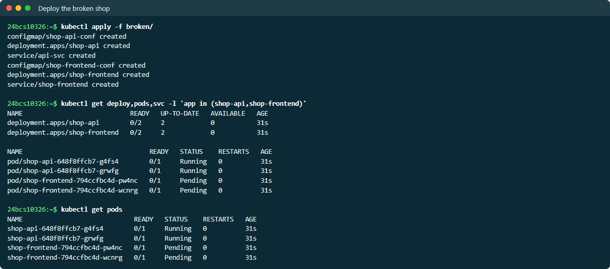
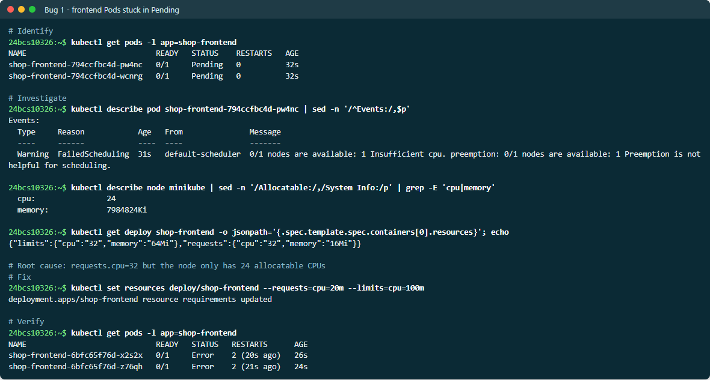
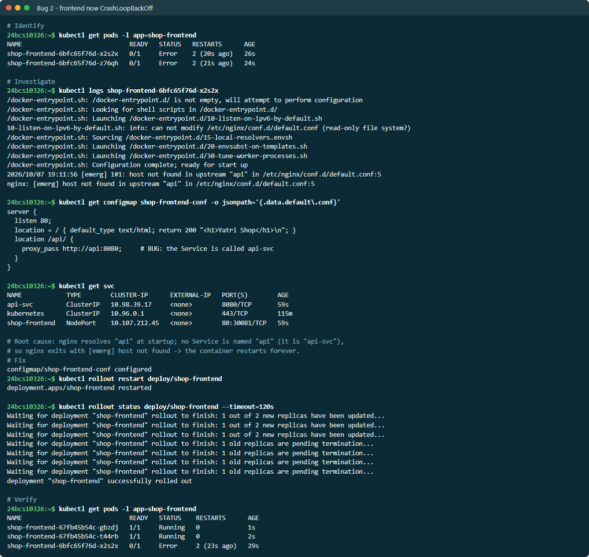
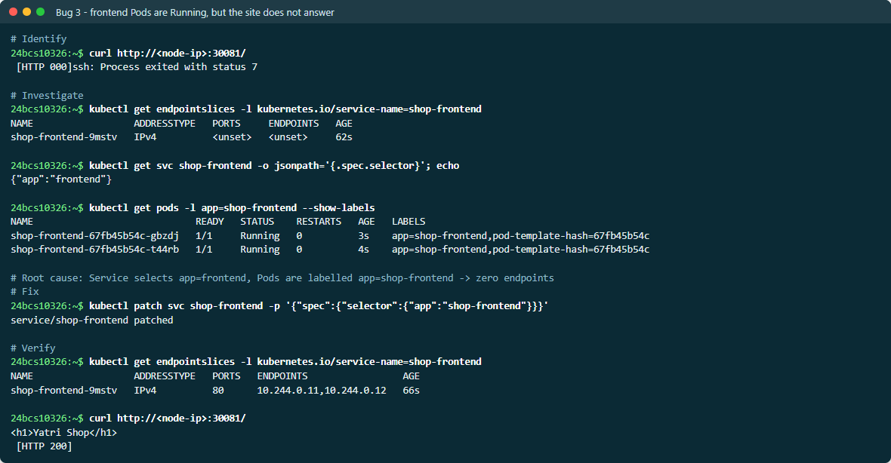
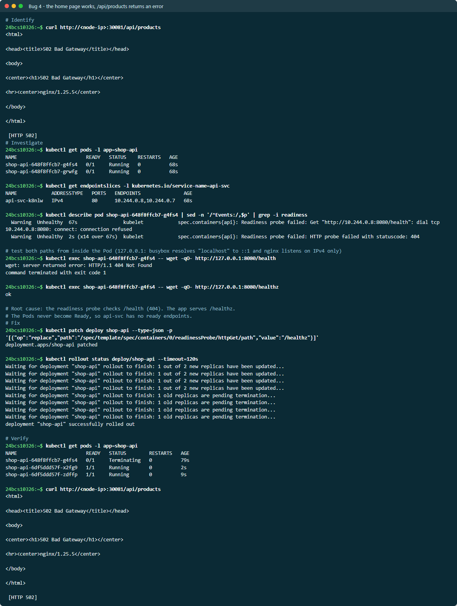
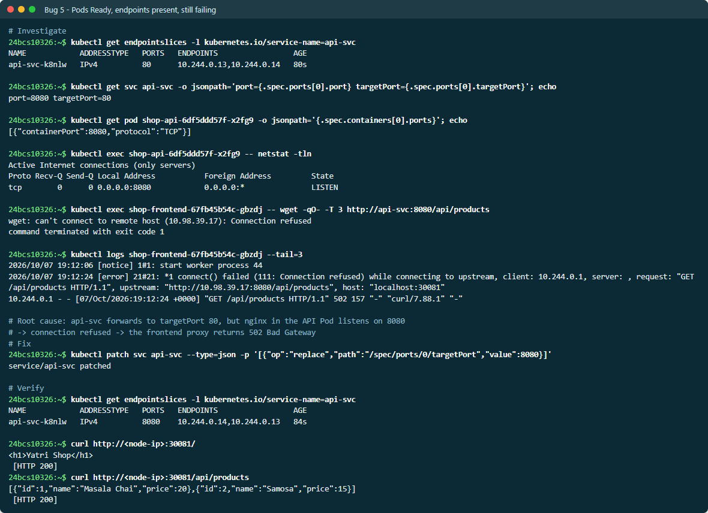
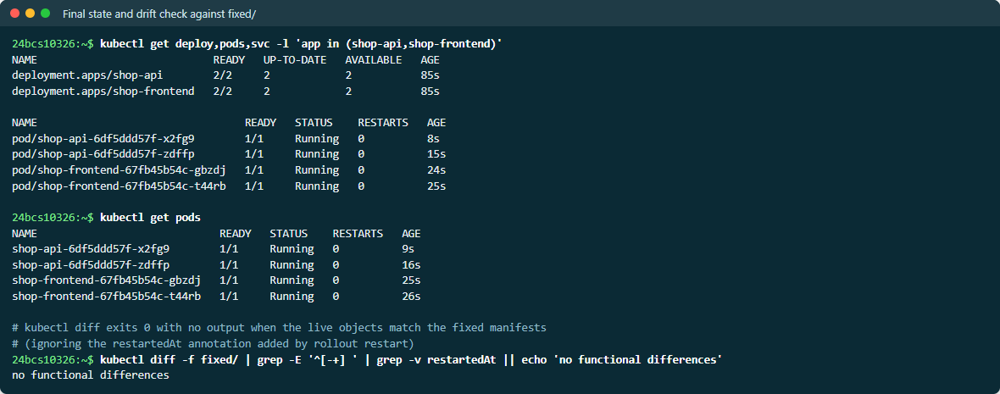

# Troubleshooting Mini Project — Yatri Shop

A two-tier shop — an nginx **frontend** that reverse-proxies `/api/` to an
nginx **API** — shipped with **five bugs layered on top of each other**. Each
fix reveals the next, which is how real incidents usually unfold. Everything
below was run live; the full output is in [EVIDENCE.md](EVIDENCE.md).

```text
 user ──► NodePort 30081 ──► Service shop-frontend ──► frontend Pods (nginx)
                                                          │ proxy_pass /api/
                                                          ▼
                                Service api-svc :8080 ──► API Pods (nginx :8080)
```

| File | Purpose |
| --- | --- |
| [broken/api.yaml](broken/api.yaml), [broken/frontend.yaml](broken/frontend.yaml) | What was deployed — every bug is commented `# BUG` |
| [fixed/api.yaml](fixed/api.yaml), [fixed/frontend.yaml](fixed/frontend.yaml) | The corrected manifests |

## Problem statement

> *"The shop is down. Nothing loads."*

> **Screenshots:** live output from a second run on 2026-10-07, so names and ages differ from the evidence text.



## Investigation, bug by bug

### Bug 1 — frontend Pods stuck in `Pending`

```text
shop-frontend-794ccfbc4d-4zmmh   0/1   Pending   0   31s

Warning  FailedScheduling  0/1 nodes are available: 1 Insufficient cpu.

$ kubectl describe node minikube | grep -A2 Allocatable
  cpu:      24
$ kubectl get deploy shop-frontend -o jsonpath='{...resources}'
{"limits":{"cpu":"32",...},"requests":{"cpu":"32",...}}
```

**Root cause:** `requests.cpu: 32` on a node with 24 allocatable CPUs.
**Fix:** `kubectl set resources deploy/shop-frontend --requests=cpu=20m --limits=cpu=100m`.



### Bug 2 — now the frontend crash-loops

```text
shop-frontend-6bfc65f76d-hkwjb   0/1   Error   2 (21s ago)

$ kubectl logs shop-frontend-6bfc65f76d-hkwjb
nginx: [emerg] host not found in upstream "api" in /etc/nginx/conf.d/default.conf:5

$ kubectl get svc
api-svc         ClusterIP   ...   8080/TCP          <- the Service is api-svc, not api
```

**Root cause:** nginx resolves `proxy_pass` hosts **at startup**. No Service is
called `api`, so nginx refuses to start. **Fix:** `proxy_pass http://api-svc:8080`
in the ConfigMap, then `kubectl rollout restart` — a ConfigMap change alone does
not restart Pods.



### Bug 3 — Pods are Running, but the site does not answer

```text
$ curl http://<node-ip>:30081/
 [HTTP 000]

$ kubectl get endpointslices -l kubernetes.io/service-name=shop-frontend
shop-frontend-rwp96   IPv4   <unset>   <unset>
$ kubectl get svc shop-frontend -o jsonpath='{.spec.selector}'
{"app":"frontend"}
$ kubectl get pods -l app=shop-frontend --show-labels
... app=shop-frontend
```

**Root cause:** the Service selects `app=frontend`; the Pods are labelled
`app=shop-frontend`, so there are zero endpoints. **Fix:** patch the selector.

```text
$ curl http://<node-ip>:30081/
<h1>Yatri Shop</h1>  [HTTP 200]
```



### Bug 4 — home page works, `/api/products` returns 502

```text
$ curl http://<node-ip>:30081/api/products
<h1>502 Bad Gateway</h1>  [HTTP 502]

shop-api-648f8ffcb7-c85lw   0/1   Running   0   71s          <- never Ready

Warning  Unhealthy  Readiness probe failed: HTTP probe failed with statuscode: 404

$ kubectl exec shop-api-... -- wget -qO- http://127.0.0.1:8080/health
wget: server returned error: HTTP/1.1 404 Not Found
$ kubectl exec shop-api-... -- wget -qO- http://127.0.0.1:8080/healthz
ok
```

**Root cause:** the readiness probe checks `/health`; the app serves
`/healthz`. The API Pods never become Ready. **Fix:** patch the probe path.

> **Side-quest found while investigating:** `wget http://localhost:8080` from
> inside the API Pod was *refused*, even though nginx was clearly running.
> BusyBox resolves `localhost` to `::1` (IPv6), and nginx was listening on
> IPv4 only. Testing against `127.0.0.1` gave the true answer. Always check
> which address family your test is actually using.



### Bug 5 — Pods Ready, endpoints present, still 502

```text
$ kubectl get endpointslices -l kubernetes.io/service-name=api-svc
api-svc-jtd8q   IPv4   80   10.244.0.176,10.244.0.177      <- endpoints on port 80

$ kubectl get svc api-svc -o jsonpath='port={...port} targetPort={...targetPort}'
port=8080 targetPort=80

$ kubectl exec shop-api-... -- netstat -tln
tcp   0   0 0.0.0.0:8080   0.0.0.0:*   LISTEN               <- app is on 8080

$ kubectl logs shop-frontend-... --tail=3
[error] connect() failed (111: Connection refused) while connecting to upstream,
        upstream: "http://10.106.169.211:8080/api/products"
```

**Root cause:** the Service forwards to `targetPort: 80`, but the container
listens on 8080. **Fix:** `targetPort: 8080`.

```text
$ curl http://<node-ip>:30081/api/products
[{"id":1,"name":"Masala Chai","price":20},{"id":2,"name":"Samosa","price":15}]  [HTTP 200]
```



## Verification

```text
deployment.apps/shop-api        2/2   2   2
deployment.apps/shop-frontend   2/2   2   2

$ kubectl diff -f fixed/ | grep -E '^[-+] ' | grep -v restartedAt || echo 'no functional differences'
no functional differences
```

`kubectl diff` against the `fixed/` manifests proves the hand-patched live
cluster now matches the corrected source of truth. In a real team the fixes
would be committed to `fixed/` (or Git) first, so the next deploy does not
reintroduce the bugs.



## Summary

| # | Symptom | Tool that revealed it | Root cause | Fix |
| --- | --- | --- | --- | --- |
| 1 | `Pending` | `describe pod` → Events | CPU request 32 > 24 available | Lower requests |
| 2 | Crash loop | `logs` | `proxy_pass` to a non-existent Service name | `api-svc` |
| 3 | Connection failure | `get endpointslices` + `--show-labels` | Selector/label mismatch | Fix selector |
| 4 | 502, Pods not Ready | `describe pod` + `exec wget` | Readiness probe on the wrong path | `/healthz` |
| 5 | 502, Pods Ready | `get svc` + `exec netstat` + frontend `logs` | `targetPort` 80 vs 8080 | `targetPort: 8080` |
