# Helm Commands

Each command was executed against the [yatri-app chart](../03-mini-project/yatri-app/)
on minikube. Excerpts are below; the full output is in [EVIDENCE.md](EVIDENCE.md).

## What Helm is

Helm is the package manager for Kubernetes. A **chart** is a package of
templated manifests plus default `values.yaml`. Installing a chart with a set
of values creates a **release**, and every install, upgrade or rollback of
that release is recorded as a numbered **revision**. Helm stores the revision
history as Secrets in the release's namespace, which is what makes
`history` and `rollback` possible.

```text
chart (templates + values.yaml)  +  your values  ──render──►  manifests  ──apply──►  release, revision N
```

## Command reference

| Command | What it does | Seen in the run |
| --- | --- | --- |
| `helm create <name>` | Scaffold a new chart | 12 files: Chart.yaml, values.yaml, templates, tests |
| `helm lint <chart>` | Check a chart for errors | `1 chart(s) linted, 0 chart(s) failed` |
| `helm template <rel> <chart>` | Render manifests locally, no cluster | ServiceAccount, Secret, ConfigMap, Service, Deployment, Ingress |
| `helm install <rel> <chart>` | Create a release (revision 1) | `STATUS: deployed`, `REVISION: 1` |
| `helm list` / `-A` | Releases in a namespace / all namespaces | `yatri-app  helm-demo  1  deployed` |
| `helm status <rel>` | State of the latest revision, plus rendered NOTES | `STATUS: deployed` |
| `helm get values` / `--all` | User-supplied values / every computed value | `null` (defaults only), then the full computed tree |
| `helm get manifest` | Exactly what was applied | kind/name list |
| `helm get notes` / `metadata` | Rendered NOTES.txt / release metadata | |
| `helm upgrade <rel> <chart>` | New revision with changed values or chart | replicas 2 → 3, new greeting |
| `helm history <rel>` | Every revision with its status | `1 superseded`, `2 deployed` |
| `helm rollback <rel> <rev>` | New revision that re-applies an old one | `3 deployed — Rollback to 1` |
| `helm uninstall <rel>` | Delete the release and its objects | `release "yatri-app" uninstalled` |
| `helm repo add/list/update/remove` | Manage chart repositories | ingress-nginx, jetstack |
| `helm search repo` / `hub` | Search added repositories / Artifact Hub | ingress-nginx versions, cert-manager, argo-cd |
| `helm show chart` / `values` | Inspect a chart before installing it | ingress-nginx `Chart.yaml` and defaults |
| `helm test <rel>` | Run the chart's test hooks | see the [mini project](../03-mini-project/) |
| `helm package <chart>` | Build a versioned `.tgz` | see the [mini project](../03-mini-project/) |

## helm create

```text
$ helm create demo-chart
Creating demo-chart

demo-chart/Chart.yaml
demo-chart/values.yaml
demo-chart/templates/{deployment,service,ingress,hpa,serviceaccount,httproute}.yaml
demo-chart/templates/_helpers.tpl
demo-chart/templates/NOTES.txt
demo-chart/templates/tests/test-connection.yaml
```

> **Screenshots:** live output from a second run on 2026-10-08, so names, ages and timestamps differ from the evidence text.

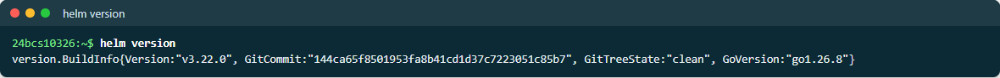

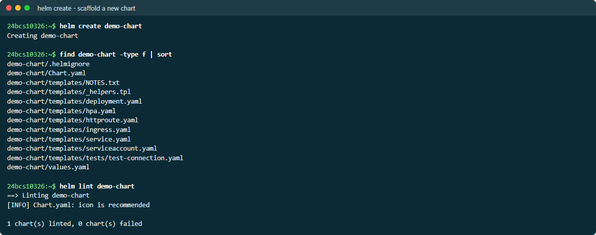

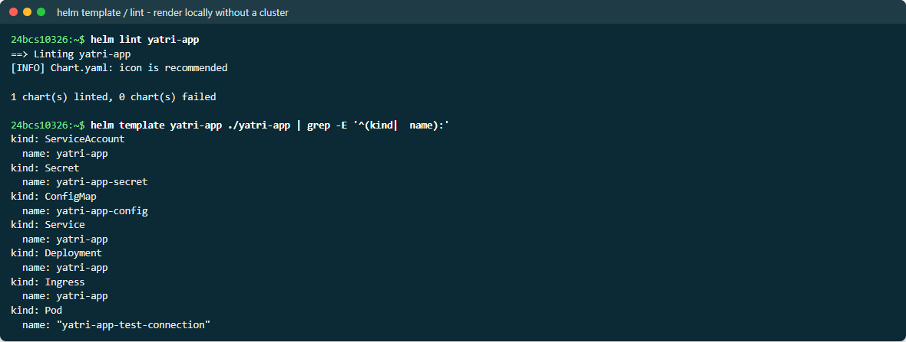

## helm install → the release is ordinary Kubernetes objects

```text
$ helm install yatri-app ./yatri-app --namespace helm-demo --wait --timeout 3m
STATUS: deployed
REVISION: 1

$ kubectl get all,configmap,secret,ingress -n helm-demo -l app.kubernetes.io/instance=yatri-app
pod/yatri-app-7c89569f48-5kz4m   1/1   Running
pod/yatri-app-7c89569f48-lgg5c   1/1   Running
service/yatri-app                ClusterIP   10.100.211.136
deployment.apps/yatri-app        2/2
configmap/yatri-app-config       5
secret/yatri-app-secret          Opaque   2
ingress.networking.k8s.io/yatri-app   nginx   yatri-helm.local

$ kubectl exec client -- wget -qO- http://yatri-app
<h1>Hello from Helm</h1>
<p>release: yatri-app</p>
<p>app:     1.25-alpine</p>
```

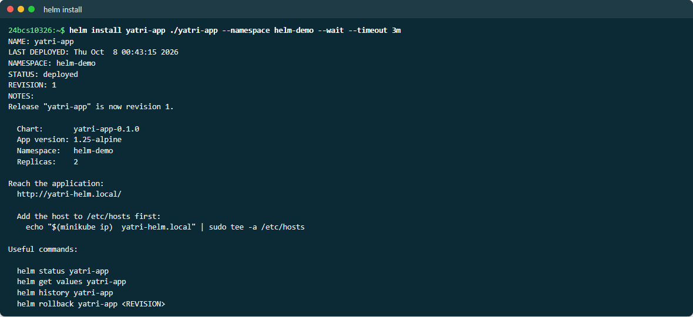

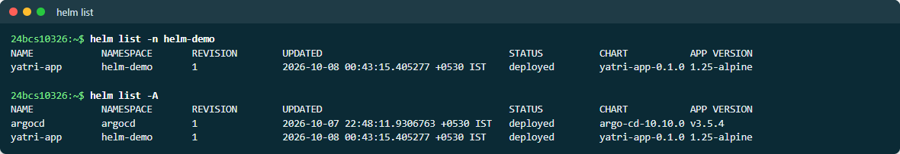

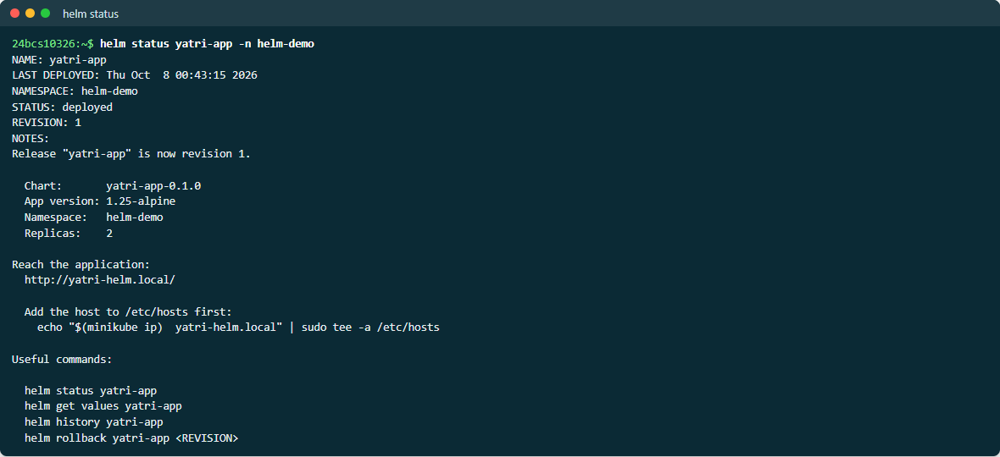

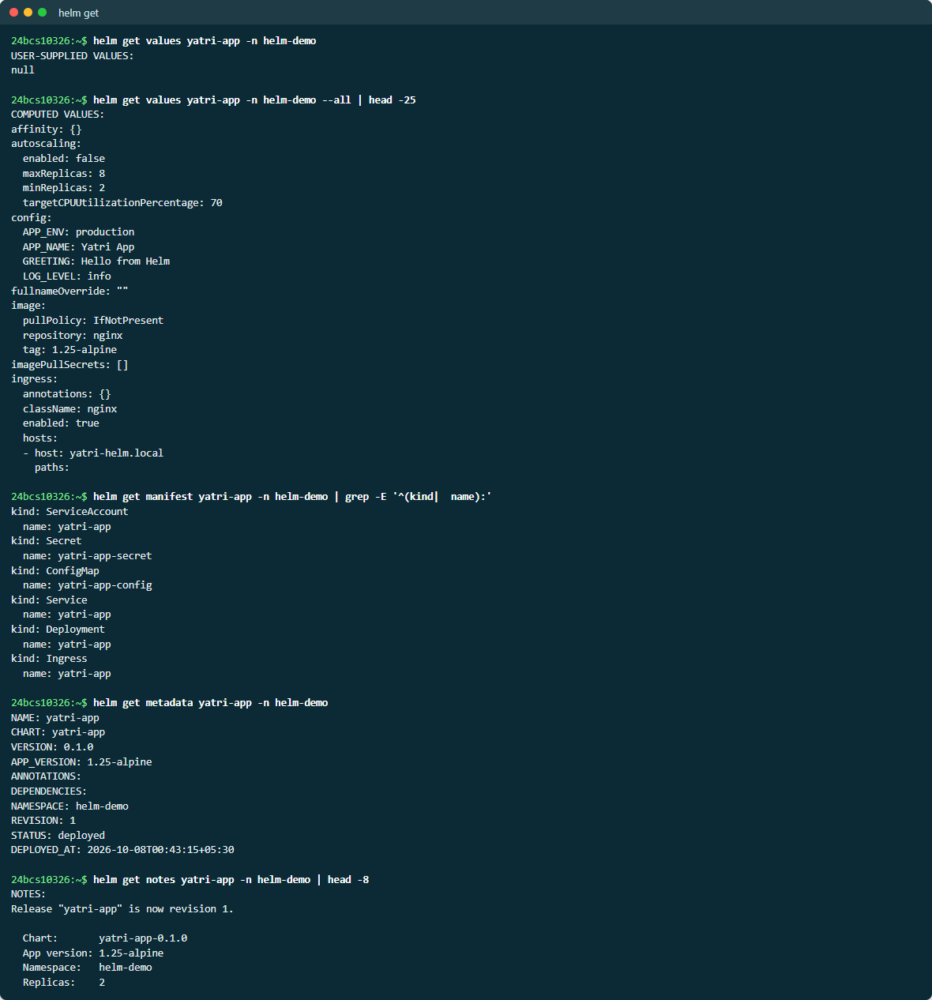

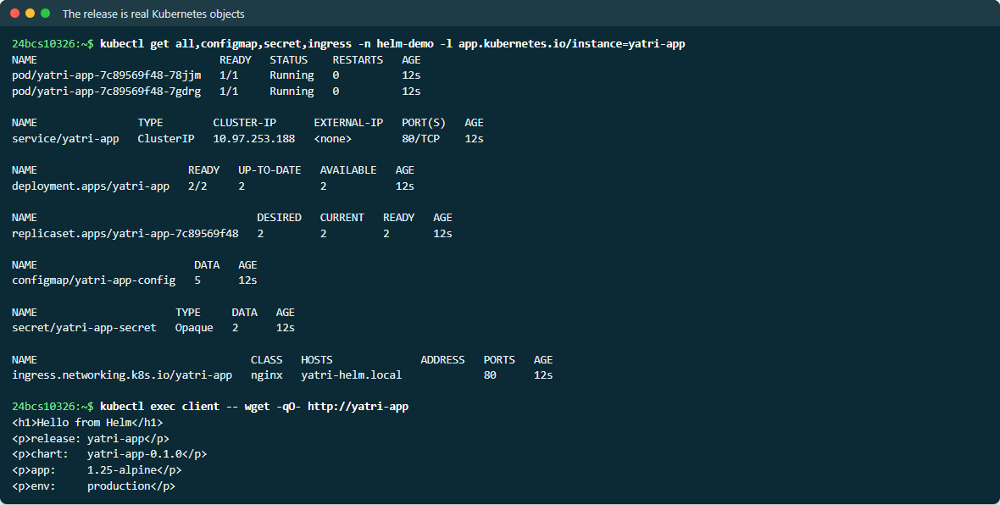

## helm upgrade → helm history → helm rollback

```text
$ helm upgrade yatri-app ./yatri-app -n helm-demo --set replicaCount=3 \
    --set 'config.GREETING=Hello from Helm - upgraded' --wait
$ kubectl get deploy yatri-app -n helm-demo
yatri-app   3/3
<h1>Hello from Helm - upgraded</h1>

$ helm history yatri-app -n helm-demo
REVISION  STATUS      DESCRIPTION
1         superseded  Install complete
2         deployed    Upgrade complete

$ helm rollback yatri-app 1 -n helm-demo --wait
Rollback was a success! Happy Helming!

$ helm history yatri-app -n helm-demo
1         superseded  Install complete
2         superseded  Upgrade complete
3         deployed    Rollback to 1
```

A rollback does **not** rewrite history. It creates a *new* revision whose
content equals the old one, so the full audit trail is kept.

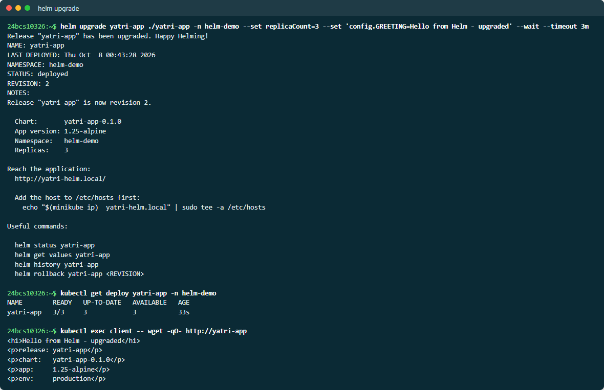

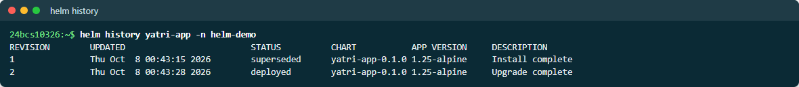

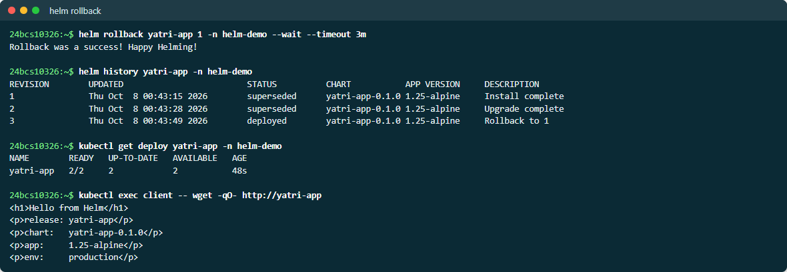

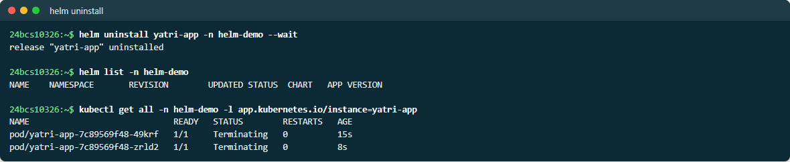

## helm repo and helm search

```text
$ helm repo add ingress-nginx https://kubernetes.github.io/ingress-nginx
$ helm repo add jetstack https://charts.jetstack.io
$ helm repo update
...Successfully got an update from the "ingress-nginx" chart repository

$ helm search repo jetstack/cert-manager
NAME                     CHART VERSION   APP VERSION
jetstack/cert-manager    v1.21.2         v1.21.2
```

`search repo` only searches repositories you have added; `search hub` queries
the public Artifact Hub index.

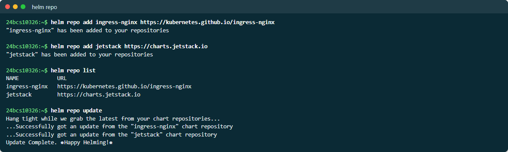

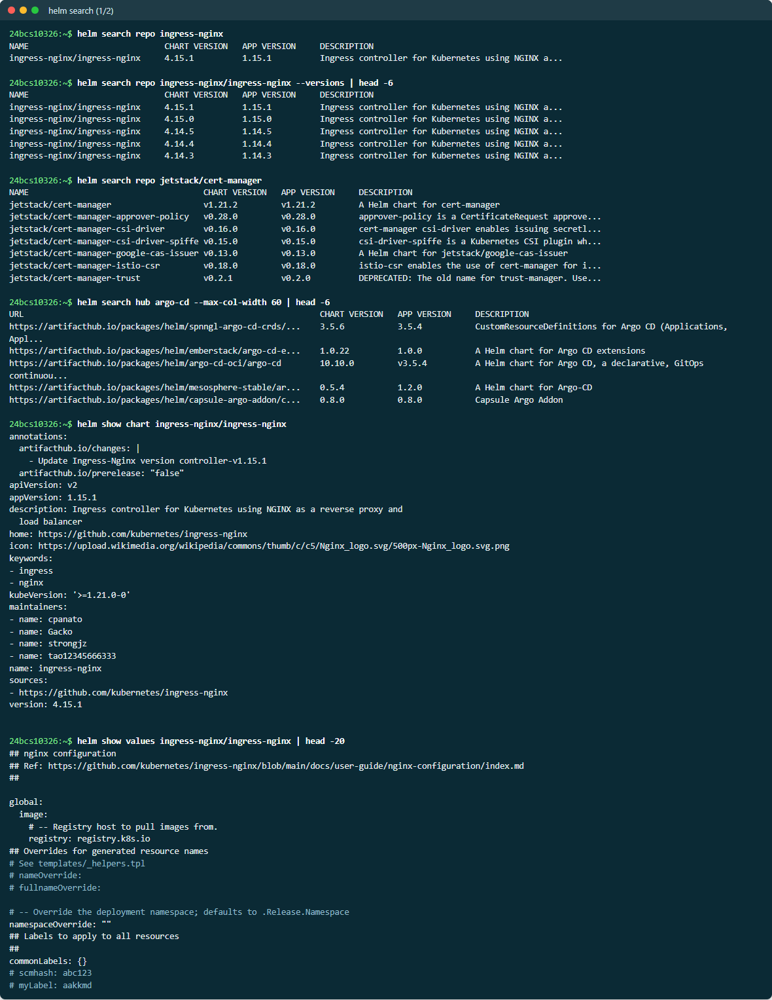

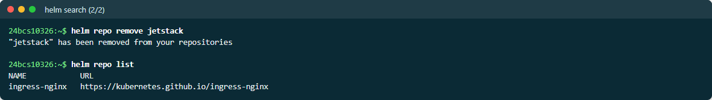

## A bug found while running this

The first `helm install` timed out (`context deadline exceeded`), and the Pods
were in `CrashLoopBackOff`:

```text
nginx: [emerg] chown("/var/cache/nginx/client_temp", 101) failed (1: Operation not permitted)
```

The chart's `securityContext` dropped **all** Linux capabilities. The stock
nginx image starts its master process as root and needs `CHOWN`, `SETUID` and
`SETGID` to prepare its cache directories and switch to the `nginx` user. The
fix keeps `drop: [ALL]` and adds back only those (plus `NET_BIND_SERVICE`) —
see the comment in [values.yaml](../03-mini-project/yatri-app/values.yaml).
`--wait` is what surfaced the problem: without it, Helm would have reported
success while every Pod was crash-looping.
