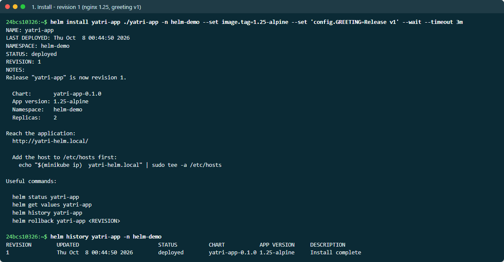
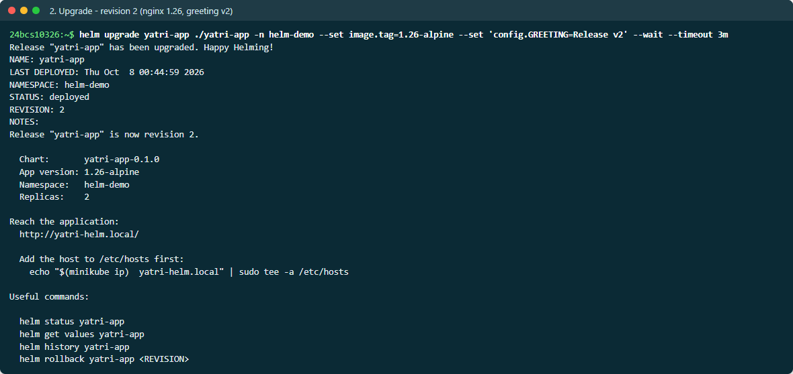
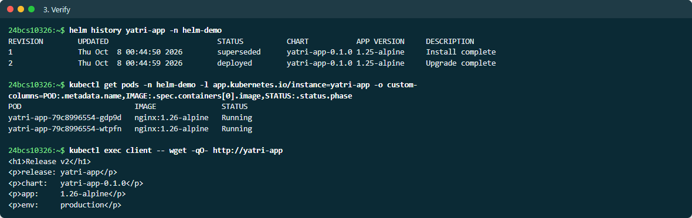
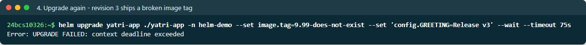
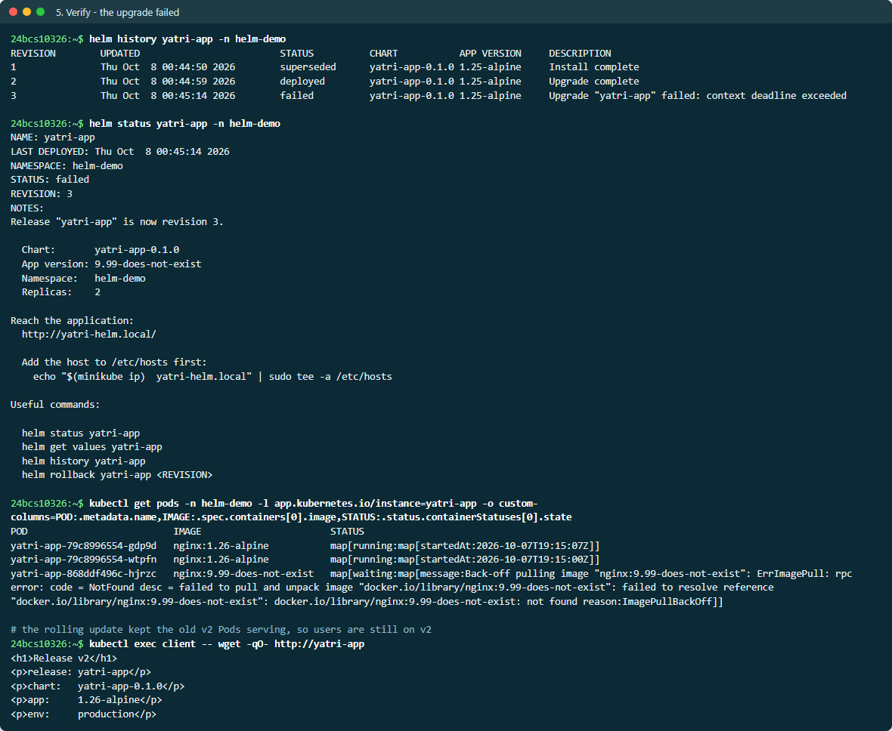
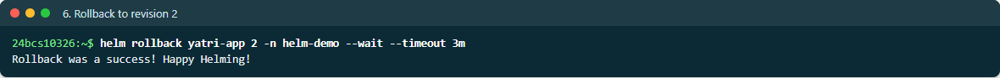
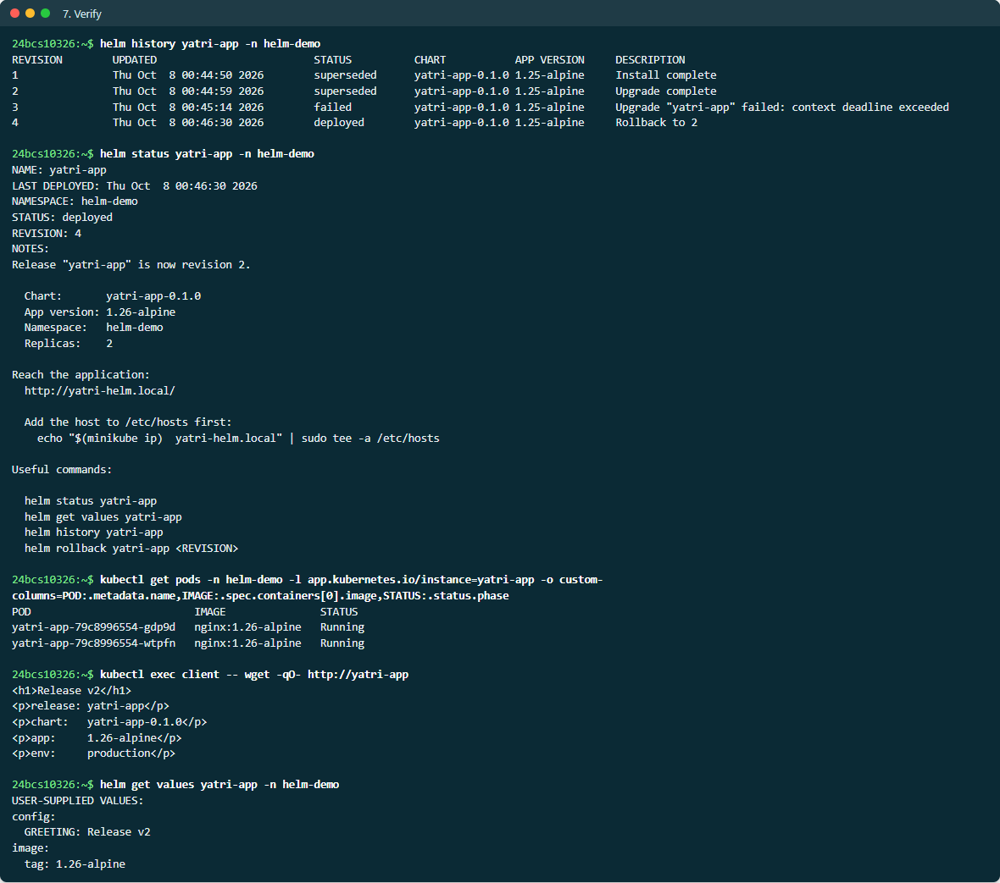

# Helm Rollback Workflow

The complete flow the assignment asks for, with a realistic twist: the second
upgrade is a **bad release** (an image tag that does not exist), which is
exactly the situation rollback exists for.

```text
Install (rev 1) → Upgrade (rev 2) → Verify → Upgrade again (rev 3, broken) → Verify → Rollback to 2 (rev 4) → Verify
```

Full output is in [EVIDENCE.md](EVIDENCE.md).

## 1. Install — revision 1

```bash
helm install yatri-app ./yatri-app -n helm-demo \
  --set image.tag=1.25-alpine --set 'config.GREETING=Release v1' --wait --timeout 3m
```

```text
REVISION  STATUS    DESCRIPTION
1         deployed  Install complete
```

> **Screenshots:** live output from a second run on 2026-10-08, so names, ages and timestamps differ from the evidence text.



## 2. Upgrade — revision 2

```bash
helm upgrade yatri-app ./yatri-app -n helm-demo \
  --set image.tag=1.26-alpine --set 'config.GREETING=Release v2' --wait --timeout 3m
```



## 3. Verify

```text
REVISION  STATUS      DESCRIPTION
1         superseded  Install complete
2         deployed    Upgrade complete

POD                          IMAGE               STATUS
yatri-app-79c8996554-dw4hw   nginx:1.26-alpine   Running
yatri-app-79c8996554-wmqn9   nginx:1.26-alpine   Running

<h1>Release v2</h1>
<p>app:     1.26-alpine</p>
```



## 4. Upgrade again — revision 3 ships a broken image

```bash
helm upgrade yatri-app ./yatri-app -n helm-demo \
  --set image.tag=9.99-does-not-exist --set 'config.GREETING=Release v3' --wait --timeout 75s
```

```text
Error: UPGRADE FAILED: context deadline exceeded
```



## 5. Verify — the upgrade failed, but users never noticed

```text
REVISION  STATUS      DESCRIPTION
1         superseded  Install complete
2         deployed    Upgrade complete
3         failed      Upgrade "yatri-app" failed: context deadline exceeded

POD                          IMAGE                       STATUS
yatri-app-79c8996554-dw4hw   nginx:1.26-alpine           running      <- v2 still serving
yatri-app-79c8996554-wmqn9   nginx:1.26-alpine           running
yatri-app-868ddf496c-d9sqp   nginx:9.99-does-not-exist   waiting      <- the bad Pod never became Ready

$ kubectl exec client -- wget -qO- http://yatri-app
<h1>Release v2</h1>
```

Why users were unaffected: the Deployment's rolling update only removes an old
Pod once a new one is **Ready**. The new Pod never became Ready, so both v2
Pods kept serving. `--wait` is what made Helm notice and mark the revision
`failed` instead of `deployed`.



## 6. Rollback to revision 2

```bash
helm rollback yatri-app 2 -n helm-demo --wait --timeout 3m
```

```text
Rollback was a success! Happy Helming!
```



## 7. Verify

```text
REVISION  STATUS      DESCRIPTION
1         superseded  Install complete
2         superseded  Upgrade complete
3         failed      Upgrade "yatri-app" failed: context deadline exceeded
4         deployed    Rollback to 2

$ kubectl exec client -- wget -qO- http://yatri-app
<h1>Release v2</h1>

$ helm get values yatri-app -n helm-demo
USER-SUPPLIED VALUES:
config:
  GREETING: Release v2
image:
  tag: 1.26-alpine
```

The rollback became **revision 4**: Helm never deletes history, so the failed
attempt stays on record. `helm get values` confirms the live release is back
on the revision 2 values, and the broken Pod was removed.



## Takeaways

- Always pass `--wait` (plus `--timeout`) to `install` and `upgrade`; otherwise
  Helm reports success as soon as the API server accepts the objects.
- `helm upgrade --atomic` combines this whole flow: on failure it rolls back
  automatically.
- Rollback restores **Kubernetes objects**, not data. A database migration
  run by revision 3 would not be undone by rolling back to revision 2.
