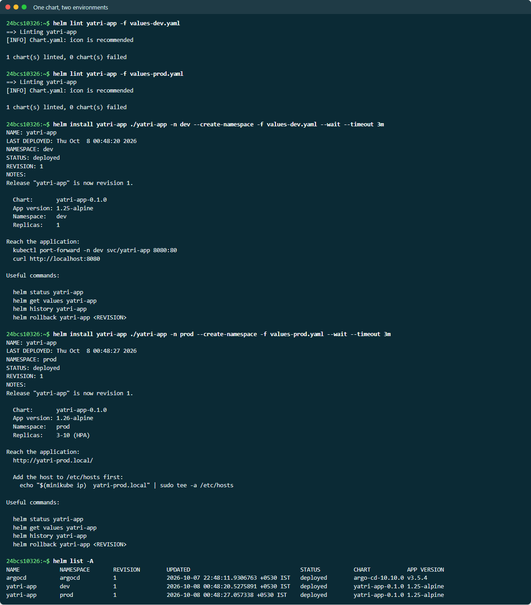
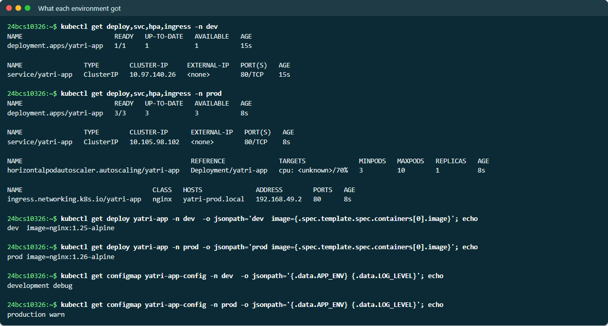
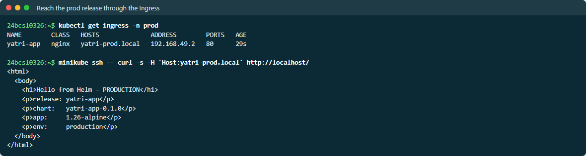
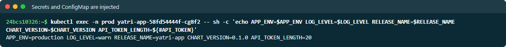
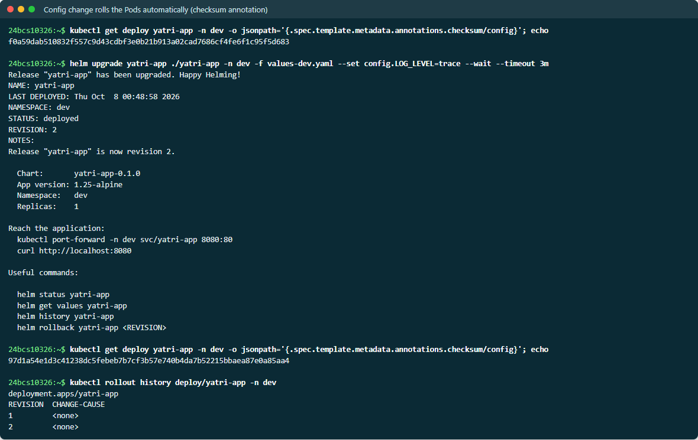
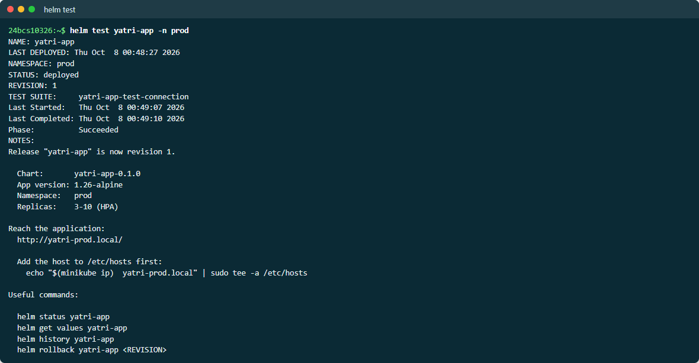
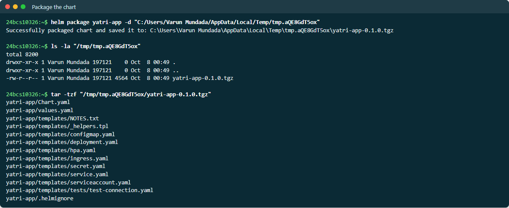

# Helm Mini Project — yatri-app chart

One chart, deployed to two environments with different values files. Full
output is in [EVIDENCE.md](EVIDENCE.md).

```text
03-mini-project/
├── yatri-app/                      the chart
│   ├── Chart.yaml                  version 0.1.0, appVersion 1.25-alpine
│   ├── values.yaml                 defaults
│   └── templates/
│       ├── _helpers.tpl            names and labels
│       ├── configmap.yaml          .Values.config -> ConfigMap, plus a rendered index.html
│       ├── secret.yaml             .Values.secrets -> base64 Secret
│       ├── deployment.yaml         checksum annotations, envFrom ConfigMap + Secret, probes
│       ├── service.yaml
│       ├── ingress.yaml
│       ├── hpa.yaml
│       ├── serviceaccount.yaml
│       ├── NOTES.txt               post-install instructions
│       └── tests/test-connection.yaml
├── values-dev.yaml                 1 replica, debug logging, no Ingress, no HPA
└── values-prod.yaml                nginx 1.26, HPA 3-10, warn logging, Ingress yatri-prod.local
```

## Templating highlights

- **Config to environment variables:** `range` over `.Values.config` builds the
  ConfigMap, and `envFrom` injects it. The same pattern with `b64enc` builds the
  Secret.
- **A page that shows what is deployed:** the ConfigMap also renders an
  `index.html` that prints the release name, chart version and image tag.
  Curling the app tells you exactly which revision is live.
- **Config changes roll the Pods:** the Pod template carries
  `checksum/config: {{ include ".../configmap.yaml" . | sha256sum }}`. When
  values change, the hash changes, so the Pod template changes, and the
  Deployment rolls. Without this, `helm upgrade` would update the ConfigMap
  while running Pods kept the old environment.
- **Conditional objects:** the Ingress and HPA only render when enabled, and
  `replicas` is omitted when the HPA owns the count.

## One chart, two environments

```bash
helm install yatri-app ./yatri-app -n dev  --create-namespace -f values-dev.yaml  --wait
helm install yatri-app ./yatri-app -n prod --create-namespace -f values-prod.yaml --wait
```

```text
$ helm list -A
NAME       NAMESPACE   REVISION   STATUS     CHART             APP VERSION
yatri-app  dev         1          deployed   yatri-app-0.1.0   1.25-alpine
yatri-app  prod        1          deployed   yatri-app-0.1.0   1.25-alpine

dev:   deployment yatri-app 1/1   image nginx:1.25-alpine   APP_ENV/LOG_LEVEL = development debug   no HPA, no Ingress
prod:  deployment yatri-app 3/3   image nginx:1.26-alpine   APP_ENV/LOG_LEVEL = production warn     HPA 3-10, Ingress yatri-prod.local
```

Through the prod Ingress:

```text
$ curl -H 'Host: yatri-prod.local' http://<ingress>/
<h1>Hello from Helm - PRODUCTION</h1>
<p>release: yatri-app</p>
<p>chart:   yatri-app-0.1.0</p>
<p>app:     1.26-alpine</p>
<p>env:     production</p>
```

ConfigMap and Secret values inside the container (the token checked by length
only):

```text
APP_ENV=production LOG_LEVEL=warn RELEASE_NAME=yatri-app CHART_VERSION=0.1.0 API_TOKEN_LENGTH=20
```

> **Screenshots:** live output from a second run on 2026-10-08, so names, ages and timestamps differ from the evidence text.









## Config change → automatic rollout

```text
checksum/config before: f0a59dab510832f557c9d43cdbf3e0b21b913a02cad7686cf4fe6f1c95f5d683
$ helm upgrade yatri-app ./yatri-app -n dev -f values-dev.yaml --set config.LOG_LEVEL=trace --wait
checksum/config after:  97d1a54e1d3c41238dc5febeb7b7cf3b57e740b4da7b52215bbaea87e0a85aa4

$ kubectl rollout history deploy/yatri-app -n dev
REVISION
1
2          <- a new ReplicaSet, triggered only by the config change
```



## helm test

```text
$ helm test yatri-app -n prod
TEST SUITE:     yatri-app-test-connection
Phase:          Succeeded
```

The test hook is a short-lived Pod that `wget`s the Service. The image is pinned
to `busybox:1.36`. An untagged `busybox` would mean `:latest`, which implies
`imagePullPolicy: Always` and a registry round-trip on every test run.



## helm package

```text
$ helm package yatri-app -d <dir>
Successfully packaged chart and saved it to: ...\yatri-app-0.1.0.tgz

$ tar -tzf yatri-app-0.1.0.tgz
yatri-app/Chart.yaml
yatri-app/values.yaml
yatri-app/templates/...
```

The `.tgz` is what a chart repository serves (`helm repo index` +
any static host, or an OCI registry with `helm push`).


