# Terraform S3 Demo

Creates an AWS S3 bucket with Terraform, configured the way a production bucket
should be: versioned, encrypted, private, TLS-only, and with lifecycle rules.

```text
terraform-s3-demo/
├── provider.tf                      # terraform{} block, AWS provider, default tags
├── variables.tf                     # inputs, with validation
├── main.tf                          # the bucket and its configuration
├── outputs.tf                       # values printed after apply
├── terraform.tfvars                 # values for this environment
├── localstack_override.tf.example   # optional: run with no AWS account
├── EVIDENCE.md                      # full verbatim run output
├── .terraform.lock.hcl              # pinned provider versions + checksums (commit this)
└── README.md
```

## What gets created

| Resource | Purpose |
| --- | --- |
| `random_id.suffix` | Bucket names are globally unique across every AWS account, so a random suffix avoids collisions |
| `aws_s3_bucket.demo` | The bucket: `devops-hw-24bcs10326-dev-<hex>` |
| `aws_s3_bucket_versioning` | Keep every version of every object |
| `aws_s3_bucket_server_side_encryption_configuration` | SSE-S3 (AES-256) at rest, with bucket keys |
| `aws_s3_bucket_public_access_block` | All four Block Public Access settings on |
| `aws_s3_bucket_ownership_controls` | `BucketOwnerEnforced` — ACLs disabled |
| `aws_s3_bucket_lifecycle_configuration` | Expire old versions after 30 days; tier `logs/` to IA → Glacier → delete; abort stuck multipart uploads (toggle: `enable_lifecycle_rules`) |
| `aws_s3_bucket_policy` | Deny any request not made over HTTPS |
| `aws_s3_object.readme` | A sample `hello.txt`, to prove the bucket works |

Since AWS provider v4, each bucket setting is its **own resource**, not a
nested block inside `aws_s3_bucket`. Each one references
`aws_s3_bucket.demo.id`, which gives Terraform the dependency order for free.

## Prerequisites

- Terraform ≥ 1.6
- AWS credentials, which Terraform reads from the standard chain:
  `aws configure` profile, `AWS_ACCESS_KEY_ID` / `AWS_SECRET_ACCESS_KEY`
  environment variables, or an IAM role. **Credentials never go in `.tf` or
  `.tfvars` files.**
- Permission for `s3:*` on the bucket, plus `sts:GetCallerIdentity`.

## The workflow

| # | Command | What it does |
| --- | --- | --- |
| 1 | `terraform init` | Downloads providers (`hashicorp/aws`, `hashicorp/random`) into `.terraform/`, writes `.terraform.lock.hcl`, configures the backend |
| 2 | `terraform fmt` | Rewrites files into canonical style. `-check` only reports, which is useful in CI |
| 3 | `terraform validate` | Checks syntax, types and references — offline, no API calls |
| 4 | `terraform plan` | Compares the config with the state and with reality, and prints exactly what will change. `-out` saves the plan |
| 5 | `terraform apply` | Executes the plan. Applying a saved plan guarantees you get exactly what you reviewed |
| 6 | `terraform show` | Prints the current state in human-readable form |
| 7 | `terraform output` | Prints the outputs; `-raw` for scripts, `-json` for tools |
| 8 | `terraform destroy` | Deletes everything in the state |

```bash
terraform init
terraform fmt
terraform validate
terraform plan -out=s3.tfplan
terraform apply s3.tfplan
terraform show
terraform output
terraform destroy
```

## Executed run

The whole workflow was run end to end on 2026-10-07. Full verbatim output is in
[EVIDENCE.md](EVIDENCE.md).

> **Where it ran.** No AWS account is configured on the machine used for this
> homework, so the run targeted **LocalStack 3.8** — a local emulator of the
> AWS APIs, running in Docker. The Terraform code is **unchanged**: a
> git-ignored `override.tf` (copied from
> [`localstack_override.tf.example`](localstack_override.tf.example)) points
> the provider's endpoints at `localhost:4566`. Delete `override.tf` and the
> same commands target real AWS.

| Step | Result |
| --- | --- |
| `init` | Installed `hashicorp/aws v5.100.0` and `hashicorp/random v3.9.1`; wrote `.terraform.lock.hcl` |
| `fmt -check` | No changes — the files were already canonical |
| `validate` | `Success! The configuration is valid.` |
| `plan` | `Plan: 8 to add, 0 to change, 0 to destroy.` |
| `apply` | `Apply complete! Resources: 8 added, 0 changed, 0 destroyed.` |
| `show` / `state list` | All 8 resources and the policy data source in state |
| `output` | Bucket name, ARN, region, domain, `versioning_status = "Enabled"`, object URI |
| Verify (AWS CLI) | Bucket listed; `hello.txt` readable; versioning `Enabled`; SSE `AES256` with bucket key; all 4 public-access blocks `true`; TLS-only policy attached |
| Change detection | `-var force_destroy=false` → `Plan: 0 to add, 2 to change` |
| `destroy` | `Destroy complete! Resources: 8 destroyed.` — state empty, bucket gone |

```text
$ terraform plan -out=s3.tfplan
  # aws_s3_bucket.demo will be created
  # aws_s3_bucket_ownership_controls.demo will be created
  # aws_s3_bucket_policy.tls_only will be created
  # aws_s3_bucket_public_access_block.demo will be created
  # aws_s3_bucket_server_side_encryption_configuration.demo will be created
  # aws_s3_bucket_versioning.demo will be created
  # aws_s3_object.readme will be created
  # random_id.suffix will be created
Plan: 8 to add, 0 to change, 0 to destroy.

$ terraform output
bucket_arn         = "arn:aws:s3:::devops-hw-24bcs10326-dev-23ca1aaa"
bucket_domain_name = "devops-hw-24bcs10326-dev-23ca1aaa.s3.ap-south-1.amazonaws.com"
bucket_name        = "devops-hw-24bcs10326-dev-23ca1aaa"
bucket_region      = "ap-south-1"
sample_object_uri  = "s3://devops-hw-24bcs10326-dev-23ca1aaa/hello.txt"
versioning_status  = "Enabled"
```

Things learned while running it:

- **Why "2 to change" for a one-variable edit.** Flipping `force_destroy` only
  changes the bucket, but the TLS-only policy comes from a *data source* that
  references the bucket. When the bucket has a pending change, Terraform
  defers reading that data source to apply time ("depends on a resource with
  changes pending"), so the policy shows as `(known after apply)`. A plain
  `terraform plan` with no edits reported **No changes** — this is not a
  perpetual diff.
- **Lifecycle rules were off for this run** (`enable_lifecycle_rules=false`).
  With LocalStack 3.8 the lifecycle configuration *is* stored — `awslocal`
  showed all three rules `Enabled` — but AWS provider 5.x's post-create
  consistency check never passes against the emulator and times out after
  3 minutes. The same check failed for every filter variant tested. On real
  AWS the default (`true`) applies them normally.

> **Screenshots:** live output from a second run of the same commands on 2026-10-07 against LocalStack 3.8, so IDs differ from [EVIDENCE.md](EVIDENCE.md). Very long outputs are split into numbered parts; for the plan and destroy, the first and last parts are shown and the full text is in EVIDENCE.md.

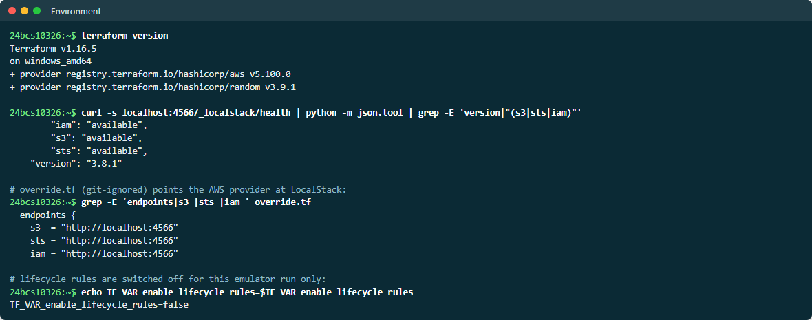

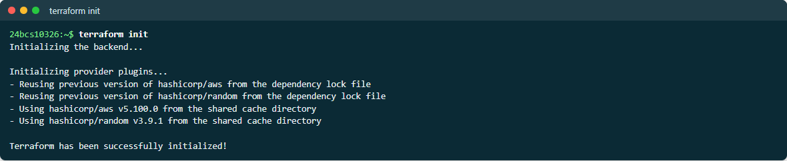

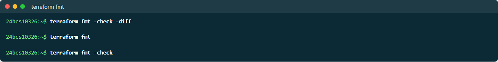

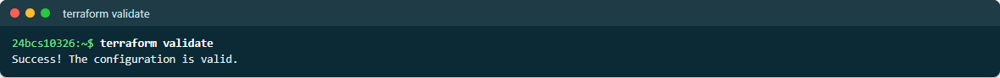

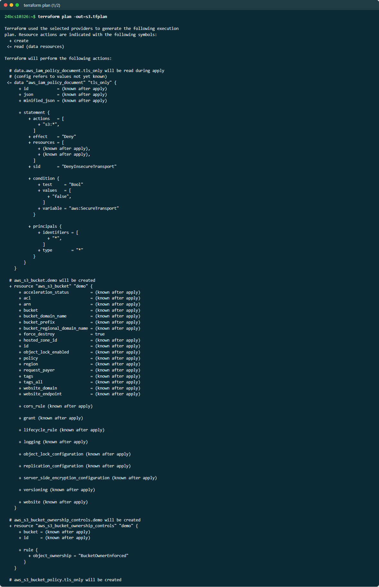

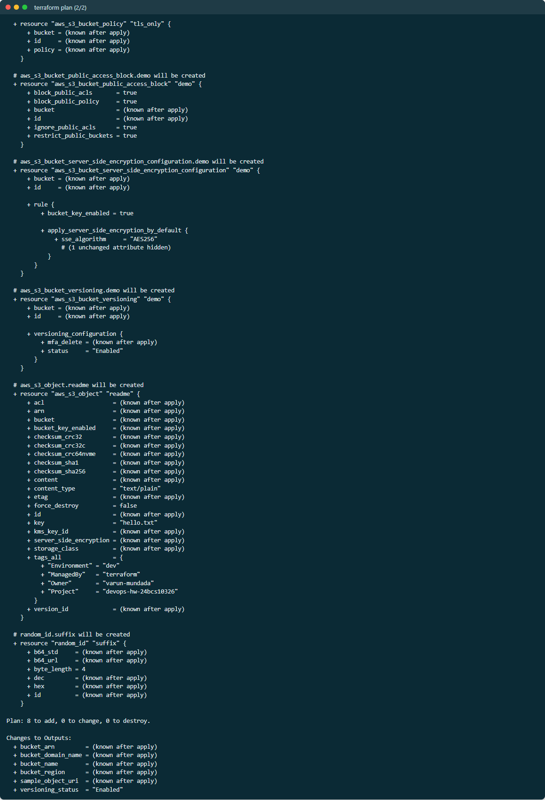

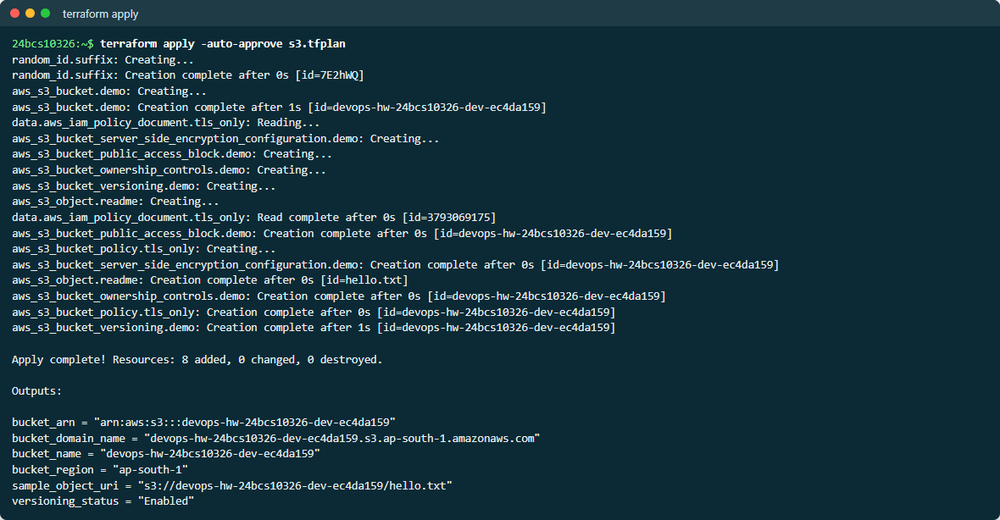

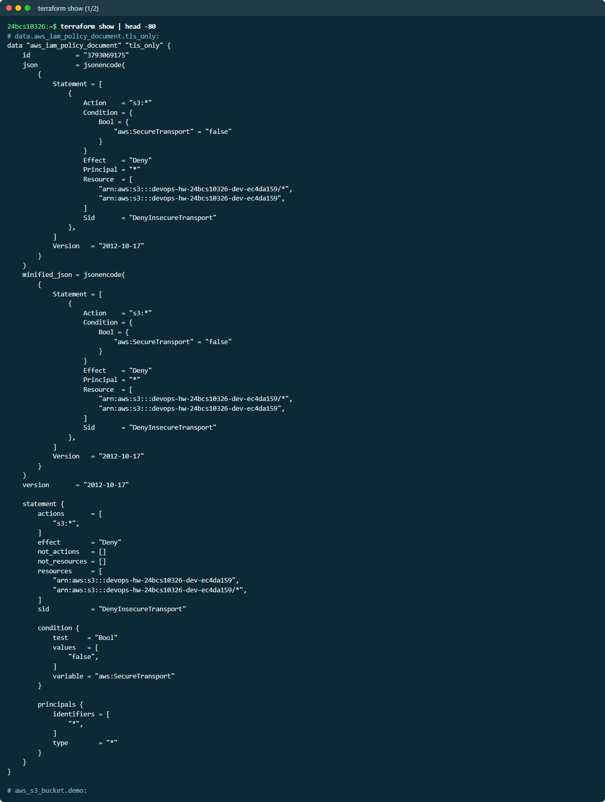

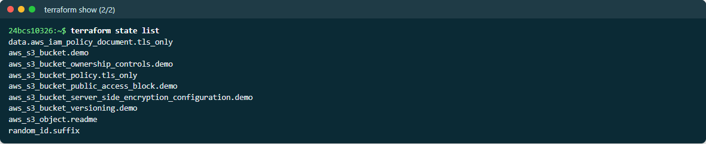

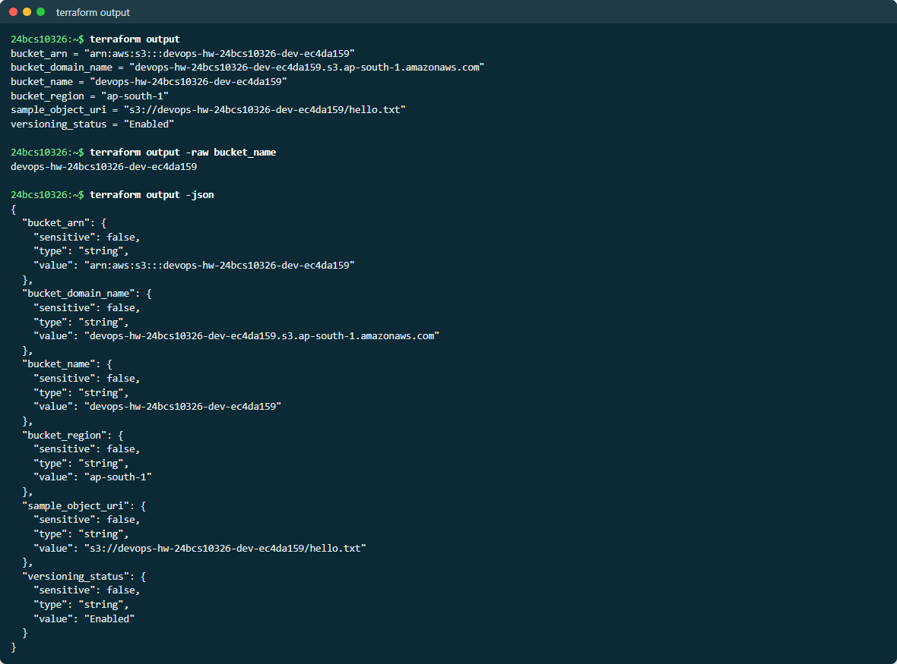

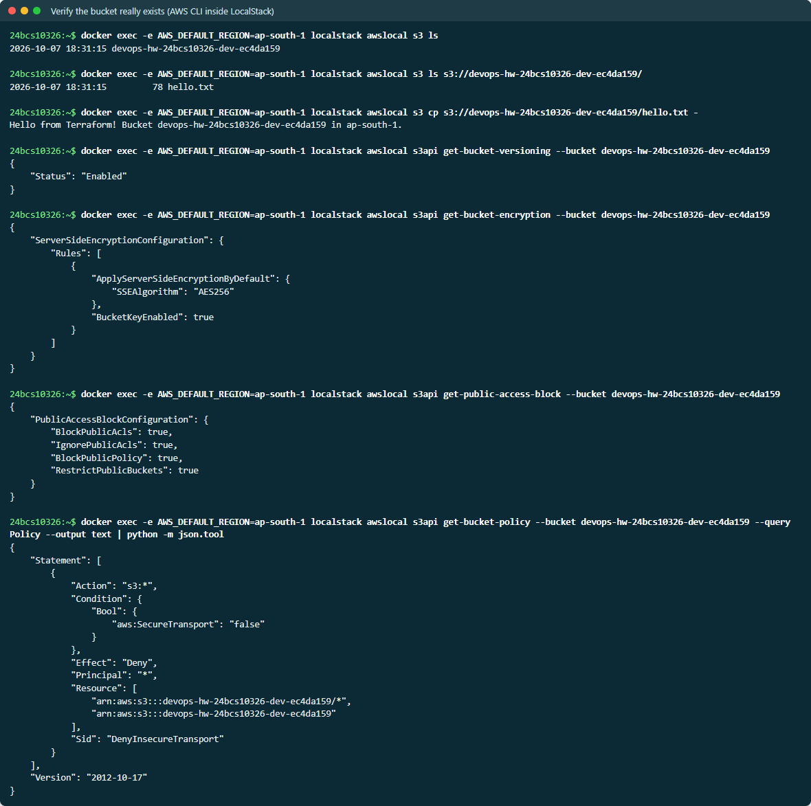

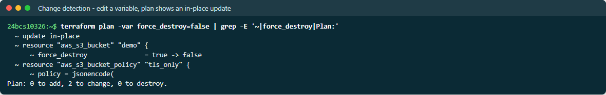

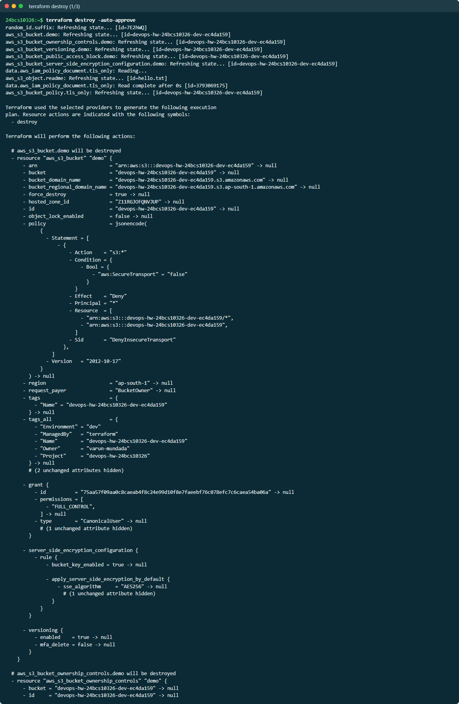

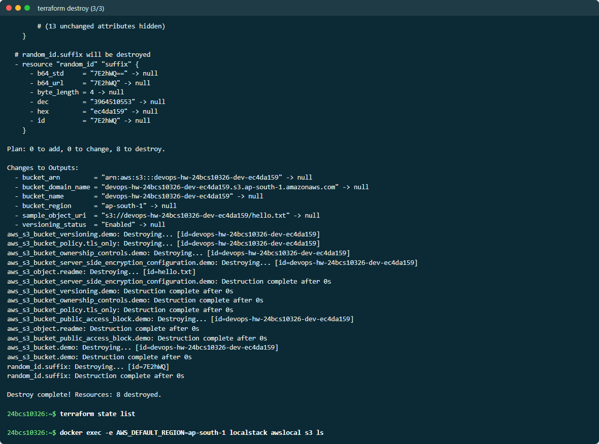

## Running it against real AWS

```bash
aws configure                     # or export AWS_PROFILE=...
rm -f override.tf                 # make sure LocalStack is not targeted
terraform init
terraform plan -out=s3.tfplan
terraform apply s3.tfplan
aws s3 ls s3://$(terraform output -raw bucket_name)/
terraform destroy
```

S3 storage for a few bytes is effectively free, but `terraform destroy` when
done is good practice. `force_destroy = true` lets destroy remove a non-empty
bucket. That is convenient for a demo; set it to `false` for anything that
matters.

## State

`terraform apply` writes `terraform.tfstate` — Terraform's record of which real
resource IDs belong to which resources in the code. It is how `plan` knows what
already exists. Points to remember:

- It can contain **secrets in plain text** (any sensitive attribute), so it is
  git-ignored here.
- On a team it lives in a **remote backend** — S3 with a DynamoDB or S3-native
  lock — so that two people cannot apply at once. The commented `backend "s3"`
  block in `provider.tf` shows the shape.
- Never edit it by hand; use `terraform state mv`, `rm` or `import`.
