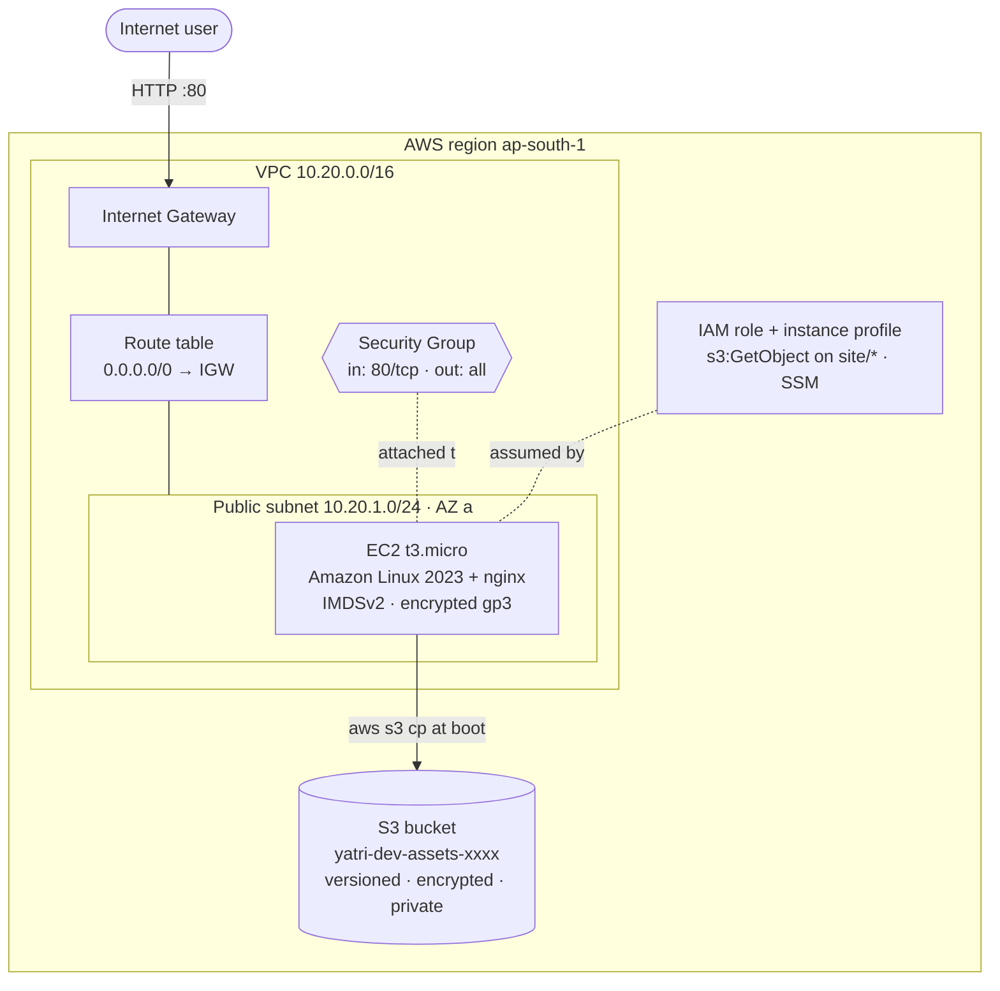

# Session 19 — Cloud & Terraform in Action

An end-to-end AWS environment built entirely with Terraform: a VPC with a
public subnet and internet routing, a Security Group, an EC2 web server that
boots nginx and pulls its page from S3 through an IAM role, and the S3 bucket
itself.

```text
18-cloud-terraform-in-action/
├── terraform/
│   ├── versions.tf                     # required Terraform + provider versions
│   ├── provider.tf                     # AWS provider, default tags
│   ├── variables.tf                    # inputs with validation
│   ├── main.tf                         # all resources
│   ├── outputs.tf                      # IDs, IPs, URL, SSM command
│   ├── terraform.tfvars                # values for dev
│   ├── localstack_override.tf.example  # optional: run with no AWS account
│   └── .terraform.lock.hcl
├── EVIDENCE.md                         # full verbatim run output
└── README.md
```

## Architecture



Plain-text version:

```text
                        Internet
                           │ HTTP :80
                ┌──────────▼───────────┐
                │   Internet Gateway   │
 ┌──────────────┴──────────────────────┴──────── VPC 10.20.0.0/16 ─┐
 │  Route table: 10.20.0.0/16 → local, 0.0.0.0/0 → IGW             │
 │                                                                 │
 │   ┌──────── Public subnet 10.20.1.0/24 (ap-south-1a) ────────┐  │
 │   │                                                          │  │
 │   │   ┌─ Security Group: in 80/tcp, out all ──────────────┐  │  │
 │   │   │  EC2 t3.micro  (Amazon Linux 2023, nginx)         │  │  │
 │   │   │  IAM instance profile ── read s3://…/site/*       │──┼──┼──► S3 bucket
 │   │   └───────────────────────────────────────────────────┘  │  │   (versioned,
 │   └──────────────────────────────────────────────────────────┘  │    encrypted,
 └─────────────────────────────────────────────────────────────────┘    private)
```

## How each required concept is demonstrated

| Concept | Where |
| --- | --- |
| **Providers** | `versions.tf` pins `hashicorp/aws ~> 5.0` and `hashicorp/random ~> 3.6`; `provider.tf` sets the region and `default_tags` applied to every resource |
| **Variables** | `variables.tf` — typed inputs (`string`, `list(string)`), defaults, and `validation` (the VPC CIDR must parse) |
| **Resources** | 20 resource blocks in `main.tf` — VPC, subnet, IGW, route table + association, SG + rules, S3 bucket + settings + object, IAM role + policy + attachment + instance profile, EC2. They produce **19 instances** by default, because the SSH rule's `for_each` is empty |
| **Data sources** | `aws_availability_zones`, `aws_ami` (latest AL2023 — never a hard-coded AMI ID), `aws_iam_policy_document` |
| **Outputs** | `outputs.tf` — IDs, public IP, website URL, and a ready-to-paste SSM command |
| **Dependencies** | *Implicit*: `aws_subnet.public` references `aws_vpc.main.id`. *Explicit*: `aws_instance.web` has `depends_on = [aws_s3_object.index, …]`, because its boot script downloads that object but nothing in its arguments references it |
| **AWS infrastructure** | VPC → subnet → IGW → route → SG → EC2, plus S3 and IAM |
| **Terraform state** | `terraform state list` / `state show`, and drift detection after a manual change |
| **plan / apply / destroy** | Full cycle executed — see below |

Security choices worth noting: **no SSH by default** (`allowed_ssh_cidrs = []`
— use SSM Session Manager instead); **IMDSv2 required**, which blocks the
classic SSRF-to-credentials attack; an encrypted root volume; and an IAM role
scoped to `s3:GetObject` on just `site/*`, so no access keys exist anywhere.

## Commands

```bash
cd terraform
terraform init                    # download providers, write the lock file
terraform fmt -recursive          # canonical formatting
terraform validate                # static checks
terraform graph                   # dependency graph (DOT format)
terraform plan -out=infra.tfplan  # review exactly what will change
terraform apply infra.tfplan      # build it
terraform state list              # what Terraform now tracks
terraform output                  # IDs, IP, URL
terraform destroy                 # tear it all down
```

## Executed run

Run end to end on 2026-10-07. Full verbatim output is in
[EVIDENCE.md](EVIDENCE.md).

> **Where it ran.** No AWS account is configured on the machine used for this
> homework, so the run targeted **LocalStack 3.8**, a local emulator of the
> EC2, S3, IAM and STS APIs. The Terraform code is unchanged: a git-ignored
> `override.tf` redirects the provider endpoints. LocalStack's EC2 is an API
> emulation — the instance exists as an API object but boots no real VM — so
> the nginx page cannot be browsed. On real AWS, `website_url` serves it once
> the instance has booted.

| Step | Result |
| --- | --- |
| `init` | `hashicorp/aws v5.100.0`, `hashicorp/random v3.9.1` |
| `fmt` / `validate` | Clean / `Success! The configuration is valid.` |
| `graph` | 22 resource-to-resource edges; `aws_instance.web -> aws_s3_object.index` is the explicit `depends_on` |
| `plan` | `Plan: 19 to add, 0 to change, 0 to destroy.` |
| `apply` | `Apply complete! Resources: 19 added, 0 changed, 0 destroyed.` |
| `state list` | 19 resources + 4 data sources |
| Verify (AWS API) | VPC `10.20.0.0/16`; subnet `10.20.1.0/24` in `ap-south-1a`, public IP on launch; routes `local` + `0.0.0.0/0 → igw`; SG allows `80/tcp` from `0.0.0.0/0` only; instance `t3.micro` **running** at `10.20.1.4`; `site/index.html` in S3 |
| Drift | Renamed the VPC tag by hand → `plan` showed `"Name" = "renamed-by-hand" -> "yatri-dev-vpc"` → `apply` restored it |
| `destroy` | `Destroy complete! Resources: 19 destroyed.` |

The dependency graph Terraform built (resource-to-resource edges only):

```text
aws_instance.web  -> aws_iam_instance_profile.web, aws_iam_role_policy.read_assets,
                     aws_route_table_association.public, aws_s3_object.index (explicit),
                     aws_security_group.web
aws_subnet.public -> aws_vpc.main
aws_internet_gateway.igw -> aws_vpc.main
aws_route_table.public -> aws_internet_gateway.igw
aws_route_table_association.public -> aws_route_table.public, aws_subnet.public
aws_security_group.web -> aws_vpc.main
aws_s3_object.index -> aws_s3_bucket.assets -> random_id.bucket_suffix
aws_iam_instance_profile.web -> aws_iam_role.web
```

Drift detection — reality changed outside Terraform, the code wins:

```text
$ awslocal ec2 create-tags --resources vpc-11b5df36 --tags Key=Name,Value=renamed-by-hand
$ terraform plan
  ~ resource "aws_vpc" "main" {
      ~ tags = {
          ~ "Name" = "renamed-by-hand" -> "yatri-dev-vpc"
Plan: 0 to add, 1 to change, 0 to destroy.
$ terraform apply -auto-approve
Apply complete! Resources: 0 added, 1 changed, 0 destroyed.
$ awslocal ec2 describe-vpcs ... Name
yatri-dev-vpc
```

Two emulator-specific findings, both handled in the git-ignored override
rather than by weakening `main.tf`:

1. **Region.** The first verification pass reported "VPC does not exist",
   because `awslocal` defaults to `us-east-1` while Terraform created
   everything in `ap-south-1`. Regional services must be queried in the right
   region; S3 bucket listing is global, which is why only S3 appeared to
   work. Fixed by passing `AWS_DEFAULT_REGION=ap-south-1`.
2. **IMDSv2 setting.** LocalStack does not implement
   `ModifyInstanceMetadataOptions` (HTTP 501) and does not report
   `metadata_options` back, so Terraform saw a permanent diff on
   `http_tokens = "required"`. The override adds
   `lifecycle { ignore_changes = [metadata_options] }` for LocalStack runs only;
   on real AWS the requirement stays enforced.

## Running it on real AWS

```bash
aws configure
cd terraform && rm -f override.tf
terraform init && terraform apply
curl $(terraform output -raw website_url)          # give it ~60s to boot
aws ssm start-session --target $(terraform output -raw instance_id)
terraform destroy
```

A `t3.micro` is free-tier eligible, but always run `terraform destroy` when you
are done.
