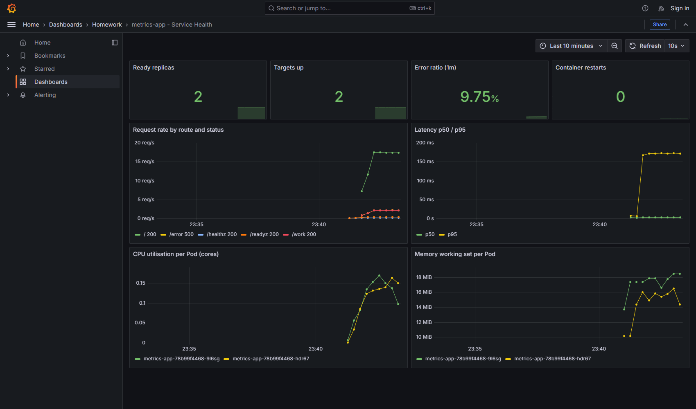
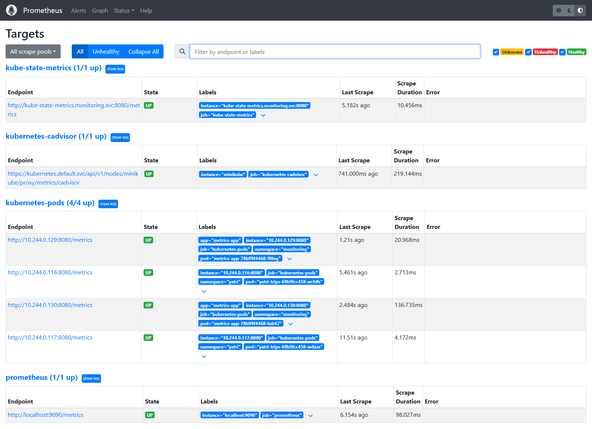
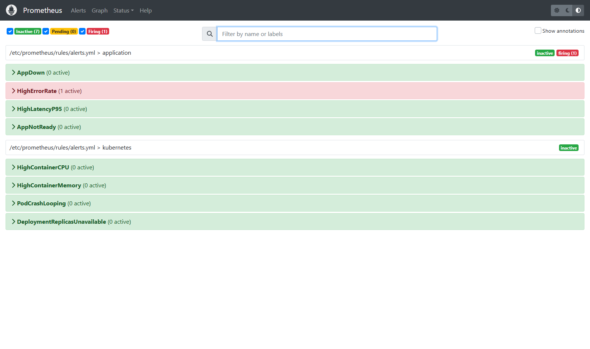
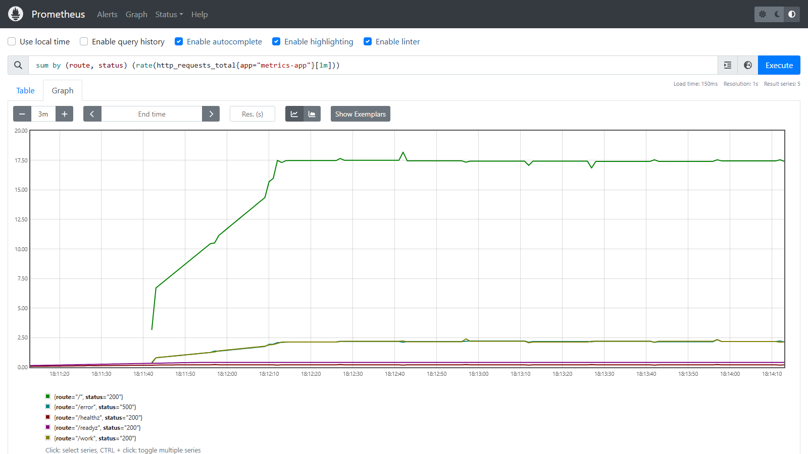
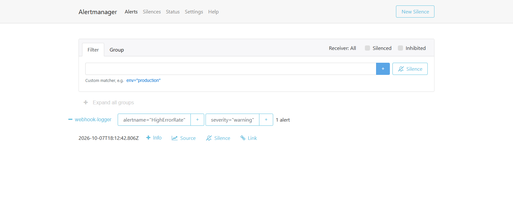

# Monitoring Demo

A complete monitoring stack on minikube, watching an instrumented application.
Every requirement — **metrics, logs, alerts, CPU utilisation, memory
utilisation, application health** — was demonstrated live. The full output is
in [EVIDENCE.md](EVIDENCE.md).

```text
                     ┌─────────────── namespace: monitoring ─────────────────┐
  traffic Pod ──────►│ metrics-app ×2  ──/metrics──┐                         │
  (normal + /work    │                             ▼                         │
   + /error)         │ kube-state-metrics ──► Prometheus ──► Alertmanager ──►│──► alert-webhook
                     │ kubelet/cAdvisor  ───►     │  rules       routes      │    (logs FIRING /
                     │                            ▼                          │     RESOLVED)
                     │                        Grafana (provisioned dashboard)│
                     └───────────────────────────────────────────────────────┘
```

| File | Component |
| --- | --- |
| [app/server.js](app/server.js) | The instrumented app: Prometheus metrics on `/metrics`, JSON logs, `/healthz` + `/readyz`; `/work` burns CPU, `/error` returns 500, `/toggle-ready` flips readiness |
| [k8s/01-metrics-app.yaml](k8s/01-metrics-app.yaml) | 2 replicas with `prometheus.io/scrape` annotations |
| [k8s/02-prometheus.yaml](k8s/02-prometheus.yaml) | RBAC, scrape config (annotated Pods, cAdvisor, kube-state-metrics), **8 alert rules** |
| [k8s/03-kube-state-metrics.yaml](k8s/03-kube-state-metrics.yaml) | Kubernetes object state as metrics |
| [k8s/04-alertmanager.yaml](k8s/04-alertmanager.yaml) | Routing (critical vs warning) to a webhook receiver |
| [k8s/05-grafana.yaml](k8s/05-grafana.yaml) | Datasource and dashboard provisioned from ConfigMaps |

```bash
minikube image load metrics-app:1.0.0          # built from app/Dockerfile
kubectl apply -f k8s/00-namespace.yaml
kubectl -n monitoring create secret generic grafana-admin --from-literal=password=<choose one>
kubectl apply -f k8s/
kubectl -n monitoring port-forward svc/grafana 3000:3000        # http://localhost:3000/d/metrics-app
kubectl -n monitoring port-forward svc/prometheus 9090:9090     # http://localhost:9090/alerts
```

## Targets discovered

```text
kube-state-metrics     up   http://kube-state-metrics.monitoring.svc:8080/metrics
kubernetes-cadvisor    up   https://kubernetes.default.svc:443/api/v1/nodes/minikube/proxy/metrics/cadvisor
kubernetes-pods        up   http://10.244.0.57:8080/metrics      <- metrics-app pod 1, found by annotation
kubernetes-pods        up   http://10.244.0.54:8080/metrics      <- metrics-app pod 2
prometheus             up   http://localhost:9090/metrics
```

## Metrics

A traffic Pod sent a mix of normal requests, CPU-heavy `/work` calls and ~10%
`/error` calls.

```text
promql: sum by (route, status) (rate(http_requests_total{app="metrics-app"}[1m]))
  route=/,status=200          18.36 req/s
  route=/work,status=200       2.27 req/s
  route=/error,status=500      2.31 req/s

promql: error ratio (5xx / all)
  0.0983                                  <- 9.8%, above the 5% alert threshold

promql: histogram_quantile(0.95, ... http_request_duration_seconds_bucket ...)
  route=/        0.0048 s
  route=/work    0.2425 s                 <- /work deliberately burns 200 ms of CPU
```

## CPU utilisation and memory utilisation

From cAdvisor (actual usage) divided by kube-state-metrics (configured limits):

```text
CPU cores per Pod            0.154   0.146
CPU as share of limit        30.7%   29.2%     (limit 500m)
memory working set           15.1 MB 18.8 MB
memory as share of limit     11.2%   14.0%     (limit 128Mi)

$ kubectl top pods -n monitoring
metrics-app-78b99f4468-2ws7t   160m   13Mi
metrics-app-78b99f4468-fkhb2   143m   17Mi
prometheus-6b5b8798b7-6twhn      5m   91Mi
grafana-8677ccdc76-w6mfl         7m   61Mi
```

Usage as a share of the **limit** is the number that matters operationally: a
container approaching its memory limit is about to be OOM-killed, and one at
its CPU limit is being throttled. Both have alert rules (`HighContainerMemory`,
`HighContainerCPU`).

## Logs

The application writes one JSON object per request to stdout. Kubernetes
captures stdout, and any log shipper (Fluent Bit, Promtail) can collect it
unchanged:

```text
{"ts":"2026-10-07T16:40:12.939Z","level":"info","method":"GET","route":"/work","status":200,"duration_ms":200,"version":"1.0.0"}
{"ts":"2026-10-07T16:40:12.941Z","level":"error","method":"GET","route":"/error","status":500,"duration_ms":0,"version":"1.0.0"}

$ kubectl -n monitoring logs -l app=metrics-app --tail=500 | grep '"level":"error"'
```

Because every line is structured, "show me only errors" is a field filter, not
a fragile text search. In Loki or Elasticsearch it is a query on `level`.

## Alerts

```text
Prometheus  /api/v1/alerts      HighErrorRate   warning   firing   More than 5% of metrics-app requests are failing
Alertmanager /api/v2/alerts     HighErrorRate   active    receivers=['webhook-logger']
alert-webhook logs              [FIRING] HighErrorRate severity=warning :: More than 5% of metrics-app requests are failing
```

The full path works: the rule evaluated the error ratio, stayed `pending` for
its `for: 1m`, then went `firing`. Alertmanager grouped it and routed it, and
the receiver got the notification.

Several minutes later, after the traffic stopped and the Pod recovered,
Alertmanager sent the matching **RESOLVED** notifications (`send_resolved:
true`). They arrive on the next group interval, not instantly:

```text
1 [FIRING]   HighErrorRate                  More than 5% of metrics-app requests are failing
1 [FIRING]   AppNotReady                    Pod metrics-app-78b99f4468-2ws7t reports itself not ready
1 [FIRING]   DeploymentReplicasUnavailable  monitoring/metrics-app has unavailable replicas
1 [RESOLVED] HighErrorRate
1 [RESOLVED] AppNotReady
1 [RESOLVED] DeploymentReplicasUnavailable
```

## Application health

One Pod was told to report itself not ready (`/toggle-ready`):

```text
metrics-app-78b99f4468-2ws7t   0/1   Running      <- readiness failing
metrics-app-78b99f4468-fkhb2   1/1   Running

kube_deployment_status_replicas_available{deployment="metrics-app"}   1      (of 2)
app_ready{pod="metrics-app-78b99f4468-2ws7t"}                          0
app_ready{pod="metrics-app-78b99f4468-fkhb2"}                          1
up{pod=...2ws7t} 1,  up{pod=...fkhb2} 1                                    <- still scraped

alerts:  AppNotReady                    firing
         DeploymentReplicasUnavailable  pending -> firing
```

Health is visible at three levels, and they say different things:

| Signal | Source | Meaning |
| --- | --- | --- |
| `up` | Prometheus scrape | The process answers on `/metrics` — still `1` for the unready Pod |
| `app_ready` | the app's own metric | The app's opinion of its readiness |
| `kube_deployment_status_replicas_available` | kube-state-metrics | Kubernetes' view — what the Service actually routes to |

`up` alone would have shown everything as healthy. Readiness only removes a
Pod from **Service** traffic; Prometheus scrapes Pods directly by IP, so the
unready Pod kept being scraped.

## Grafana

The datasource and dashboard came from ConfigMaps — no clicking:

```text
/api/health                                  database ok, version 11.3.0
/api/datasources/uid/prometheus/health       "Successfully queried the Prometheus API."
/api/search?query=metrics-app                metrics-app - Service Health   folder=Homework   uid=metrics-app

panels: [stat] Ready replicas · [stat] Targets up · [stat] Error ratio (1m) · [stat] Container restarts
        [timeseries] Request rate by route and status · [timeseries] Latency p50 / p95
        [timeseries] CPU utilisation per Pod (cores) · [timeseries] Memory working set per Pod
```

Open it with `kubectl -n monitoring port-forward svc/grafana 3000:3000`, then
http://localhost:3000/d/metrics-app.

## Screenshots

Captured on 2026-10-07 with this folder's manifests redeployed in the same
cluster as the Session 21 platform. Both use the `monitoring` namespace, so
Session 21's monitoring was paused for a few minutes, and Argo CD restored it
from Git afterwards. The traffic Pod from the run above sent ~10% of requests
to `/error`.

**Grafana** — the provisioned dashboard: 2 ready replicas, a 9.75% error ratio,
request rate by route, latency, and CPU and memory per Pod.



**Prometheus targets** — every scrape target `UP`. Discovery is by
annotation in all namespaces, so it also finds the two Session 21
`yatri-trips` Pods running in the same cluster.



**Prometheus alerts** — `HighErrorRate` firing (error ratio above 5%); the
other 7 rules inactive.



**PromQL** — `sum by (route, status) (rate(http_requests_total{app="metrics-app"}[1m]))`.



**Alertmanager** — the alert routed to the `webhook-logger` receiver.


