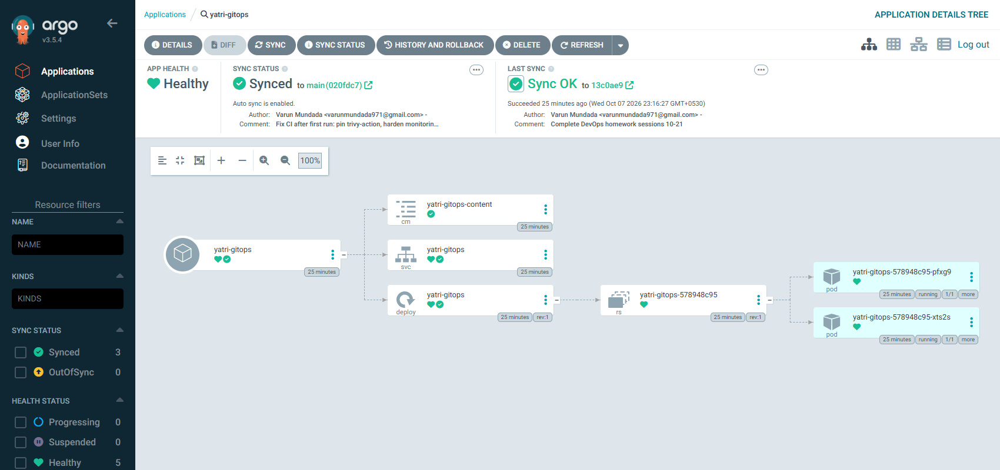

# GitOps

## What is GitOps?

GitOps is an operating model for infrastructure and applications in which a
**Git repository is the single source of truth for the desired state of the
system**, and an automated agent running *inside* the cluster continuously
makes reality match it.

You never run `kubectl apply` against production. You open a pull request.
When it merges, the cluster converges on the new state by itself.

The four OpenGitOps principles:

| Principle | Meaning |
| --- | --- |
| **Declarative** | The system's desired state is described as data (YAML, Helm values, Kustomize), not as a script of steps |
| **Versioned and immutable** | That desired state is stored in Git, so every change has an author, a review, a timestamp and a revert |
| **Pulled automatically** | Agents in the cluster *pull* the state from Git; nobody *pushes* into the cluster |
| **Continuously reconciled** | Agents keep comparing actual with desired state and correct any difference |

## Git as the source of truth

| Question | Without GitOps | With GitOps |
| --- | --- | --- |
| What is running in prod? | Ask the cluster, and hope | Read the `main` branch |
| Who changed it, and why? | Shell history, maybe | `git log`, with the pull request discussion |
| How do I roll back? | Remember the previous command | `git revert` |
| How do I rebuild a lost cluster? | Re-run everything from memory | Point a new Argo CD at the repo |
| Who has cluster credentials? | Every engineer and the CI system | Only the in-cluster agent |

## Declarative configuration

```yaml
# Declarative: "there should be 3 replicas of nginx:1.25-alpine"
spec:
  replicas: 3
  template:
    spec:
      containers:
        - image: nginx:1.25-alpine
```

as opposed to imperative steps such as
`kubectl scale deploy web --replicas=3`. A declaration can be diffed, reviewed,
re-applied any number of times with the same result (it is **idempotent**), and
compared against reality — which is exactly what reconciliation needs.

## Continuous reconciliation

```text
           ┌──────────────────────────────────────────────┐
           │                                              │
           ▼                                              │
   ┌──────────────┐   desired    ┌───────────────┐        │
   │  Git repo    │─────────────►│   Argo CD     │        │
   │  (main)      │   state      │  controller   │        │
   └──────────────┘              └──────┬────────┘        │
                                        │ compare         │
                                        ▼                 │
                                 ┌──────────────┐  actual │
                                 │   cluster    │─────────┘
                                 └──────────────┘  state
           in sync?   yes → nothing to do
                      no  → OutOfSync → sync (apply the Git version)
```

Argo CD polls the repository (every 3 minutes by default, or instantly via a
webhook) **and** watches the live cluster objects. Either side changing
triggers a comparison:

- **Git changes** → the app goes `OutOfSync` → auto-sync applies the new
  commit.
- **The cluster drifts** (someone runs `kubectl edit`) → `OutOfSync` →
  `selfHeal` reverts it to what Git says.
- **A file is deleted from Git** → `prune` deletes the object from the
  cluster.

## GitOps workflow

```text
 developer                 GitHub                  CI (Actions)                Argo CD (in cluster)
    │  feature branch         │                         │                              │
    ├─ commit + push ────────►│                         │                              │
    │                         ├─ pull request ─────────►│ build, test, scan,           │
    │                         │                         │ push image :sha-abc123       │
    │                         │◄── bump image tag ──────┤ (commit to the config repo)  │
    │◄─ review / approve ─────┤                         │                              │
    ├─ merge to main ────────►│                         │                              │
    │                         │◄──────────── poll / webhook ───────────────────────────┤
    │                         │                         │       diff → OutOfSync       │
    │                         │                         │       sync → apply           │
    │                         │                         │       health → Healthy       │
```

The key separation: **CI never touches the cluster.** CI builds an image and
records its tag in Git; Argo CD deploys it. The cluster's credentials never
leave the cluster.

## Kubernetes + GitOps

Kubernetes is the natural GitOps target, because everything about it is
already declarative and it is itself built on reconciliation loops — a
Deployment controller continuously drives Pods toward `replicas`. GitOps adds
one more loop on top, driving the *objects themselves* toward Git.

| Tool | Notes |
| --- | --- |
| **Argo CD** | CNCF graduated. UI, multi-cluster, Helm/Kustomize/plain YAML, `Application` and `ApplicationSet` CRDs. Used below |
| **Flux** | CNCF graduated. CLI- and CRD-driven, no built-in UI, composable controllers |
| **Argo Rollouts / Flagger** | Progressive delivery (canary, blue-green) driven by metrics, on top of GitOps |

## Demo

| File | Purpose |
| --- | --- |
| [argocd/application-live-demo.yaml](argocd/application-live-demo.yaml) | Application used in the live run. It tracks a path already on GitHub (`09-…/03-deployment`) |
| [argocd/application.yaml](argocd/application.yaml) | Application for this folder's own [`manifests/`](manifests/), with `prune`, `selfHeal`, retry, and a finalizer |
| [manifests/](manifests/) | ConfigMap + Deployment + Service managed purely through Git |

The demo was executed on minikube with Argo CD v3.5.4. Full output is in
[EVIDENCE.md](EVIDENCE.md).

### Part A — sync from GitHub, then three kinds of drift

An Application pointing at a path already on GitHub
(`09-kubernetes-pods-replicasets-deployments/03-deployment`):

```text
$ kubectl get applications -n argocd
NAME                SYNC STATUS   HEALTH STATUS
nginx-gitops-demo   Synced        Healthy
revision=47f0f69a5754627d645a2a15e20cef6a33331028      <- the repository's real HEAD commit
deployment.apps/nginx-deployment   3/3
```

| Drift introduced by hand | What Argo CD did (`selfHeal: true`) |
| --- | --- |
| `kubectl scale --replicas=1` | Back to **3/3** within seconds — Git says `replicas: 3` |
| `kubectl set image ... nginx:1.26-alpine` | Reverted to `nginx:1.25-alpine` before the change could even be read back |
| `kubectl delete deploy nginx-deployment` | Recreated; `3/3`, `AGE 1s` |

Argo CD's own events show the reconcile loop each time:

```text
Updated sync status: Synced -> OutOfSync
Updated health status: Healthy -> Missing
Initiated automated sync to '47f0f69a5754627d645a2a15e20cef6a33331028'
Partial sync operation to 47f0f69... succeeded
Updated sync status: OutOfSync -> Synced
Updated health status: Progressing -> Healthy
```

### Part B — the full Git loop

Against the in-cluster Git server ([git-server/gitea.yaml](git-server/gitea.yaml))
and [argocd/application-gitea.yaml](argocd/application-gitea.yaml):

| Step | Git | What happened in the cluster |
| --- | --- | --- |
| 1 | `1b64fbb` Desired state v1: 2 replicas | Synced → `2/2`, page shows `Version: v1` |
| 2 | `38abed7` Release v2: 4 replicas, new content | **No kubectl, no webhook.** Argo CD found it on its own after **193s** → `4/4`, `Version: v2` |
| 3 | `a60bdcd` "Tidy configmap" — a **bad commit** (`apiVersion: v2`) | Argo CD **refused** it: `failed to discover server resources for group version v2`. Cluster untouched: still `4/4`, `Version: v2` |
| 4 | `7361617` Revert "Tidy configmap" | Back to `Synced`/`Healthy` |
| 5 | `ff75d4c` Revert "Release v2" — **rollback** | Synced in 23s → `2/2`, `Version: v1` |
| 6 | `a522729` Remove the Service | **Pruned**: `No resources found` |

```text
$ git log --oneline                                  $ argo deployment history
a522729 Remove the Service                           3  a522729  17:12:00
ff75d4c Revert "Release v2: 4 replicas..."           2  ff75d4c  17:11:23
7361617 Revert "Tidy configmap"                      (no change to apply)
a60bdcd Tidy configmap                               (never deployed)
38abed7 Release v2: 4 replicas, new content          1  38abed7  17:09:40
1b64fbb Desired state v1: yatri-gitops, 2 replicas   0  1b64fbb  17:06:22
```

What the run shows:

- **Git is the deployment log.** Every change to the cluster maps to a commit;
  the bad commit never reached the deployment history because it was never
  applied.
- **Rollback is `git revert`** — reviewed, auditable, and identical in
  mechanism to a forward change.
- **The 193-second delay is real behaviour.** Polling was set to 20s, but the
  repo-server also caches what `main` resolves to (3 minutes by default). In
  production a **Git webhook** removes that delay. From step 3 onwards the
  demo triggers an immediate refresh after each push — the same thing a
  webhook does — so steps 4–6 converged in 0–23 seconds.
- **A failing commit is safe.** The sync failed validation before touching
  anything, so the running v2 kept serving. A short `retry` policy keeps such
  a failure from blocking the fix that follows it.

### Lab adjustments (documented, not hidden)

- Argo CD's install manifest sets `imagePullPolicy: Always`. With the images
  already on the node and a slow link, they were switched to `IfNotPresent`
  so Pod starts did not queue behind the kubelet's serialised image pulls.
- The first GitHub sync failed: `git fetch ... timeout after 1m30s` for the
  ~8 MB repository on a saturated link. Raising `ARGOCD_EXEC_TIMEOUT` (5m) and
  the controller's repo-server timeout fixed it. Both are in
  [EVIDENCE.md](EVIDENCE.md).

### Try the full commit → sync loop yourself

The live run used a path already on GitHub, so it could demonstrate syncing
and every kind of drift correction without a push. After this folder was
pushed, [argocd/application.yaml](argocd/application.yaml) was applied, and
Argo CD synced [`manifests/`](manifests/) **straight from GitHub**:
Synced / Healthy at the pushed commit, with a ConfigMap, a Service, and a
Deployment with 2 Pods.



The commit → sync loop from here:

```bash
kubectl apply -f argocd/application.yaml          # Argo CD now watches manifests/

# change the desired state IN GIT, not in the cluster:
sed -i 's/replicas: 2/replicas: 4/' manifests/deployment.yaml
sed -i 's/Version: v1/Version: v2/' manifests/configmap.yaml
git commit -am "Scale yatri-gitops to 4, content v2" && git push

kubectl -n argocd get application yatri-gitops -w  # OutOfSync -> Synced
kubectl -n yatri-gitops get deploy yatri-gitops    # 4/4
git revert HEAD && git push                        # rollback = revert
```

Argo CD UI:

```bash
kubectl -n argocd port-forward svc/argocd-server 8443:443
kubectl -n argocd get secret argocd-initial-admin-secret \
  -o jsonpath='{.data.password}' | base64 -d        # user: admin
# open https://localhost:8443
```
